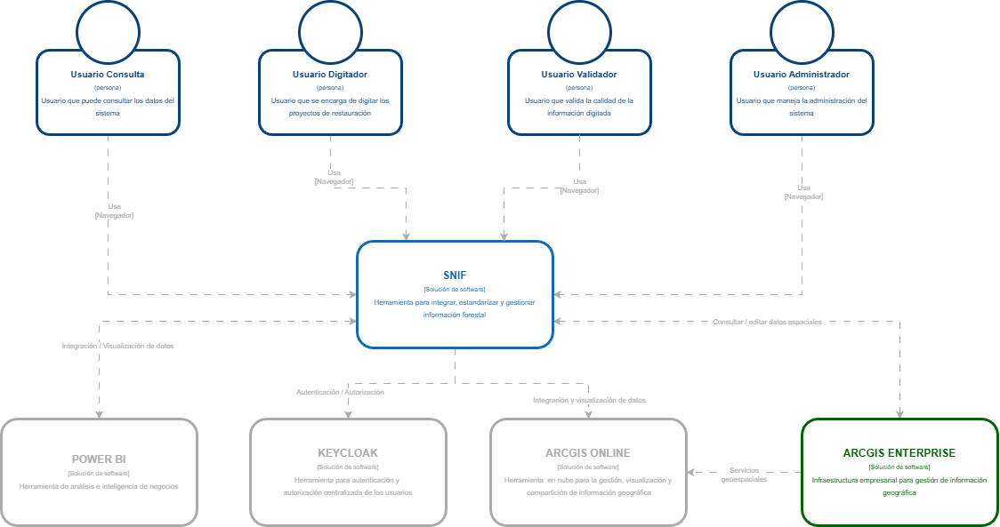

[Inicio](/README.md) → [Arquitectura de software](content/arquitectura_software/README.md)

# Modelo C4 – Nivel 1: Contexto del Sistema

## 1.1 Descripción general

El **Sistema Nacional de Información Forestal (SNIF)** es una plataforma tecnológica que permite **integrar, estandarizar y gestionar información forestal a nivel nacional**.  
Su propósito principal es **centralizar los datos provenientes de múltiples fuentes** y facilitar su análisis, validación y difusión mediante herramientas especializadas.

El SNIF actúa como el **núcleo del ecosistema de información forestal**, proporcionando una interfaz unificada para los diferentes perfiles de usuario y estableciendo integraciones con sistemas externos que complementan sus capacidades de **autenticación, análisis e información geoespacial**.

---

## 1.2 Actores principales

El sistema es utilizado por diversos tipos de usuarios, cada uno con roles y responsabilidades específicas:

| **Actor**                 | **Descripción**                                                                                              |
| ------------------------- | ------------------------------------------------------------------------------------------------------------ |
| **Usuario Consulta**      | Accede al sistema para consultar los datos disponibles del SNIF.                                             |
| **Usuario Digitador**     | Encargado de digitar y actualizar los proyectos o registros de reforestación dentro del sistema.             |
| **Usuario Validador**     | Verifica la calidad, consistencia y completitud de la información ingresada.                                 |
| **Usuario Administrador** | Posee privilegios de administración. Gestiona usuarios, configuraciones del sistema y mantenimiento general. |

> Todos los usuarios acceden al sistema a través de un **navegador web**.

---

## 1.3 Sistema principal

| **Nombre**                                          | **Tipo**               | **Propósito**                                                                |
| --------------------------------------------------- | ---------------------- | ---------------------------------------------------------------------------- |
| **SNIF (Sistema Nacional de Información Forestal)** | Aplicación web central | Integrar, estandarizar y gestionar la información forestal a nivel nacional. |

**Responsabilidades principales:**

- Centralizar la información proveniente de diferentes fuentes.
- Facilitar la digitación, validación y consulta de datos forestales.
- Integrarse con sistemas externos de autenticación, análisis e información geoespacial.
- Permitir la visualización y análisis de datos tanto alfanuméricos como espaciales.

---

## 1.4 Sistemas externos e integraciones

El SNIF se comunica con varias plataformas externas que amplían sus capacidades funcionales:

| **Sistema Externo**   | **Tipo / Función**                                            | **Interacción con SNIF**                                                                          |
| --------------------- | ------------------------------------------------------------- | ------------------------------------------------------------------------------------------------- |
| **Keycloak**          | Plataforma de autenticación y autorización                    | Gestiona la autenticación y autorización centralizada de los usuarios del SNIF.                   |
| **ArcGIS Online**     | Plataforma en la nube para gestión y visualización geográfica | Permite la visualización, análisis y compartición de información geográfica proveniente del SNIF. |
| **ArcGIS Enterprise** | Infraestructura corporativa de servicios geoespaciales        | Proporciona servicios y herramientas para la gestión avanzada de información espacial.            |
| **Power BI**          | Herramienta de análisis e inteligencia de negocios            | Consume e integra datos del SNIF para crear reportes y paneles analíticos.                        |

---

## 1.5 Flujo de interacción

1. Los usuarios acceden al SNIF mediante un **navegador web**.
2. El sistema delega la autenticación y autorización a **Keycloak**, que gestiona los permisos de acceso.
3. Una vez autenticados, los usuarios interactúan con el sistema según su rol (consulta, digitación, validación o administración).
4. El SNIF se integra con **ArcGIS Online** y **ArcGIS Enterprise** para la consulta, edición y visualización de información geoespacial.
5. Los datos consolidados pueden ser consumidos por **Power BI** para análisis e inteligencia de negocio.

---

## 1.6 Límites del sistema

El SNIF se ubica en el **centro del ecosistema de información forestal**, siendo responsable de la **gestión integral de los datos forestales**.  
Los sistemas externos —**Keycloak**, **ArcGIS Online**, **ArcGIS Enterprise** y **Power BI**— se consideran **fuera del límite del sistema**, aunque mantienen **interacciones directas y críticas** para el funcionamiento general de la solución.

---

## 1.7 Diagrama de contexto

> **Descripción:** Este diagrama representa el **Sistema Nacional de Información Forestal (SNIF)** en su entorno, mostrando los actores y sistemas externos que interactúan con él.

---

## Enlaces relacionados

- [Modelo C4 – Nivel 2: Contenedores](content/arquitectura_software/c4/nivel2.md)
- [Modelo C4 – Nivel 3: Componentes](content/arquitectura_software/c4/nivel3.md)
