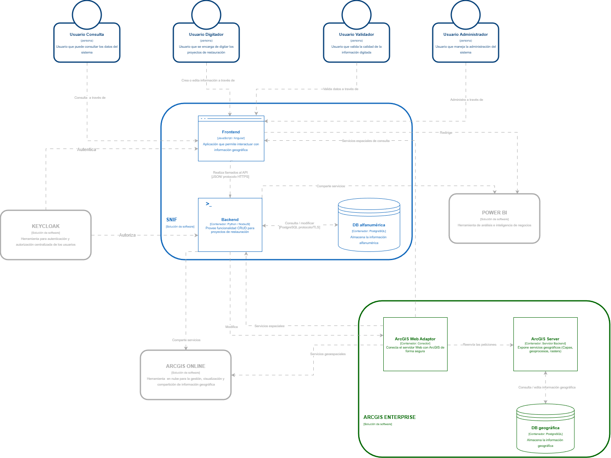

[Inicio](/README.md) → [Arquitectura de software](content/arquitectura_software/README.md) → [Modelo C4 – Nivel 1: Contexto](content/arquitectura_software/nivel1.md)

# Modelo C4 – Nivel 2: Contenedores

## 2.1 Descripción general

El **Sistema Nacional de Información Forestal (SNIF)** se compone de una **arquitectura modular** que separa responsabilidades entre sus principales contenedores: **Frontend**, **Backend** y **Base de Datos Alfanumérica**.  
Cada uno cumple un rol específico dentro del ecosistema, comunicándose mediante **servicios seguros** y **protocolos estandarizados** (HTTPS, REST y conexiones cifradas TLS).

El sistema mantiene **integraciones clave** con **Keycloak**, **ArcGIS Enterprise**, **ArcGIS Online** y **Power BI**, garantizando **autenticación centralizada**, **servicios geoespaciales** y **análisis avanzado de la información**.

---

## 2.2 Contenedores principales

| **Contenedor**                 | **Tecnología / Rol**     | **Responsabilidades principales**                                                                                                                                                                                                                                                        |
| ------------------------------ | ------------------------ | ---------------------------------------------------------------------------------------------------------------------------------------------------------------------------------------------------------------------------------------------------------------------------------------- |
| **Frontend**                   | Angular / Aplicación web | - Proporciona la interfaz de usuario para interacción con el sistema. - Consume los servicios REST expuestos por el backend. - Permite la digitación, consulta y validación de información forestal. - Gestiona autenticación y autorización mediante Keycloak.                 |
| **Backend (SNIF API)**         | Node.js / NestJS         | - Expone servicios API REST (JSON sobre HTTPS). - Implementa la lógica de negocio relacionada con proyectos de restauración. - Gestiona operaciones CRUD sobre la base de datos alfanumérica. - Se comunica con ArcGIS Enterprise y ArcGIS Online para servicios geoespaciales. |
| **Base de Datos Alfanumérica** | PostgreSQL               | - Almacena información alfanumérica del sistema (proyectos, usuarios, registros de restauración). - Respalda las operaciones transaccionales del backend. - Se comunica de forma segura mediante PostgreSQL/TLS.                                                                   |

---

## 2.3 Integraciones externas

El SNIF mantiene comunicación con las siguientes plataformas externas, esenciales para la autenticación, gestión geoespacial y análisis de datos:

| **Sistema Externo**   | **Interacción con SNIF**                                                                                                                                                                                                                                                                                                                                                         |
| --------------------- | -------------------------------------------------------------------------------------------------------------------------------------------------------------------------------------------------------------------------------------------------------------------------------------------------------------------------------------------------------------------------------- |
| **Keycloak**          | Gestiona la autenticación y autorización de los usuarios. El Frontend obtiene tokens de acceso que son validados por el Backend para asegurar el acceso controlado a los recursos.                                                                                                                                                                                               |
| **ArcGIS Enterprise** | Proporciona servicios geoespaciales para consulta, edición y visualización de información geográfica. Se compone de: - **ArcGIS Web Adaptor:** intermedia las peticiones hacia ArcGIS Server. - **ArcGIS Server:** expone servicios geográficos (capas, geoprocesos, rutas). - **Base de Datos Geográfica:** almacena información espacial en un contenedor PostgreSQL. |
| **ArcGIS Online**     | Permite la publicación y visualización de capas geográficas en la nube, compartiendo servicios provenientes del SNIF o de ArcGIS Enterprise.                                                                                                                                                                                                                                     |
| **Power BI**          | Consume datos del SNIF para generar reportes analíticos y tableros de inteligencia de negocio. La comunicación se realiza a través de servicios expuestos por el Backend o integraciones directas con la base de datos.                                                                                                                                                          |

---

## 2.4 Flujo de interacción entre contenedores

1. **Autenticación:**  
   Los usuarios acceden al **Frontend**, el cual delega la autenticación a **Keycloak** mediante **OpenID Connect** u **OAuth2**.  
   Una vez autenticados, reciben un **token de acceso** que se incluye en las solicitudes hacia el **Backend**.

2. **Interacción principal:**  
   El **Frontend** consume los servicios del **Backend** utilizando peticiones REST seguras (**HTTPS**).  
   El **Backend** gestiona la lógica de negocio y realiza consultas o actualizaciones sobre la **Base de Datos Alfanumérica**.

3. **Servicios geoespaciales:**  
   El **Backend** solicita o modifica información geográfica a través de **ArcGIS Enterprise**, compuesto por el **Web Adaptor**, **ArcGIS Server** y la **Base de Datos Geográfica**.

4. **Publicación y análisis de datos:**  
   Los datos geográficos pueden publicarse en **ArcGIS Online** para su difusión, mientras que los datos alfanuméricos pueden ser consultados desde **Power BI** para generar informes y análisis.

---

## 2.5 Comunicación y seguridad

- Todas las comunicaciones entre componentes utilizan **protocolos cifrados (HTTPS / TLS)**.
- La **autenticación** se centraliza en **Keycloak**, garantizando control de acceso unificado.
- El **Backend** valida los tokens antes de procesar solicitudes, evitando accesos no autorizados.
- Las conexiones a las bases de datos (alfanumérica y geográfica) se realizan de forma segura mediante **TLS**.

---

## 2.6 Diagrama de contenedores

> **Descripción:** Representa los principales contenedores del SNIF (Frontend, Backend y Base de Datos) y su interacción con los sistemas externos (Keycloak, ArcGIS Enterprise, ArcGIS Online y Power BI).

---

## Enlaces relacionados

- [Modelo C4 – Nivel 1: Contexto](content/arquitectura_software/c4/nivel1.md)
- [Modelo C4 – Nivel 3: Componentes](content/arquitectura_software/c4/nivel3.md)
