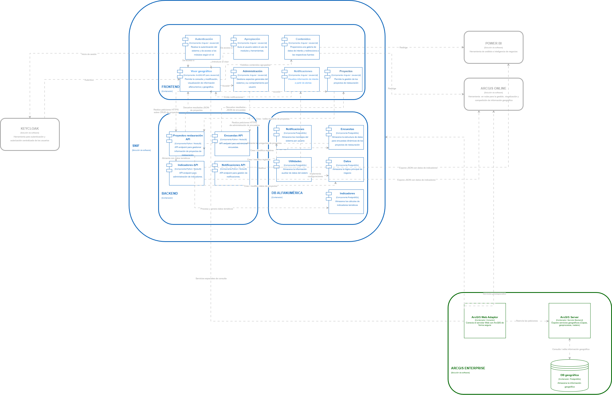

[Inicio](/README.md) → [Arquitectura de software](content/arquitectura_software/README.md) → [Modelo C4 – Nivel 2: Contenedores](content/arquitectura_software/nivel2.md)

# Modelo C4 – Nivel 3: Componentes Internos del Sistema

## 3.1 Descripción general

El **Nivel 3** del modelo C4 del **Sistema Nacional de Información Forestal (SNIF)** detalla la composición interna de los principales contenedores definidos en el nivel anterior: **Frontend**, **Backend** y **Base de Datos Alfanumérica**.

Este nivel identifica los **componentes de software**, sus **responsabilidades**, y las **interacciones** entre sí y con los **servicios externos** (Keycloak, ArcGIS Online, ArcGIS Enterprise y Power BI).  
Su propósito es mostrar cómo se estructura la aplicación dentro de cada contenedor, preservando la modularidad, mantenibilidad y seguridad del sistema.

---

## 3.2 Componentes del Frontend

El **Frontend** del SNIF está desarrollado en **Angular**, aplicando una arquitectura modular que agrupa funcionalidades por dominios de negocio.  
Cada módulo es responsable de ofrecer una sección específica de la interfaz y comunicarse con los servicios del backend mediante peticiones HTTPS autenticadas con Keycloak.

### Principales módulos

| Módulo               | Rol / Funcionalidad principal                                                                                                |
| -------------------- | ---------------------------------------------------------------------------------------------------------------------------- |
| **Autenticación**    | Gestiona el inicio y cierre de sesión mediante Keycloak (OpenID Connect / OAuth2). Valida roles y mantiene sesiones seguras. |
| **Visor Geográfico** | Permite la visualización e interacción con capas geográficas, integrando servicios de ArcGIS Enterprise.                     |
| **Administración**   | Gestiona usuarios, roles, permisos, parámetros del sistema y configuraciones generales.                                      |
| **Proyectos**        | Centraliza la creación, edición, seguimiento y validación de los proyectos de restauración.                                  |
| **Apropiación**      | Facilita el acceso a contenidos educativos, capacitaciones y materiales de gestión del conocimiento.                         |
| **Contenidos**       | Administra la publicación y mantenimiento de materiales informativos y reportes estadísticos.                                |
| **Notificaciones**   | Muestra alertas, recordatorios y mensajes automáticos generados por el backend o eventos del sistema.                        |

---

## 3.3 Componentes del Backend

El **Backend** del SNIF está construido sobre **Node.js con el framework NestJS**, utilizando una arquitectura modular orientada a dominios funcionales.  
Cada módulo encapsula su lógica de negocio, operaciones sobre la base de datos y exposición de servicios REST (JSON sobre HTTPS).

### Principales módulos

| Módulo                            | Responsabilidad principal                                                                     |
| --------------------------------- | --------------------------------------------------------------------------------------------- |
| **Proyectos de Restauración API** | Controla el ciclo de vida de los proyectos (creación, actualización, consulta y eliminación). |
| **Encuestas API**                 | Administra configuraciones, formularios y respuestas asociadas a los proyectos.               |
| **Indicadores API**               | Calcula, almacena y expone indicadores temáticos de desempeño y resultados.                   |
| **Notificaciones API**            | Genera y distribuye notificaciones y eventos del sistema consumidos por el frontend.          |
| **Utilidades**                    | Ofrece funciones comunes: manejo de archivos, validaciones, logs y soporte transversal.       |
| **Datos API**                     | Expone conjuntos de datos estructurados (JSON) para consumo por Power BI y ArcGIS Online.     |

Cada módulo mantiene **controladores**, **servicios** y **entidades** claramente definidos, lo que facilita la escalabilidad y el mantenimiento del sistema.

---

## 3.4 Componentes de la Base de Datos Alfanumérica

La **Base de Datos Alfanumérica**, implementada en **PostgreSQL**, centraliza la información administrativa, técnica y de seguimiento de los proyectos.  
Su modelo relacional garantiza integridad referencial, consistencia transaccional y trazabilidad de la información.

### Principales esquemas / tablas

| Componente         | Descripción                                                                                 |
| ------------------ | ------------------------------------------------------------------------------------------- |
| **Proyectos**      | Almacena la información general y específica de los proyectos de restauración.              |
| **Encuestas**      | Registra formularios, respuestas y metadatos asociados a levantamientos de información.     |
| **Indicadores**    | Guarda fórmulas, resultados y valores calculados de indicadores institucionales.            |
| **Notificaciones** | Registra los mensajes y eventos generados por el backend para visualización en el frontend. |

Todas las conexiones a la base de datos se realizan bajo **TLS**, asegurando cifrado de datos en tránsito y cumplimiento de políticas de seguridad institucional.

---

## 3.5 Integraciones externas

El SNIF mantiene una **arquitectura interoperable** mediante integraciones con sistemas y plataformas institucionales que complementan su operación.

| Sistema externo       | Función dentro del ecosistema SNIF                                                                        |
| --------------------- | --------------------------------------------------------------------------------------------------------- |
| **Keycloak**          | Gestiona la autenticación y autorización centralizada de usuarios y roles.                                |
| **ArcGIS Enterprise** | Provee servicios geoespaciales avanzados mediante ArcGIS Server y base de datos geográfica en PostgreSQL. |
| **ArcGIS Online**     | Publica y comparte servicios geográficos provenientes del SNIF para su análisis en la nube.               |
| **Power BI**          | Consume endpoints del backend para generar tableros de control y reportes analíticos.                     |

---

## 3.6 Flujo de comunicación entre componentes

1. **El usuario** accede al **Frontend**, que solicita autenticación mediante **Keycloak**.
2. Una vez autenticado, el Frontend consume los servicios del **Backend** a través de peticiones **HTTPS seguras** con token JWT.
3. El **Backend** procesa las solicitudes, aplica reglas de negocio y accede a la **Base de Datos Alfanumérica** para leer o persistir información.
4. Los resultados se devuelven al **Frontend** o se publican en plataformas externas como **Power BI** o **ArcGIS Online**.
5. **ArcGIS Enterprise** mantiene sincronización de datos espaciales, permitiendo que el Backend acceda a servicios geográficos o actualice capas.

---

## Enlaces relacionados

- [Modelo C4 – Nivel 1: Contexto](content/arquitectura_software/c4/nivel1.md)
- [Modelo C4 – Nivel 2: Contenedores](content/arquitectura_software/c4/nivel2.md)
