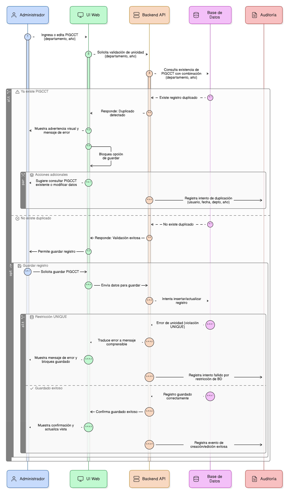
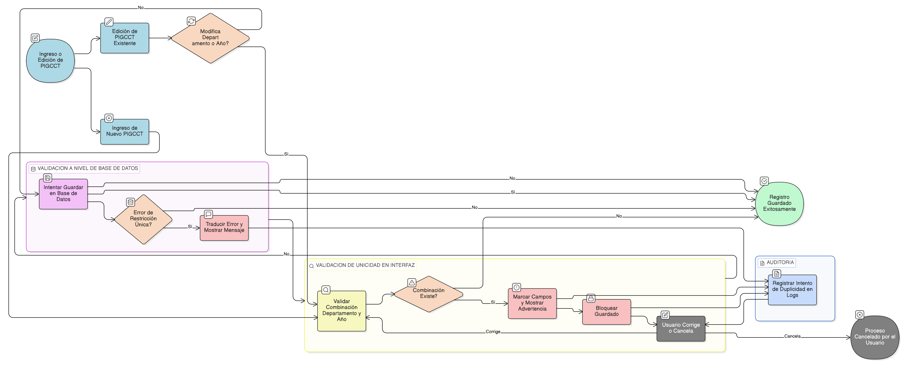

# HU-PIGCCT-SYM-002  
## Épica: Administración de la tabla maestra de PIGCCT  
### Validar unicidad del PIGCCT por departamento y año

---

## DESCRIPCIÓN HISTORIA DE USUARIO

> **Como:** administrador del sistema.  
> **Quiero:** que el sistema valide automáticamente la unicidad del PIGCCT por departamento y año.  
> **Para:** evitar la duplicación de planes y garantizar la consistencia, integridad y confiabilidad de la información registrada en la tabla maestra de PIGCCT.

---

## CRITERIOS DE ACEPTACIÓN

### 1. Validación automática de unicidad
1.1 El sistema debe validar que no exista más de un PIGCCT con la misma combinación **departamento + año**.  
1.2 La validación debe ejecutarse tanto:
- Durante el registro de un nuevo PIGCCT.
- Durante la edición de un PIGCCT existente cuando se modifique el departamento o el año.

### 2. Validación en tiempo real
2.1 El sistema debe realizar la validación de unicidad de forma inmediata al diligenciar o modificar los campos **departamento** y **año**.  
2.2 Si se detecta un registro existente con la misma combinación, el sistema debe:
- Marcar visualmente los campos involucrados.
- Mostrar un mensaje de advertencia claro e informativo.

### 3. Prevención del guardado de duplicados
3.1 El sistema debe bloquear la opción de guardar cuando exista un conflicto de unicidad.  
3.2 No debe permitirse la creación ni actualización de registros que violen la regla de unicidad.

### 4. Mensajes al usuario
4.1 El mensaje de error debe indicar explícitamente:
- El departamento.
- El año.
- Que ya existe un PIGCCT registrado con esa combinación.

4.2 El mensaje debe orientar al usuario a:
- Consultar el PIGCCT existente.
- Modificar el año o departamento si corresponde.

### 5. Validación a nivel de base de datos
5.1 La unicidad debe reforzarse mediante una **restricción única (UNIQUE)** o índice único a nivel de base de datos sobre los campos:
- `departamento_id`
- `anio`

5.2 El sistema debe manejar adecuadamente los errores provenientes de la base de datos y traducirlos en mensajes comprensibles para el usuario.

### 6. Consideraciones para registros históricos
6.1 La validación debe aplicarse independientemente del estado del PIGCCT (Activo o Inactivo).  
6.2 No se debe permitir duplicidad incluso si uno de los registros se encuentra inactivo, con el fin de preservar la trazabilidad histórica.

### 7. Auditoría y trazabilidad
7.1 Cuando se presente un intento de duplicación, el sistema debe registrar el evento en los logs de auditoría indicando:
- Usuario.
- Fecha y hora.
- Valores de departamento y año involucrados.

---

### Resultado esperado

El sistema garantiza que **exista un único PIGCCT por departamento y año**, evitando duplicidades, asegurando la integridad de la información y fortaleciendo la confiabilidad del módulo de administración del PIGCCT.

---

## DIAGRAMA DE SECUENCIA

## DIAGRAMA DE FLUJO DEL PROCESO

## PROTOTIPO PRELIMINAR

