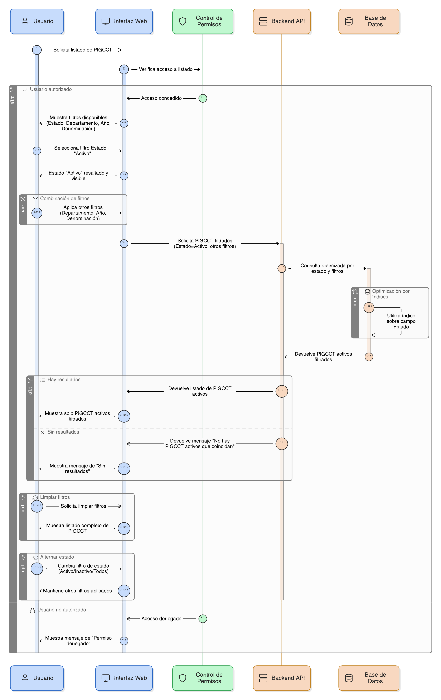
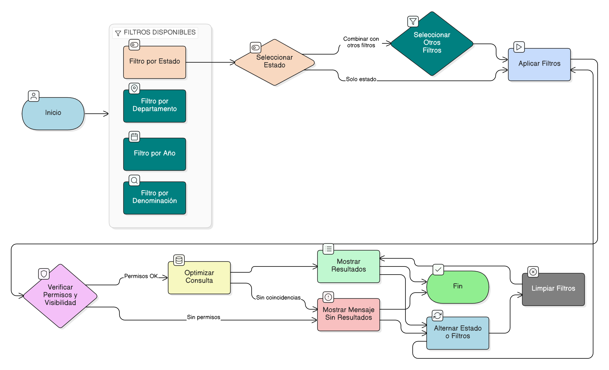

# HU-PIGCCT-SYM-005  
## Épica: Administración de la tabla maestra de PIGCCT  
### Filtrar PIGCCT activos

---

## DESCRIPCIÓN HISTORIA DE USUARIO

> **Como:** usuario del sistema.  
> **Quiero:** filtrar el listado de PIGCCT para visualizar únicamente aquellos que se encuentren en estado **Activo**.  
> **Para:** trabajar exclusivamente con información vigente y relevante para la gestión, seguimiento y toma de decisiones.

---

## CRITERIOS DE ACEPTACIÓN

### 1. Disponibilidad del filtro por estado
1.1 El sistema debe incluir un filtro por **Estado del PIGCCT** en la vista de listado.  
1.2 El filtro debe permitir seleccionar como mínimo las opciones:
- Todos
- Activo
- Inactivo

### 2. Aplicación del filtro de PIGCCT activos
2.1 Al seleccionar la opción **Activo**, el sistema debe mostrar únicamente los PIGCCT cuyo estado sea activo.  
2.2 El filtrado debe aplicarse de forma inmediata o al confirmar la acción, sin necesidad de recargar completamente la página.

### 3. Combinación con otros filtros
3.1 El filtro por estado **Activo** debe poder combinarse con otros filtros disponibles, tales como:
- Departamento.
- Año del PIGCCT.
- Búsqueda por denominación del plan.

### 4. Comportamiento del filtro
4.1 El sistema debe permitir limpiar el filtro y retornar al listado completo de PIGCCT.  
4.2 Si no existen PIGCCT activos que coincidan con los filtros aplicados, el sistema debe mostrar un mensaje indicando que no hay resultados.

### 5. Control de visibilidad y permisos
5.1 Todos los usuarios con acceso al listado deben poder aplicar el filtro de PIGCCT activos.  
5.2 El filtrado debe respetar las reglas de visibilidad y permisos definidas por rol.

### 6. Rendimiento y optimización
6.1 El sistema debe optimizar la consulta utilizando índices sobre el campo de estado del PIGCCT.  
6.2 El rendimiento debe ser adecuado incluso con un alto volumen de registros históricos.

### 7. Usabilidad y experiencia de usuario
7.1 El filtro debe ser claro, intuitivo y consistente con el diseño general del sistema.  
7.2 El estado seleccionado debe permanecer visible mientras el filtro esté activo.  
7.3 El sistema debe permitir alternar entre estados sin perder los filtros previamente aplicados.

---

### Resultado esperado

El usuario puede **visualizar exclusivamente los PIGCCT activos**, asegurando que las operaciones y análisis se realicen únicamente sobre planes vigentes y fortaleciendo la eficiencia en la gestión del PIGCCT.

---

## DIAGRAMA DE SECUENCIA

## DIAGRAMA DE FLUJO DEL PROCESO

## PROTOTIPO PRELIMINAR

