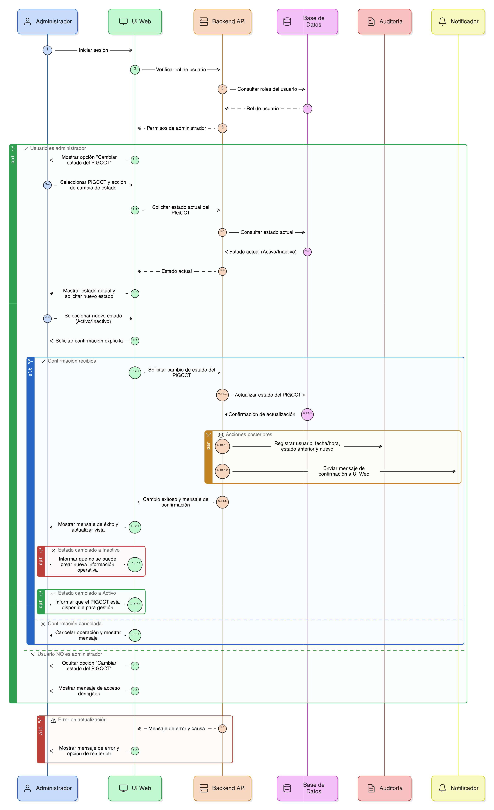
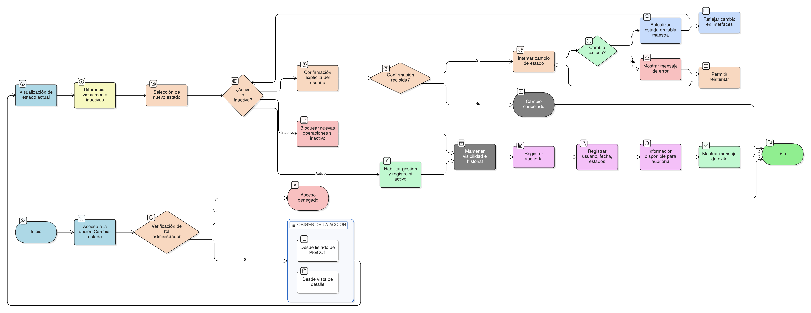

# HU-PIGCCT-SYM-007  
## Épica: Administración de la tabla maestra de PIGCCT  
### Actualizar estado del PIGCCT

---

## DESCRIPCIÓN HISTORIA DE USUARIO

> **Como:** administrador del sistema.  
> **Quiero:** actualizar el estado de un PIGCCT (activar o desactivar).  
> **Para:** controlar su vigencia operativa sin eliminar información histórica ni afectar la trazabilidad del plan.

---

## CRITERIOS DE ACEPTACIÓN

### 1. Acceso a la actualización de estado
1.1 El sistema debe permitir la opción **“Cambiar estado del PIGCCT”** únicamente a usuarios con rol de **administrador**.  
1.2 La opción debe estar disponible desde:
- El listado de PIGCCT (acción por registro).
- La vista de detalle del PIGCCT.

### 2. Estados del PIGCCT
2.1 El sistema debe manejar como mínimo los siguientes estados:
- **Activo**
- **Inactivo**

2.2 El estado actual del PIGCCT debe mostrarse de forma clara en el listado y en la vista de detalle.

### 3. Cambio de estado
3.1 El administrador debe poder cambiar el estado de:
- Activo → Inactivo.
- Inactivo → Activo.

3.2 Antes de confirmar el cambio, el sistema debe solicitar confirmación explícita al usuario.

### 4. Efectos del cambio de estado
4.1 Cuando un PIGCCT se encuentra en estado **Inactivo**:
- No debe permitir la creación de nueva información operativa asociada (ejes, medidas, indicadores, acciones).
- Debe conservar toda la información histórica registrada.
- Debe seguir siendo visible en los listados y consultas.

4.2 Cuando un PIGCCT se reactiva:
- Debe volver a estar disponible para la gestión y registro de información asociada.

### 5. Persistencia y actualización
5.1 Al confirmar el cambio, el sistema debe actualizar el estado del PIGCCT en la tabla maestra.  
5.2 El cambio de estado debe reflejarse inmediatamente en el listado y vistas relacionadas.

### 6. Auditoría y trazabilidad
6.1 El sistema debe registrar automáticamente:
- Usuario que realizó el cambio de estado.
- Fecha y hora del cambio.
- Estado anterior y nuevo estado.

6.2 Esta información debe quedar disponible para fines de auditoría y control institucional.

### 7. Mensajes y retroalimentación
7.1 El sistema debe mostrar un mensaje de confirmación exitoso al completar el cambio de estado.  
7.2 En caso de error, el sistema debe informar claramente la causa y permitir reintentar la operación.

### 8. Usabilidad y experiencia de usuario
8.1 La acción de cambio de estado debe ser clara y accesible.  
8.2 El sistema debe diferenciar visualmente los PIGCCT inactivos en los listados.  
8.3 El sistema debe prevenir cambios accidentales mediante confirmaciones.

---

### Resultado esperado

El administrador puede **activar o desactivar un PIGCCT de forma controlada**, asegurando la gestión de su vigencia sin pérdida de información histórica y manteniendo la integridad y trazabilidad del sistema.

---

## DIAGRAMA DE SECUENCIA

## DIAGRAMA DE FLUJO DEL PROCESO

## PROTOTIPO PRELIMINAR

