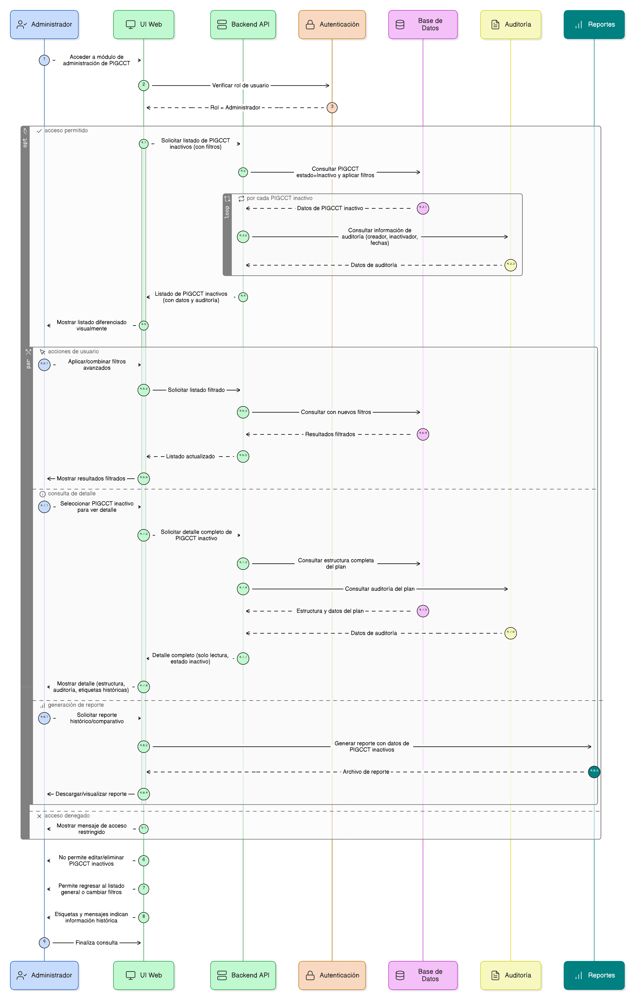
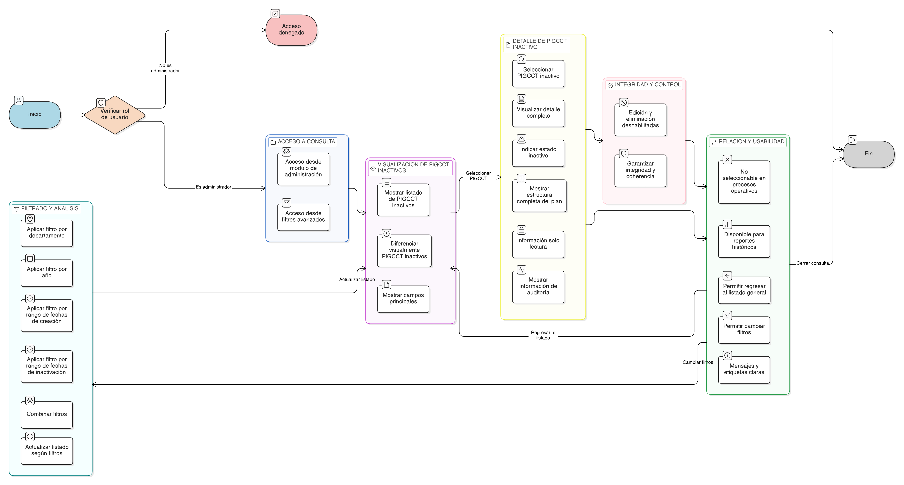

# HU-PIGCCT-SYM-009  
## Épica: Administración de la tabla maestra de PIGCCT  
### Conservar historial de planes (Consulta de PIGCCT inactivos)

---

## DESCRIPCIÓN HISTORIA DE USUARIO

> **Como:** administrador del sistema.  
> **Quiero:** consultar PIGCCT inactivos.  
> **Para:** realizar análisis históricos, comparativos y de trazabilidad de los planes departamentales.

---

## CRITERIOS DE ACEPTACIÓN

### 1. Acceso a la consulta histórica
1.1 El sistema debe permitir únicamente a usuarios con rol de **administrador** acceder a la consulta de PIGCCT inactivos.  
1.2 La opción debe estar disponible desde:
- El módulo de administración de PIGCCT.
- Los filtros avanzados del listado general.

### 2. Visualización de PIGCCT inactivos
2.1 El sistema debe mostrar un listado de todos los PIGCCT con estado **Inactivo**.  
2.2 Cada registro debe mostrar como mínimo:
- Nombre o denominación del PIGCCT.
- Departamento.
- Año de vigencia.
- Estado (Inactivo).
- Fecha de creación.
- Fecha de inactivación.

### 3. Filtros para análisis histórico
3.1 El sistema debe permitir filtrar los PIGCCT inactivos por:
- Departamento.
- Año.
- Rango de fechas de creación.
- Rango de fechas de inactivación.

3.2 El sistema debe permitir combinar filtros para facilitar análisis comparativos.

### 4. Consulta de detalle histórico
4.1 El administrador debe poder acceder al **detalle completo** de un PIGCCT inactivo.  
4.2 En la vista de detalle:
- Toda la información debe ser de solo lectura.
- Debe indicarse claramente que el PIGCCT se encuentra **Inactivo**.
- Debe conservarse la estructura completa del plan (ejes, medidas, indicadores, acciones y seguimientos).

### 5. Integridad y trazabilidad de la información
5.1 La información asociada a un PIGCCT inactivo no debe poder ser editada ni eliminada.  
5.2 El sistema debe garantizar la integridad de los datos históricos y su coherencia con el estado del plan.

### 6. Auditoría y control
6.1 El sistema debe permitir visualizar la información de auditoría asociada al PIGCCT:
- Usuario que creó el plan.
- Usuario que lo inactivó.
- Fecha y hora de creación.
- Fecha y hora de inactivación.

6.2 La información debe estar disponible para fines de control institucional y seguimiento.

### 7. Relación con otros módulos
7.1 Los PIGCCT inactivos:
- No deben ser seleccionables en procesos operativos del sistema.
- Sí deben estar disponibles para reportes históricos y comparativos.

### 8. Usabilidad y experiencia de usuario
8.1 El sistema debe diferenciar visualmente los PIGCCT inactivos en los listados.  
8.2 El sistema debe permitir regresar fácilmente al listado general o cambiar filtros.  
8.3 Los mensajes y etiquetas deben indicar claramente que la información es histórica.

---

### Resultado esperado

El administrador puede **consultar, filtrar y analizar PIGCCT inactivos**, manteniendo la integridad, trazabilidad y disponibilidad de la información histórica para procesos de evaluación y comparación.

---

## DIAGRAMA DE SECUENCIA

## DIAGRAMA DE FLUJO DEL PROCESO

## PROTOTIPO PRELIMINAR

