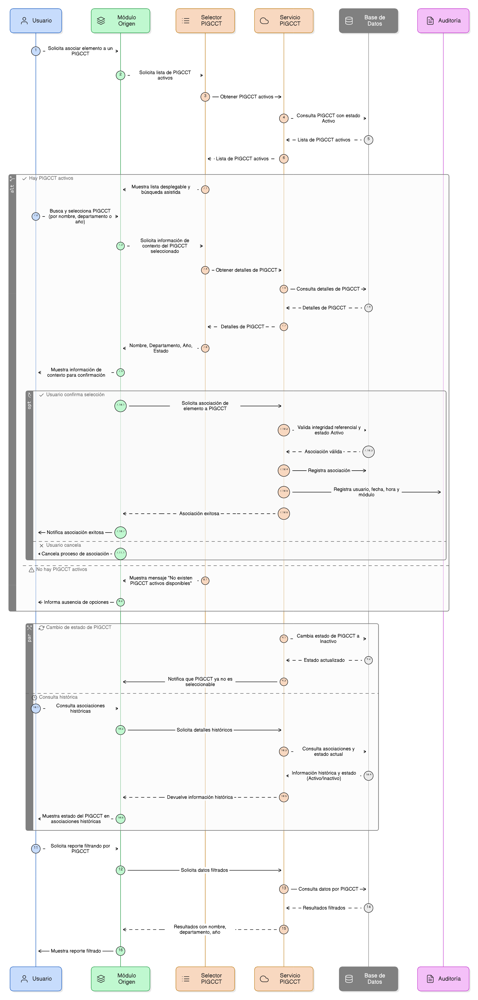
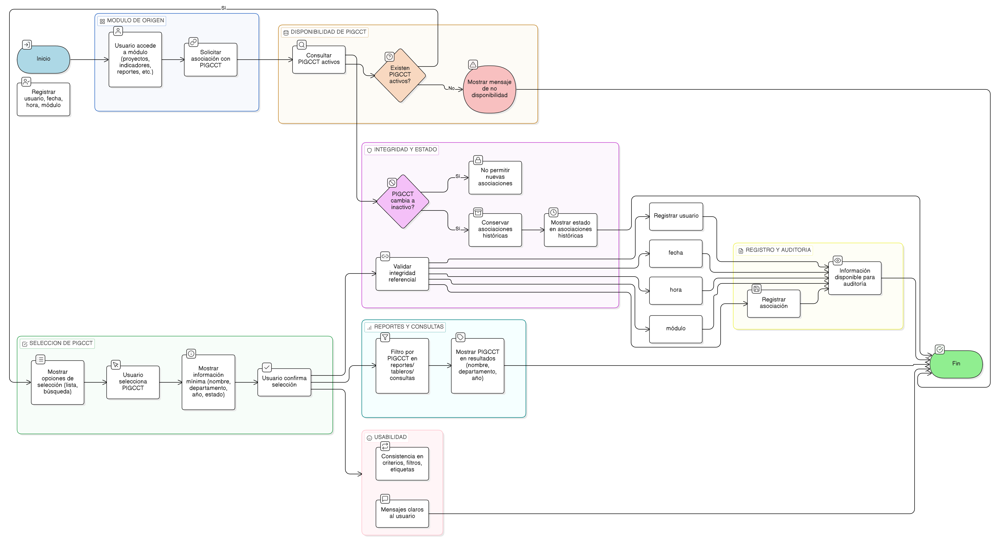

# HU-PIGCCT-SYM-011  
## Épica: Administración de la tabla maestra de PIGCCT  
### Uso del PIGCCT en otros módulos

---

## DESCRIPCIÓN HISTORIA DE USUARIO

> **Como:** usuario del sistema.  
> **Quiero:** seleccionar un PIGCCT desde otros módulos del sistema.  
> **Para:** asociar proyectos, indicadores, reportes u otros elementos al plan de gestión de cambio climático correspondiente.

---

## CRITERIOS DE ACEPTACIÓN

### 1. Disponibilidad del PIGCCT como entidad transversal
1.1 El sistema debe exponer el PIGCCT como una **entidad transversal** reutilizable en los distintos módulos.  
1.2 La selección del PIGCCT debe estar disponible en módulos como:
- Gestión de proyectos.
- Gestión de indicadores.
- Seguimiento y monitoreo.
- Reportes y análisis.

### 2. Selección controlada del PIGCCT
2.1 El sistema debe permitir seleccionar el PIGCCT mediante:
- Lista desplegable.
- Búsqueda asistida por nombre, departamento o año.

2.2 Solo deben estar disponibles para selección los **PIGCCT activos**.  
2.3 Los PIGCCT inactivos no deben aparecer como opción seleccionable.

### 3. Información visible al seleccionar un PIGCCT
3.1 Al seleccionar un PIGCCT, el sistema debe mostrar información mínima de contexto:
- Nombre del PIGCCT.
- Departamento.
- Año.
- Estado (Activo).

3.2 Esta información debe ayudar al usuario a confirmar que está asociando el elemento al plan correcto.

### 4. Integridad referencial entre módulos
4.1 El sistema debe garantizar la integridad referencial entre los módulos y la tabla maestra de PIGCCT.  
4.2 La base de datos debe implementar claves foráneas o validaciones equivalentes para asegurar relaciones válidas.

### 5. Comportamiento ante cambios de estado
5.1 Si un PIGCCT cambia a estado **Inactivo**:
- No debe poder ser seleccionado para nuevas asociaciones.
- Las asociaciones existentes deben conservarse para fines históricos y de trazabilidad.

5.2 El sistema debe mostrar el estado del PIGCCT en las asociaciones existentes cuando se consulte información histórica.

### 6. Uso en reportes y consultas
6.1 El sistema debe permitir utilizar el PIGCCT como criterio de filtrado en:
- Reportes.
- Tableros de control.
- Consultas analíticas.

6.2 El PIGCCT debe ser identificable claramente en los resultados (nombre, departamento, año).

### 7. Auditoría y trazabilidad
7.1 El sistema debe registrar:
- Qué usuario realizó la asociación.
- Fecha y hora de la asociación.
- Módulo desde el cual se realizó.

7.2 La información debe estar disponible para procesos de seguimiento, control y auditoría.

### 8. Usabilidad y experiencia de usuario
8.1 La selección del PIGCCT debe ser consistente en todos los módulos (mismos criterios, filtros y etiquetas).  
8.2 El sistema debe mostrar mensajes claros cuando no existan PIGCCT activos disponibles para selección.

---

### Resultado esperado

Los usuarios pueden **seleccionar de forma controlada un PIGCCT activo desde otros módulos**, asegurando asociaciones correctas, integridad referencial y trazabilidad de la información en todo el sistema.

---

## DIAGRAMA DE SECUENCIA

## DIAGRAMA DE FLUJO DEL PROCESO

