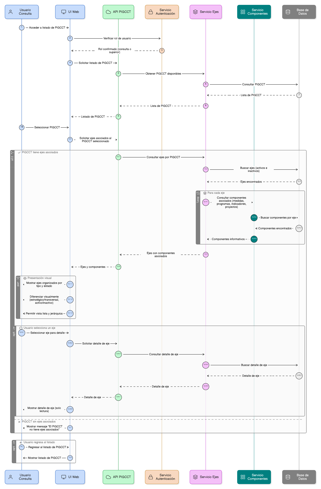

# HU-PIGCCT-SYM-015  
## Épica: Administración de ejes del PIGCCT  
### Consultar ejes de un PIGCCT

---

## DESCRIPCIÓN HISTORIA DE USUARIO

> **Como:** usuario de consulta.  
> **Quiero:** visualizar los ejes asociados a un PIGCCT.  
> **Para:** comprender la estructura estratégica y transversal del plan territorial de gestión de cambio climático.

---

## CRITERIOS DE ACEPTACIÓN

### 1. Acceso a la consulta
1.1 El sistema debe permitir a usuarios con rol de **consulta** y roles superiores visualizar los ejes de un PIGCCT.  
1.2 La funcionalidad debe estar disponible desde:
- El listado de PIGCCT.
- La vista de detalle de un PIGCCT.

### 2. Selección del PIGCCT
2.1 El usuario debe poder seleccionar un PIGCCT desde un listado o buscador.  
2.2 El sistema debe permitir consultar ejes de PIGCCT **activos e inactivos** en modo solo lectura.

### 3. Visualización de ejes asociados
3.1 El sistema debe mostrar todos los ejes asociados al PIGCCT seleccionado.  
3.2 Cada eje debe mostrar como mínimo:
- Nombre del eje.
- Descripción.
- Tipo de eje (estratégico o transversal).
- Estado (activo/inactivo).

### 4. Organización y presentación
4.1 Los ejes deben presentarse organizados por:
- Tipo de eje (estratégico / transversal).
- Estado.

4.2 El sistema debe permitir:
- Vista en lista.
- Vista jerárquica o agrupada (si aplica al diseño del sistema).

### 5. Diferenciación visual
5.1 El sistema debe diferenciar visualmente:
- Ejes estratégicos vs transversales.
- Ejes activos vs inactivos.

5.2 La diferenciación puede realizarse mediante:
- Etiquetas.
- Íconos.
- Colores.

### 6. Consulta de detalle del eje
6.1 El usuario debe poder seleccionar un eje para visualizar su detalle.  
6.2 La vista de detalle debe ser de **solo lectura** e incluir:
- Información general del eje.
- PIGCCT al que pertenece.
- Estado y alcance.

### 7. Relación con otros componentes del plan
7.1 El sistema debe permitir visualizar, de forma informativa, los componentes asociados al eje (si existen), tales como:
- Medidas.
- Programas.
- Indicadores.
- Proyectos.

7.2 Esta información debe ser solo informativa, sin permitir edición desde el perfil de consulta.

### 8. Usabilidad y experiencia de usuario
8.1 El sistema debe mostrar mensajes claros cuando:
- El PIGCCT no tenga ejes asociados.
- No existan ejes activos.

8.2 El sistema debe permitir regresar fácilmente al listado de PIGCCT.

---

### Resultado esperado

El usuario puede **consultar y comprender la estructura de ejes de un PIGCCT**, identificando su alcance, estado y relación con otros componentes del plan, en un entorno de solo lectura y fácil navegación.

---

## DIAGRAMA DE SECUENCIA

## DIAGRAMA DE FLUJO DEL PROCESO

