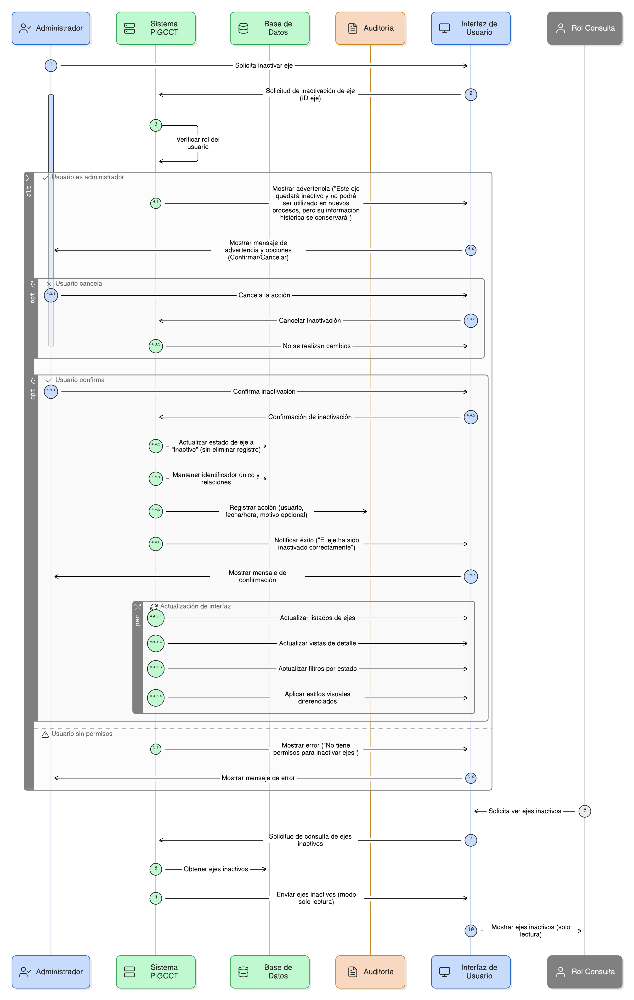
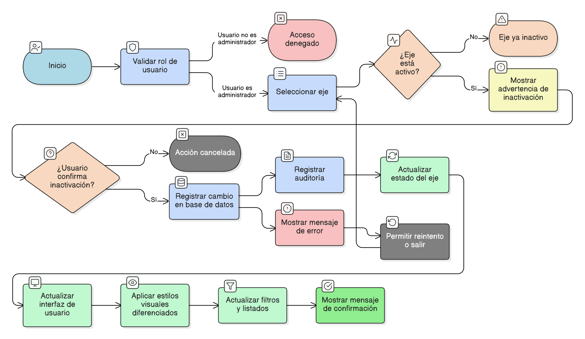

# HU-PIGCCT-SYM-020  
## Épica: Administración de ejes del PIGCCT  
### Inactivar eje sin eliminarlo

---

## DESCRIPCIÓN HISTORIA DE USUARIO

> **Como:** usuario administrador.  
> **Quiero:** marcar un eje del PIGCCT como inactivo sin eliminarlo del sistema.  
> **Para:** conservar la trazabilidad histórica del plan y permitir análisis retrospectivos de su estructura.

---

## CRITERIOS DE ACEPTACIÓN

### 1. Permisos y acceso
1.1 El sistema debe permitir inactivar ejes **únicamente** a usuarios con rol de **administrador**.  
1.2 Los usuarios con rol de consulta deben visualizar los ejes inactivos solo en modo lectura.

### 2. Comportamiento de la inactivación
2.1 La acción de inactivar un eje:
- No debe eliminar el registro de la base de datos.
- No debe eliminar ni alterar su información histórica.
- No debe romper relaciones existentes con otros componentes del PIGCCT.

2.2 El identificador único del eje debe mantenerse sin cambios.

### 3. Reglas de negocio
3.1 Un eje inactivo:
- No debe estar disponible para selección en nuevos registros, asociaciones o reportes operativos.
- Sí debe estar disponible para consultas históricas, auditorías y análisis comparativos.

3.2 El sistema debe diferenciar claramente entre:
- Ejes activos.
- Ejes inactivos.

### 4. Confirmación de la acción
4.1 Antes de confirmar la inactivación, el sistema debe mostrar un mensaje de advertencia al usuario administrador, por ejemplo:
> “Este eje quedará inactivo y no podrá ser utilizado en nuevos procesos, pero su información histórica se conservará”.

4.2 El usuario debe poder cancelar la acción sin que se realicen cambios.

### 5. Persistencia y auditoría
5.1 El sistema debe registrar el cambio de estado en la base de datos.  
5.2 El sistema debe almacenar, cuando aplique:
- Usuario que realizó la inactivación.
- Fecha y hora.
- Motivo de la inactivación (opcional).

### 6. Actualización de la interfaz
6.1 Una vez inactivado el eje, el sistema debe reflejar el cambio de estado de forma inmediata en:
- Listados de ejes.
- Vistas de detalle.
- Filtros por estado.

6.2 El sistema debe aplicar estilos visuales diferenciados para ejes inactivos.

### 7. Mensajes al usuario
7.1 El sistema debe mostrar un mensaje de confirmación al completar la acción, por ejemplo:
> “El eje ha sido inactivado correctamente”.

7.2 En caso de error, el sistema debe mostrar mensajes claros y orientados a la corrección.

---

### Resultado esperado

El usuario administrador puede **inactivar un eje del PIGCCT sin eliminarlo**, garantizando la conservación de la información histórica, la trazabilidad del plan y la integridad del sistema.

---

## DIAGRAMA DE SECUENCIA

## DIAGRAMA DE FLUJO DEL PROCESO

