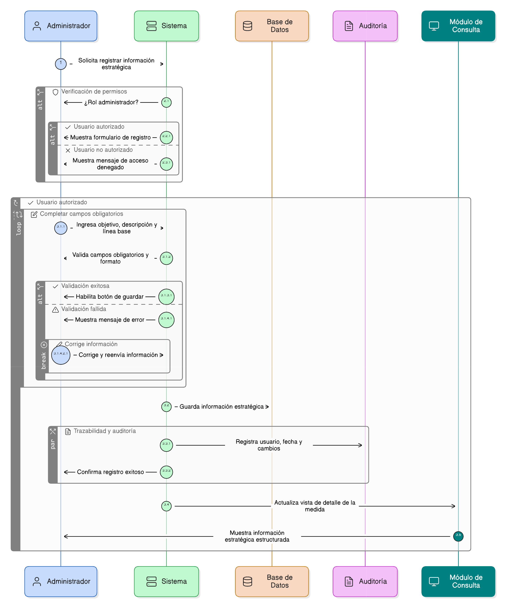
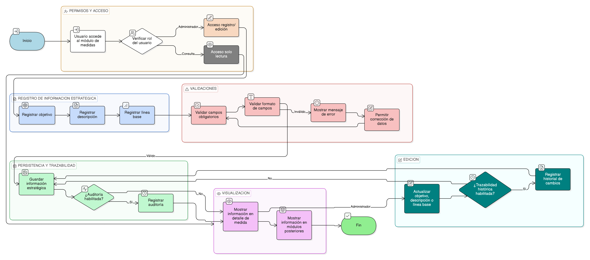

# HU-PIGCCT-SYM-026  
## Épica: Administración de medidas del PIGCCT  
### Registrar información estratégica de la medida

---

## DESCRIPCIÓN HISTORIA DE USUARIO

> **Como:** usuario administrador.  
> **Quiero:** registrar la información estratégica de una medida del PIGCCT.  
> **Para:** documentar claramente su propósito, alcance conceptual y estado inicial, facilitando el seguimiento, evaluación y análisis del plan.

---

## CAMPOS ESTRATÉGICOS DE LA MEDIDA

La información estratégica mínima que debe permitir registrar el sistema es:

- **Objetivo de la medida**  
- **Descripción de la medida**  
- **Línea base**

## CRITERIOS DE ACEPTACIÓN

### 1. Permisos y acceso
1.1 Solo los usuarios con rol de **administrador** pueden registrar o editar la información estratégica de la medida.  
1.2 Los usuarios de consulta pueden visualizar esta información en modo lectura.

### 2. Registro del objetivo
2.1 El sistema debe permitir registrar un **objetivo claro y concreto** para la medida.  
2.2 El campo objetivo debe ser obligatorio.  
2.3 El sistema debe definir una longitud máxima del texto (configurable).

### 3. Registro de la descripción
3.1 El sistema debe permitir registrar una **descripción detallada** de la medida.  
3.2 La descripción debe explicar:
- Qué busca la medida.
- Qué tipo de acciones contempla.
- Su relación con el eje y el PIGCCT.

3.3 El campo descripción debe ser obligatorio.

### 4. Registro de la línea base
4.1 El sistema debe permitir registrar la **línea base**, entendida como el estado inicial de la medida antes de su implementación.  
4.2 La línea base puede incluir:
- Texto descriptivo.
- Valores cuantitativos o cualitativos (según corresponda).

4.3 El campo línea base puede ser obligatorio o opcional según configuración del sistema.

### 5. Validaciones
5.1 El sistema debe validar que los campos obligatorios estén diligenciados antes de guardar.  
5.2 El sistema debe mostrar mensajes claros cuando:
- Falte información requerida.
- El formato no sea válido.

### 6. Persistencia y trazabilidad
6.1 El sistema debe almacenar la información estratégica asociada a la medida.  
6.2 Si el sistema cuenta con auditoría:
- Debe registrar fecha, usuario y cambios realizados sobre estos campos.

### 7. Visualización de la información estratégica
7.1 La información estratégica debe visualizarse en:
- Vista de detalle de la medida.
- Módulos posteriores que consuman medidas (indicadores, reportes, seguimiento).

7.2 El sistema debe presentar esta información de forma clara y estructurada.

### 8. Edición de la información estratégica
8.1 El usuario administrador debe poder actualizar el objetivo, descripción o línea base.  
8.2 El sistema debe conservar trazabilidad histórica si la funcionalidad está habilitada.

---

### Resultado esperado

El sistema permite **documentar de manera estructurada la información estratégica de cada medida del PIGCCT**, asegurando claridad sobre su objetivo, descripción y estado inicial, y fortaleciendo los procesos de planificación, seguimiento y evaluación.

---

## DIAGRAMA DE SECUENCIA

## DIAGRAMA DE FLUJO DEL PROCESO

