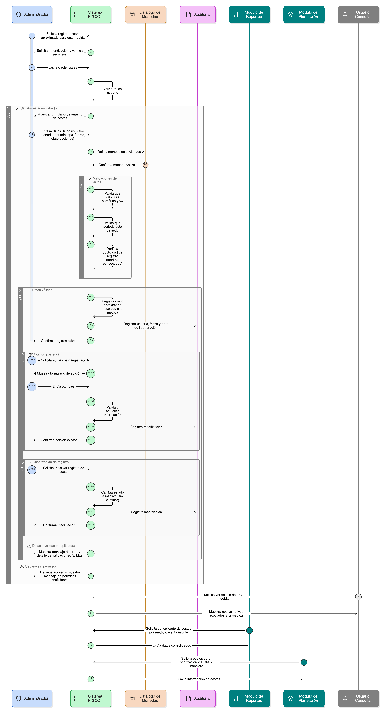
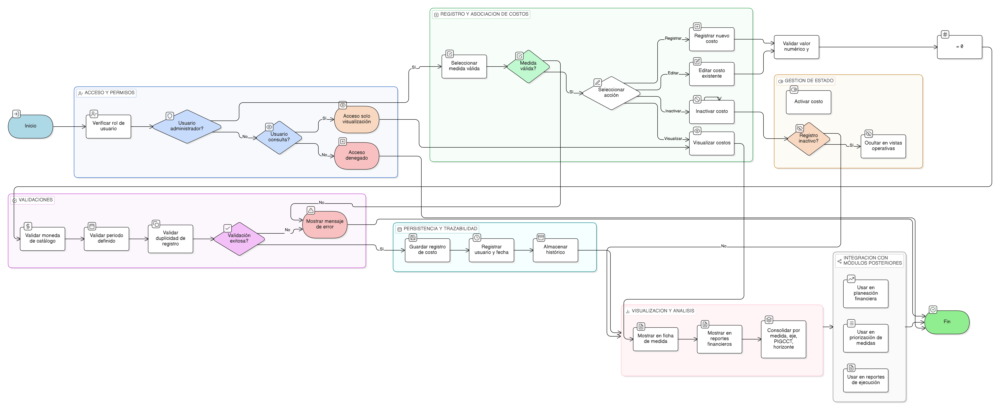

# HU-PIGCCT-SYM-031  
## Épica: Administración de medidas del PIGCCT  
### Registrar costos aproximados

---

## DESCRIPCIÓN HISTORIA DE USUARIO

> **Como:** usuario administrador.  
> **Quiero:** registrar los costos aproximados asociados a una medida del PIGCCT.  
> **Para:** facilitar la planeación presupuestal, la priorización de inversiones y el análisis financiero del plan.

---

## CRITERIOS DE ACEPTACIÓN

### 1. Permisos y acceso
1.1 Solo los usuarios con rol **administrador** pueden registrar, editar o inactivar información de costos.  
1.2 Los usuarios de consulta pueden visualizar los costos registrados.

### 2. Asociación con la medida
2.1 El sistema debe permitir registrar costos únicamente para **medidas válidas** del PIGCCT.  
2.2 Cada registro de costos debe estar asociado a una única medida.  
2.3 Una medida puede tener uno o varios registros de costos, según el periodo u horizonte definido.

### 3. Información de costos aproximados
El sistema debe permitir registrar, como mínimo, la siguiente información:

- **Valor del costo estimado** (obligatorio).  
- **Moneda** (ej. COP, USD) (obligatorio).  
- **Periodo o horizonte de inversión** (ej. corto, mediano, largo plazo; anual; total del plan) (obligatorio).

Campos adicionales (opcional según diseño):
- Tipo de costo (inversión, operación, mantenimiento).
- Fuente de financiación.
- Observaciones o supuestos financieros.

### 4. Validaciones
4.1 El sistema debe validar que:
- El valor del costo sea numérico y mayor o igual a cero.  
- La moneda corresponda a un catálogo definido.  
- El periodo u horizonte esté definido.

4.2 El sistema debe evitar registros duplicados de costos para la misma medida, periodo y tipo de costo, si la regla de negocio lo establece.

### 5. Edición y gestión del estado
5.1 El usuario administrador debe poder editar la información de costos registrada.  
5.2 El sistema debe permitir **activar o inactivar** un registro de costos sin eliminarlo, para conservar trazabilidad histórica.  
5.3 Los registros inactivos no deben mostrarse por defecto en vistas operativas.

### 6. Visualización y análisis
6.1 El sistema debe mostrar los costos aproximados en:
- La ficha de detalle de la medida.
- Reportes financieros y presupuestales.

6.2 La información debe poder consolidarse para análisis por:
- Medida.
- Eje.
- PIGCCT.
- Horizonte temporal.

### 7. Persistencia y trazabilidad
7.1 El sistema debe almacenar el histórico de costos registrados.  
7.2 Si existe auditoría, se debe registrar:
- Usuario que realiza el registro o modificación.
- Fecha y hora del cambio.

### 8. Uso en módulos posteriores
8.1 Los costos aproximados deben ser utilizados en:
- Módulos de planeación financiera.
- Priorización de medidas.
- Reportes de ejecución presupuestal.

---

### Resultado esperado

El sistema permite **estimar y analizar los costos asociados a cada medida del PIGCCT**, apoyando la toma de decisiones financieras y la planificación eficiente de recursos para la implementación del plan.

---
   
## DIAGRAMA DE SECUENCIA

## DIAGRAMA DE FLUJO DEL PROCESO

