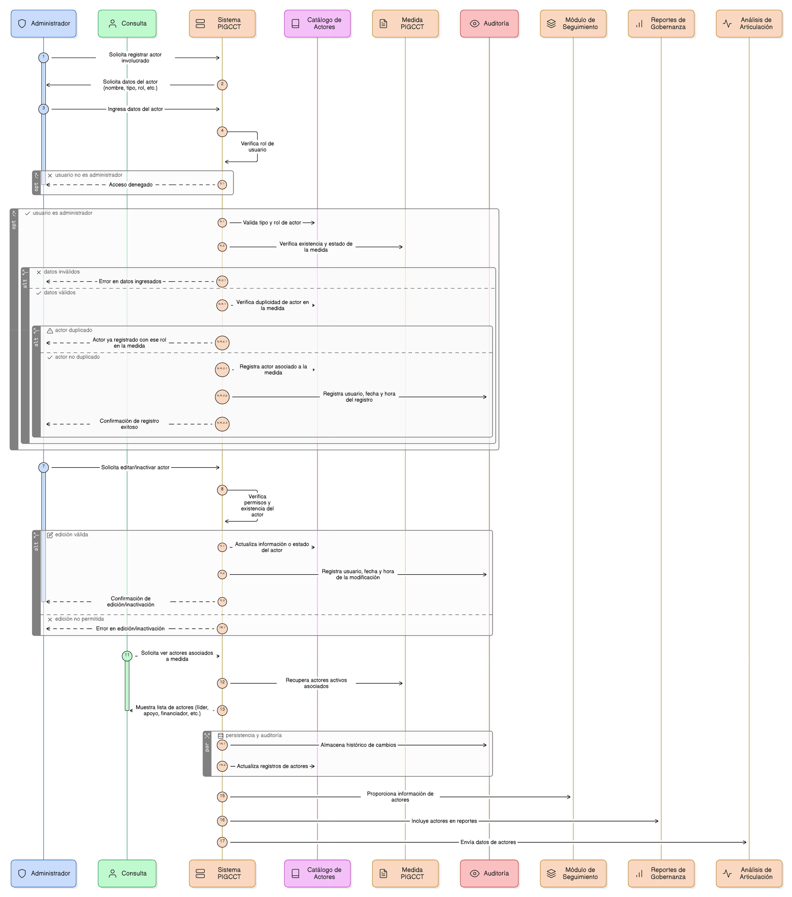
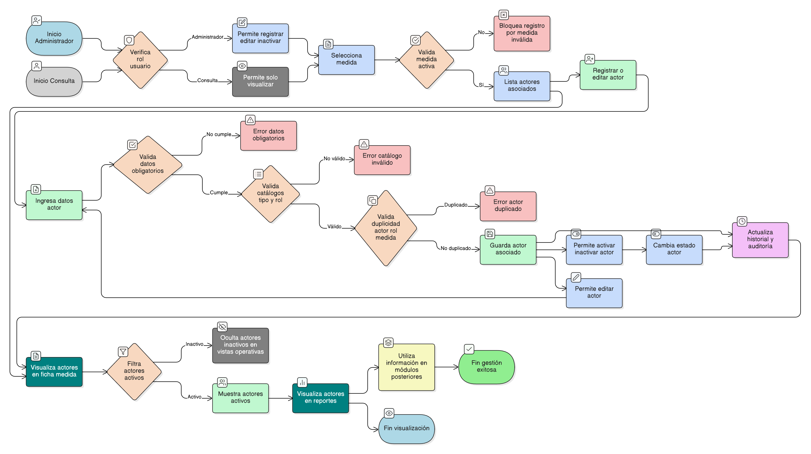

# HU-PIGCCT-SYM-032  
## Épica: Administración de medidas del PIGCCT  
### Registrar actores involucrados

---

## DESCRIPCIÓN HISTORIA DE USUARIO

> **Como:** usuario administrador.  
> **Quiero:** registrar e identificar los actores involucrados en la implementación de una medida del PIGCCT.  
> **Para:** coordinar la gestión interinstitucional, definir responsabilidades y fortalecer la articulación entre entidades y actores clave.

---

## CRITERIOS DE ACEPTACIÓN

### 1. Permisos y acceso
1.1 Solo los usuarios con rol **administrador** pueden registrar, editar o inactivar actores involucrados.  
1.2 Los usuarios de consulta pueden visualizar los actores asociados a la medida.

### 2. Asociación con la medida
2.1 El sistema debe permitir asociar actores únicamente a **medidas válidas** del PIGCCT.  
2.2 Una medida puede tener uno o varios actores involucrados.  
2.3 Un mismo actor puede estar asociado a múltiples medidas.

### 3. Información de los actores involucrados
El sistema debe permitir registrar, como mínimo, la siguiente información para cada actor:

- **Nombre del actor o entidad** (obligatorio).  
- **Tipo de actor** (ej. entidad pública, privada, academia, comunidad, ONG, cooperación internacional) (obligatorio).  
- **Rol en la medida** (ej. líder, coejecutor, apoyo, financiador, articulador) (obligatorio).

Campos adicionales (opcional según diseño):
- Nivel de participación (nacional, departamental, municipal, comunitario).
- Datos de contacto institucional.
- Observaciones.

### 4. Validaciones
4.1 El sistema debe validar que:
- El nombre del actor no esté vacío.
- El tipo de actor y rol correspondan a catálogos definidos.
- La medida asociada exista y esté activa.

4.2 El sistema debe evitar duplicar el mismo actor con el mismo rol dentro de una misma medida, si la regla de negocio así lo define.

### 5. Gestión del estado
5.1 El usuario administrador debe poder **editar** la información del actor asociado a la medida.  
5.2 El sistema debe permitir **activar o inactivar** un actor dentro de la medida sin eliminar el registro.  
5.3 Los actores inactivos no deben mostrarse por defecto en vistas operativas.

### 6. Visualización y coordinación
6.1 El sistema debe mostrar los actores involucrados en:
- La ficha de detalle de la medida.
- Reportes de gobernanza y articulación institucional.

6.2 La visualización debe permitir identificar claramente:
- Actores líderes.
- Actores de apoyo.
- Actores financiadores.

### 7. Persistencia y trazabilidad
7.1 El sistema debe almacenar el histórico de actores asociados a cada medida.  
7.2 Si existe auditoría, se debe registrar:
- Usuario que realiza el registro o modificación.
- Fecha y hora del cambio.

### 8. Uso en módulos posteriores
8.1 La información de actores involucrados debe ser utilizada en:
- Módulos de seguimiento a la implementación.
- Reportes de gobernanza del PIGCCT.
- Análisis de articulación interinstitucional.

---

### Resultado esperado

El sistema permite **identificar y gestionar claramente los actores involucrados en cada medida del PIGCCT**, fortaleciendo la coordinación interinstitucional, la asignación de responsabilidades y la efectividad en la implementación del plan.

---
   
## DIAGRAMA DE SECUENCIA

## DIAGRAMA DE FLUJO DEL PROCESO

