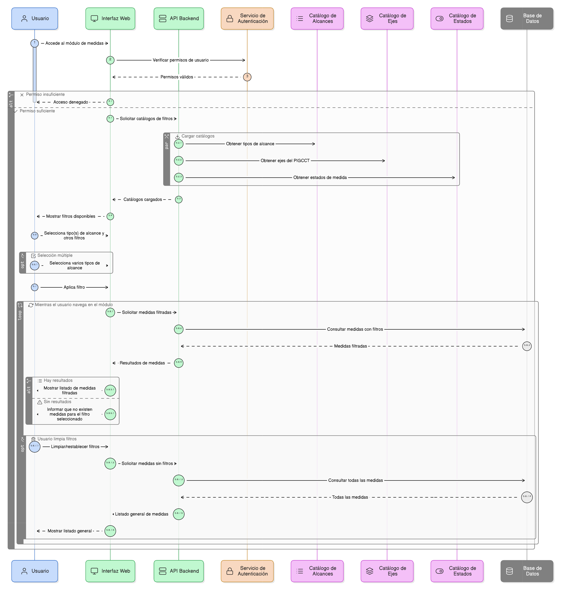
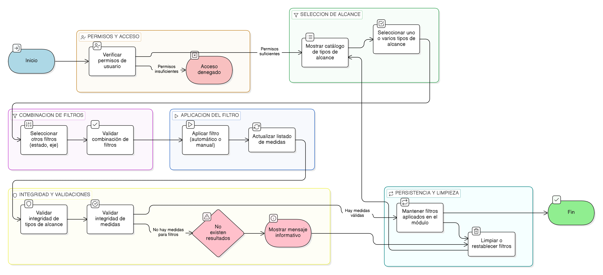

# HU-PIGCCT-SYM-036  
## Épica: Administración de medidas del PIGCCT  
### Filtrar medidas por alcance

---

## DESCRIPCIÓN HISTORIA DE USUARIO

> **Como:** usuario del sistema.  
> **Quiero:** filtrar las medidas del PIGCCT por tipo de alcance.  
> **Para:** distinguir y analizar de manera diferenciada las líneas estratégicas, líneas de acción y medidas, según su rol dentro del plan.

---

## CRITERIOS DE ACEPTACIÓN

### 1. Permisos y acceso
1.1 Los usuarios con permisos de **consulta o superiores** deben poder utilizar el filtro por alcance.  
1.2 El acceso debe respetar los roles y perfiles definidos en el sistema.

### 2. Tipos de alcance
2.1 El sistema debe permitir filtrar las medidas según los siguientes tipos de alcance:
- Línea estratégica.  
- Línea de acción.  
- Medida.  

2.2 Los tipos de alcance deben provenir de un **catálogo controlado** y consistente con la definición del PIGCCT.

### 3. Aplicación del filtro
3.1 El filtro por alcance debe poder aplicarse:
- Dentro de la consulta de medidas por eje.  
- En listados generales de medidas del PIGCCT.

3.2 El usuario debe poder seleccionar uno o varios tipos de alcance de forma simultánea.

### 4. Comportamiento del listado
4.1 Al aplicar el filtro, el sistema debe actualizar el listado de manera inmediata o mediante una acción explícita de búsqueda.  
4.2 El listado resultante debe mostrar únicamente las medidas que correspondan al tipo de alcance seleccionado.

### 5. Combinación con otros filtros
5.1 El filtro por alcance debe poder combinarse con otros filtros existentes, tales como:
- Estado (activa / inactiva).  
- Eje del PIGCCT.  

5.2 La combinación de filtros no debe generar resultados inconsistentes o duplicados.

### 6. Persistencia del filtro
6.1 El sistema debe mantener el filtro aplicado mientras el usuario navega dentro del mismo módulo.  
6.2 El usuario debe poder limpiar o restablecer el filtro en cualquier momento.

### 7. Integridad y validaciones
7.1 El sistema debe garantizar que el tipo de alcance mostrado corresponda a la definición registrada para cada medida.  
7.2 Si no existen medidas para el tipo de alcance seleccionado, el sistema debe informar claramente al usuario.

---

### Resultado esperado

El sistema permite **filtrar y analizar las medidas del PIGCCT por su tipo de alcance**, facilitando la comprensión de la estructura del plan y apoyando la toma de decisiones en los procesos de planeación, seguimiento y evaluación.

---

## DIAGRAMA DE SECUENCIA

## DIAGRAMA DE FLUJO DEL PROCESO

## PROTOTIPO PRELIMINAR

