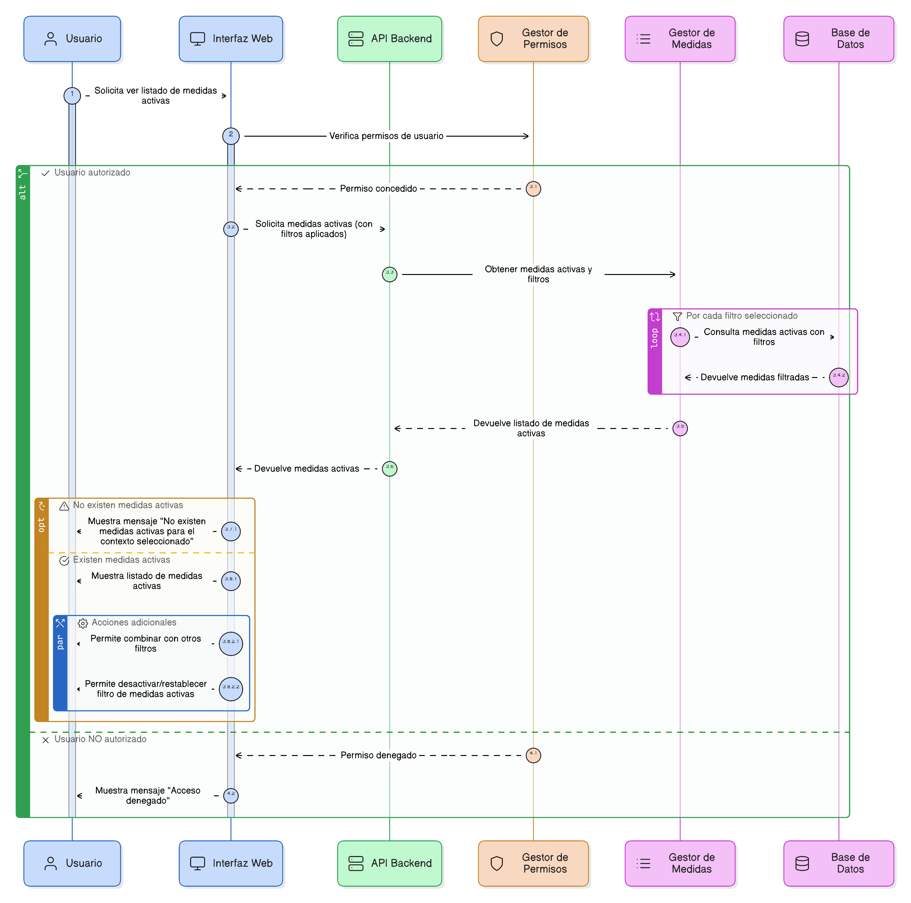
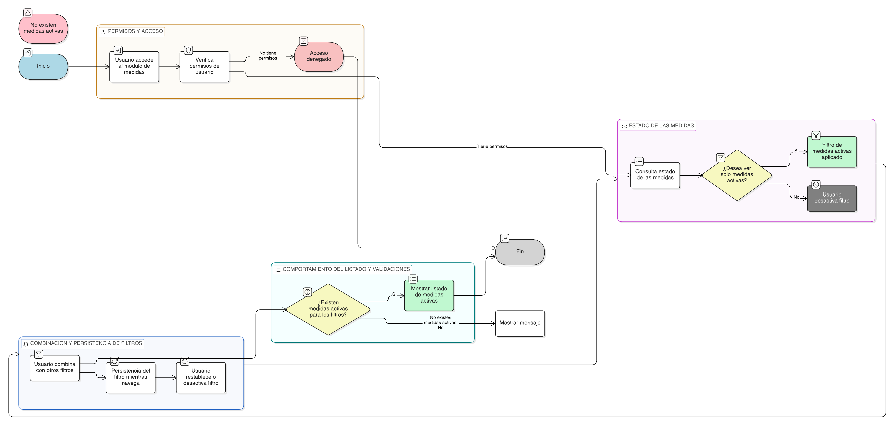

# HU-PIGCCT-SYM-037  
## Épica: Administración de medidas del PIGCCT  
### Visualizar medidas activas

---

## DESCRIPCIÓN HISTORIA DE USUARIO

> **Como:** usuario del sistema.  
> **Quiero:** consultar únicamente las medidas activas del PIGCCT.  
> **Para:** trabajar con información vigente y relevante para los procesos de planeación, seguimiento y evaluación.

---

## CRITERIOS DE ACEPTACIÓN

### 1. Permisos y acceso
1.1 Los usuarios con permisos de **consulta o superiores** deben poder visualizar las medidas activas.  
1.2 El acceso debe respetar los roles y perfiles definidos en el sistema.

### 2. Estado de las medidas
2.1 Cada medida del PIGCCT debe contar con un **estado** claramente definido (activa / inactiva).  
2.2 El estado debe ser gestionado únicamente por usuarios con rol administrador.

### 3. Filtro de medidas activas
3.1 El sistema debe ofrecer una opción (filtro o vista por defecto) para mostrar **solo las medidas activas**.  
3.2 El filtro de medidas activas debe estar disponible en:
- Listados generales de medidas.  
- Consulta de medidas por eje.

### 4. Comportamiento del listado
4.1 Al aplicar el filtro de medidas activas, el sistema debe mostrar únicamente aquellas con estado **activo**.  
4.2 El sistema no debe mostrar medidas inactivas en vistas operativas, salvo que el usuario habilite explícitamente su visualización.

### 5. Combinación con otros filtros
5.1 El filtro de medidas activas debe poder combinarse con otros filtros existentes, tales como:
- Eje del PIGCCT.  
- Tipo de alcance (línea estratégica, línea de acción, medida).  

5.2 La combinación de filtros debe mantener consistencia y evitar resultados duplicados.

### 6. Persistencia del filtro
6.1 El sistema debe mantener activo el filtro mientras el usuario navega dentro del módulo.  
6.2 El usuario debe poder desactivar o restablecer el filtro en cualquier momento.

### 7. Integridad y validaciones
7.1 El sistema debe garantizar que solo las medidas con estado activo sean incluidas en los resultados.  
7.2 Si no existen medidas activas para el contexto seleccionado, el sistema debe informar claramente al usuario.

---

### Resultado esperado

El sistema permite **visualizar únicamente las medidas activas del PIGCCT**, asegurando que los usuarios trabajen con información vigente y facilitando la eficiencia en los procesos de gestión y toma de decisiones.

---

## DIAGRAMA DE SECUENCIA

## DIAGRAMA DE FLUJO DEL PROCESO

