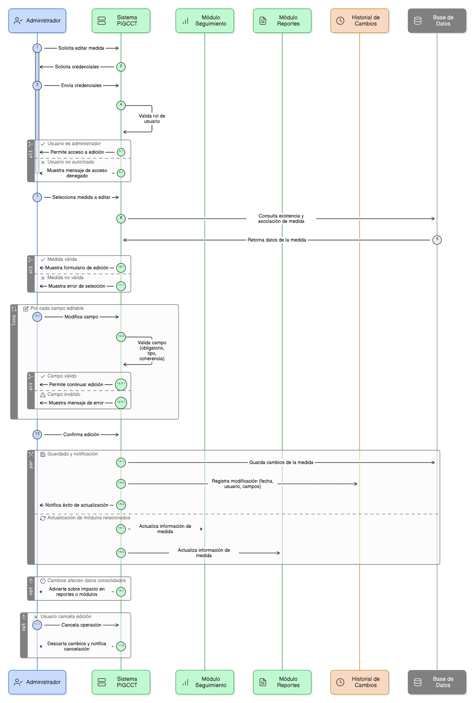
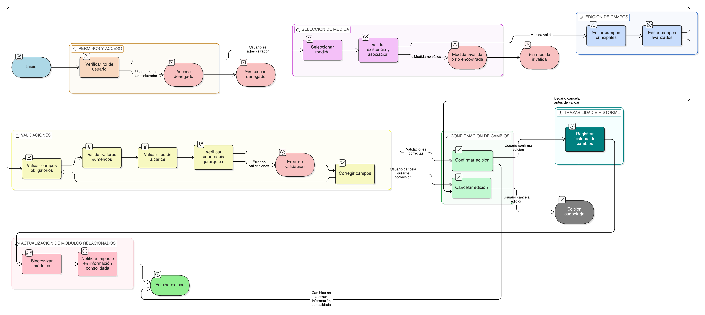

# HU-PIGCCT-SYM-038  
## Épica: Administración de medidas del PIGCCT  
### Editar información de la medida

---

## DESCRIPCIÓN HISTORIA DE USUARIO

> **Como:** usuario administrador.  
> **Quiero:** actualizar la información de una medida del PIGCCT.  
> **Para:** ajustar su formulación técnica o administrativa, manteniendo la coherencia del plan y la trazabilidad de los cambios realizados.

---

## CRITERIOS DE ACEPTACIÓN

### 1. Permisos y acceso
1.1 Solo los usuarios con rol **administrador** pueden editar la información de una medida.  
1.2 Los usuarios de consulta solo pueden visualizar la información registrada.

### 2. Selección de la medida
2.1 El sistema debe permitir al administrador seleccionar una **medida válida** asociada a un eje y a un PIGCCT.  
2.2 La medida seleccionada debe existir y estar correctamente asociada en la estructura jerárquica.

### 3. Información editable
3.1 El sistema debe permitir editar, como mínimo, los siguientes campos de la medida:
- Nombre de la medida.  
- Objetivo.  
- Descripción.  
- Línea base.  
- Tipo de alcance (línea estratégica, línea de acción o medida).  

3.2 Según reglas de negocio, también debe permitir editar:
- Acciones por horizonte temporal.  
- Potencial de reducción de GEI.  
- Área de intervención territorial.  
- Población beneficiada estimada.  
- Costos aproximados.  
- Actores involucrados.  
- Barreras de implementación.  
- Fuentes de financiación.

### 4. Validaciones
4.1 El sistema debe validar que:
- Los campos obligatorios no estén vacíos.  
- Los valores numéricos (costos, población, reducción GEI) sean válidos.  
- El tipo de alcance corresponda a valores permitidos.  

4.2 Si se modifica el tipo de alcance, el sistema debe verificar la coherencia jerárquica con el eje y las medidas relacionadas.

### 5. Gestión de cambios
5.1 El sistema debe guardar los cambios solo cuando el usuario confirme la edición.  
5.2 Si el usuario cancela la operación, no se deben aplicar modificaciones.  
5.3 El sistema debe notificar al usuario cuando la actualización se realice exitosamente.

### 6. Trazabilidad e historial
6.1 El sistema debe conservar un **historial de modificaciones** de la medida.  
6.2 El historial debe incluir, al menos:
- Fecha y hora del cambio.  
- Usuario que realizó la modificación.  
- Campos modificados.

### 7. Impacto en otros módulos
7.1 Los cambios realizados deben reflejarse automáticamente en:
- Módulos de seguimiento y evaluación.  
- Reportes del PIGCCT.  
- Módulos que consuman la información de la medida.

7.2 El sistema debe advertir al usuario si los cambios afectan información ya reportada o consolidada.

---

### Resultado esperado

El sistema permite **editar y actualizar de forma controlada la información de una medida del PIGCCT**, garantizando consistencia técnica, trazabilidad de los cambios y correcta integración con los demás módulos del sistema.

---

## DIAGRAMA DE SECUENCIA

## DIAGRAMA DE FLUJO DEL PROCESO

