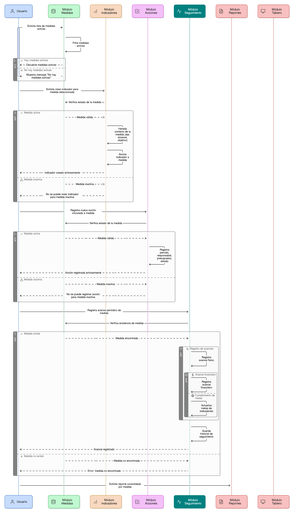
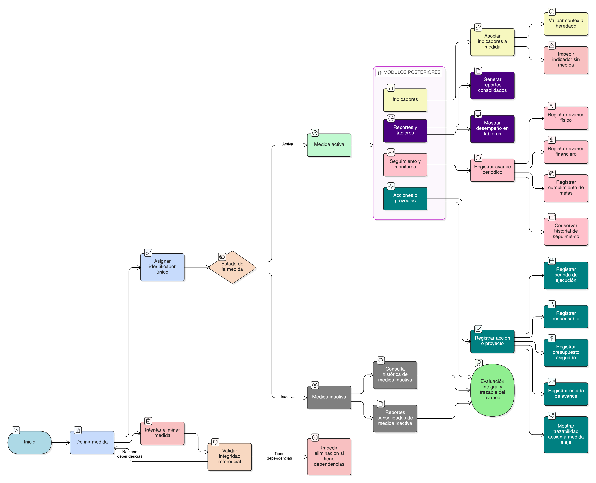

# HU-PIGCCT-SYM-041  
## Épica: Administración de medidas del PIGCCT  
### Uso de la medida en módulos posteriores

---

## DESCRIPCIÓN HISTORIA DE USUARIO

> **Como:** usuario del sistema (técnico, analista, tomador de decisiones).  
> **Quiero:** utilizar las medidas del PIGCCT como base para indicadores, acciones, seguimiento y reportes.  
> **Para:** evaluar de manera integral y trazable el avance en la implementación del PIGCCT.

---

## CRITERIOS DE ACEPTACIÓN

### 1. Medida como entidad base del sistema
1.1 El sistema debe definir la **medida** como una entidad transversal y reutilizable en los módulos de:
- Indicadores.  
- Acciones o proyectos.  
- Seguimiento y monitoreo.  
- Reportes y tableros de control.

1.2 Cada módulo posterior debe referenciar la medida mediante un identificador único.

### 2. Asociación de indicadores a medidas
2.1 El sistema debe permitir asociar uno o varios **indicadores** a una medida.  
2.2 Cada indicador debe heredar el contexto de la medida (eje, alcance, objetivo).  
2.3 No debe permitirse crear indicadores sin una medida asociada.

### 3. Asociación de acciones o proyectos
3.1 El sistema debe permitir registrar **acciones, proyectos o intervenciones** vinculadas a una medida.  
3.2 Cada acción debe poder registrar:
- Periodo de ejecución.  
- Responsable.  
- Presupuesto asignado.  
- Estado de avance.

3.3 La trazabilidad acción → medida → eje debe ser visible para el usuario.

### 4. Seguimiento y monitoreo
4.1 El sistema debe permitir registrar avances periódicos por medida.  
4.2 El seguimiento debe contemplar:
- Avance físico.  
- Avance financiero.  
- Cumplimiento de metas asociadas a indicadores.

4.3 El sistema debe conservar el historial de seguimiento para análisis temporal.

### 5. Uso en reportes y tableros
5.1 El sistema debe permitir generar reportes consolidados por:
- Medida.  
- Eje.  
- Periodo.  
- Estado de avance.

5.2 Los tableros de control deben mostrar el desempeño de las medidas mediante indicadores visuales.

### 6. Reglas de estado y vigencia
6.1 Solo las **medidas activas** deben estar disponibles para:
- Creación de nuevos indicadores.  
- Registro de acciones.  
- Seguimiento operativo.

6.2 Las medidas inactivas deben mantenerse disponibles para:
- Consulta histórica.  
- Reportes consolidados.

### 7. Integridad y consistencia
7.1 El sistema debe garantizar integridad referencial entre medidas y los módulos posteriores.  
7.2 No debe permitirse eliminar una medida si está siendo utilizada en indicadores, acciones o seguimiento.

---

### Resultado esperado

Las medidas del PIGCCT funcionan como el **eje articulador** de los módulos de indicadores, acciones, seguimiento y reportes, permitiendo una evaluación integral, trazable y consistente del avance del plan.

---

## DIAGRAMA DE SECUENCIA

## DIAGRAMA DE FLUJO DEL PROCESO

