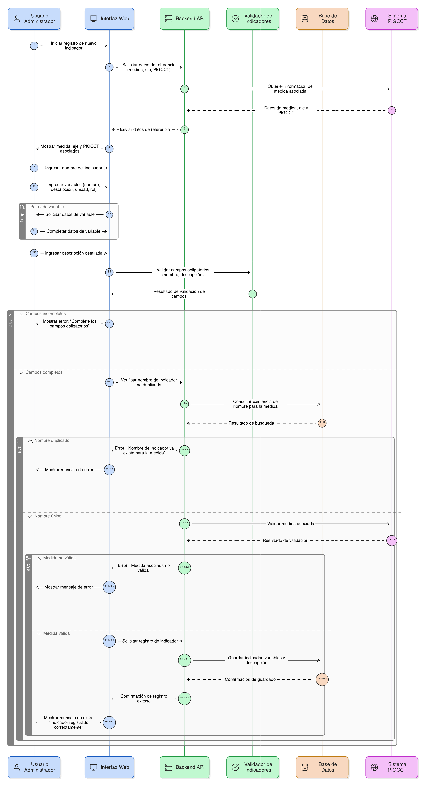
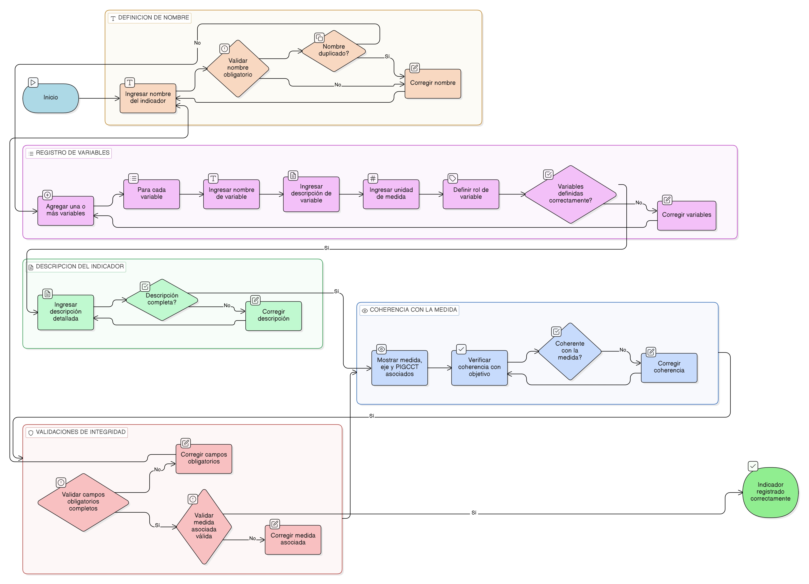

# HU-PIGCCT-SYM-043  
## Épica: Administración de indicadores del PIGCCT  
### Definir nombre y descripción del indicador

---

## DESCRIPCIÓN HISTORIA DE USUARIO

> **Como:** usuario administrador del sistema.  
> **Quiero:** definir el nombre, las variables y la descripción de un indicador.  
> **Para:** documentar claramente qué mide el indicador, cómo se calcula y cómo debe interpretarse dentro del seguimiento del PIGCCT.

---

## CRITERIOS DE ACEPTACIÓN

### 1. Definición del nombre del indicador
1.1 El sistema debe permitir registrar un **nombre claro, conciso y representativo** del indicador.  
1.2 El nombre del indicador debe ser obligatorio para poder guardar el registro.  
1.3 El sistema debe validar que el nombre no esté duplicado para la misma medida del PIGCCT.

### 2. Registro de variables del indicador
2.1 El sistema debe permitir registrar una o más **variables** asociadas al indicador.  
2.2 Para cada variable, el sistema debe permitir definir como mínimo:
- Nombre de la variable.  
- Descripción de la variable.  
- Unidad de medida (cuando aplique).  

2.3 El sistema debe permitir identificar el rol de cada variable (por ejemplo: numerador, denominador, factor, cualitativa).

### 3. Descripción del indicador
3.1 El sistema debe permitir registrar una **descripción detallada** del indicador.  
3.2 La descripción debe incluir:
- Qué mide el indicador.  
- Qué fenómeno o resultado busca reflejar.  
- Cómo debe interpretarse su valor.

3.3 El campo de descripción debe permitir texto extenso.

### 4. Coherencia con la medida asociada
4.1 El sistema debe mostrar como referencia la medida, el eje y el PIGCCT al cual pertenece el indicador.  
4.2 El usuario debe poder verificar que el indicador es coherente con el objetivo de la medida.

### 5. Validaciones de integridad
5.1 El sistema debe validar que los campos obligatorios (nombre y descripción) estén completos antes de guardar.  
5.2 El sistema debe impedir el registro de indicadores sin una medida asociada válida.

---

### Resultado esperado

El sistema permite definir de forma estructurada y clara el nombre, las variables y la descripción del indicador, asegurando una correcta comprensión técnica y una interpretación homogénea para el seguimiento y evaluación del PIGCCT.

---

## DIAGRAMA DE SECUENCIA

## DIAGRAMA DE FLUJO DEL PROCESO

