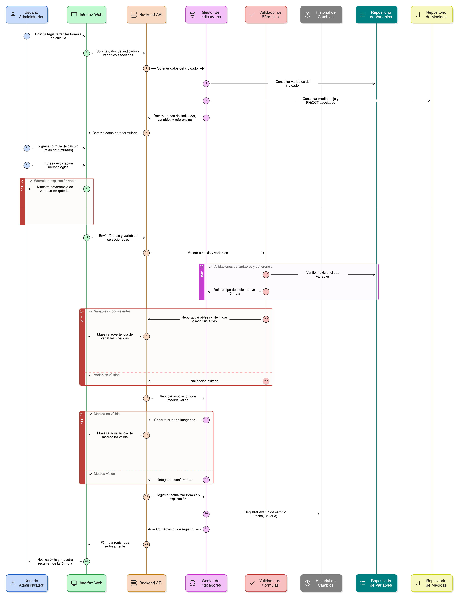
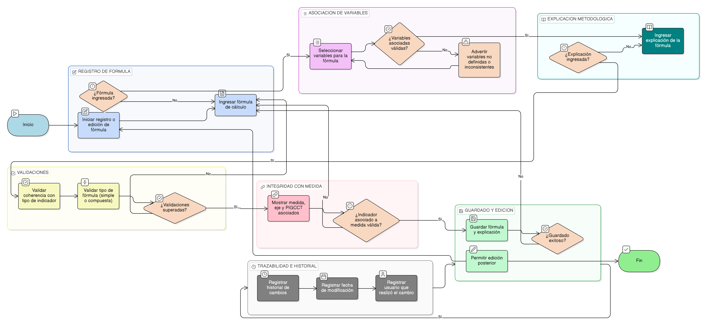

# HU-PIGCCT-SYM-044  
## Épica: Administración de indicadores del PIGCCT  
### Definir fórmula de cálculo del indicador

---

## DESCRIPCIÓN HISTORIA DE USUARIO

> **Como:** usuario administrador del sistema.  
> **Quiero:** definir y registrar la fórmula de cálculo de un indicador.  
> **Para:** garantizar consistencia metodológica, trazabilidad técnica y comparabilidad en la medición del avance del PIGCCT.

---

## CRITERIOS DE ACEPTACIÓN

### 1. Registro de la fórmula de cálculo
1.1 El sistema debe permitir registrar la **fórmula de cálculo del indicador** en formato texto estructurado.  
1.2 La fórmula debe poder incluir variables previamente definidas para el indicador.  
1.3 El campo de fórmula debe ser obligatorio para guardar el indicador.

### 2. Asociación con variables
2.1 El sistema debe permitir seleccionar las variables que intervienen en la fórmula.  
2.2 El sistema debe validar que las variables utilizadas en la fórmula correspondan únicamente a las variables registradas para el indicador.  
2.3 El sistema debe advertir si la fórmula contiene variables no definidas o inconsistentes.

### 3. Claridad metodológica
3.1 El sistema debe permitir registrar una **explicación de la fórmula**, que describa:
- Cómo se realiza el cálculo.  
- Qué representa el resultado obtenido.  
- Supuestos o consideraciones técnicas relevantes.

3.2 El campo de explicación debe permitir texto extenso.

### 4. Validaciones de coherencia
4.1 El sistema debe validar que la fórmula sea coherente con el tipo de indicador (cuantitativo o cualitativo).  
4.2 El sistema debe permitir registrar fórmulas simples o compuestas (porcentajes, razones, promedios, índices, etc.).

### 5. Integridad con la medida
5.1 El sistema debe mostrar la medida, el eje y el PIGCCT asociados al indicador como referencia.  
5.2 El sistema debe impedir guardar la fórmula si el indicador no está correctamente asociado a una medida válida.

### 6. Edición y trazabilidad
6.1 El sistema debe permitir editar la fórmula de cálculo del indicador.  
6.2 El sistema debe conservar el historial de cambios de la fórmula, registrando:
- Fecha de modificación.  
- Usuario que realizó el cambio.  

---

### Resultado esperado

El sistema permite registrar, validar y documentar la fórmula de cálculo de los indicadores del PIGCCT, asegurando consistencia metodológica, transparencia técnica y soporte para el seguimiento y evaluación del plan.

---

## DIAGRAMA DE SECUENCIA

## DIAGRAMA DE FLUJO DEL PROCESO

