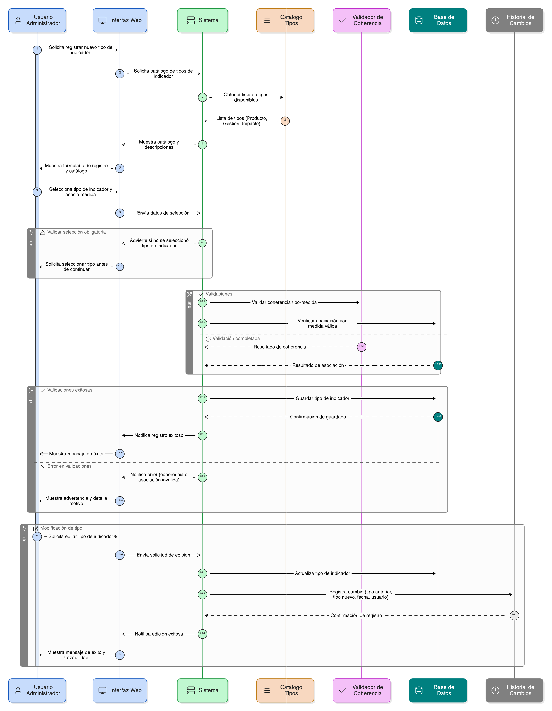
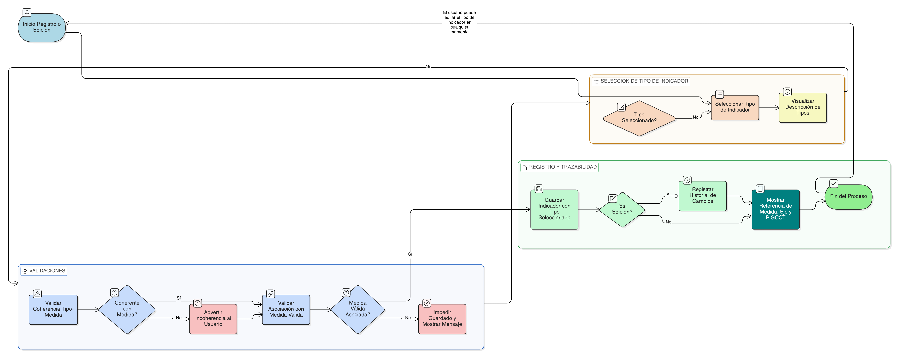

# HU-PIGCCT-SYM-045  
## Épica: Administración de indicadores del PIGCCT  
### Definir tipo de indicador

---

## DESCRIPCIÓN HISTORIA DE USUARIO

> **Como:** usuario administrador del sistema.  
> **Quiero:** definir y registrar el tipo de indicador.  
> **Para:** clasificarlo como de producto, gestión o impacto y diferenciar su nivel dentro del sistema de seguimiento y evaluación del PIGCCT.

---

## CRITERIOS DE ACEPTACIÓN

### 1. Clasificación del tipo de indicador
1.1 El sistema debe permitir seleccionar el **tipo de indicador** a partir de un catálogo predefinido.  
1.2 Los tipos de indicador disponibles deben ser como mínimo:
- Indicador de **Producto**  
- Indicador de **Gestión**  
- Indicador de **Impacto**

1.3 La selección del tipo de indicador debe ser obligatoria para guardar el registro.

### 2. Definición conceptual del tipo
2.1 El sistema debe mostrar una breve descripción de cada tipo de indicador para apoyar la correcta clasificación:
- **Producto:** mide bienes, servicios o resultados directos generados por la medida.  
- **Gestión:** mide avances en la ejecución, procesos o desempeño institucional.  
- **Impacto:** mide cambios o efectos generados en el territorio, la población o el ambiente.

### 3. Validaciones de coherencia
3.1 El sistema debe validar la coherencia entre el tipo de indicador y la medida asociada.  
3.2 El sistema debe advertir al usuario si el tipo seleccionado no es coherente con el alcance o propósito de la medida.

### 4. Integridad con la medida y el PIGCCT
4.1 El sistema debe mostrar como referencia la medida, el eje y el PIGCCT al que pertenece el indicador.  
4.2 El sistema debe impedir guardar el tipo de indicador si el indicador no está asociado a una medida válida.

### 5. Edición y trazabilidad
5.1 El sistema debe permitir modificar el tipo de indicador en cualquier momento.  
5.2 El sistema debe conservar el historial de cambios, registrando:
- Tipo anterior y tipo nuevo.  
- Fecha del cambio.  
- Usuario que realizó la modificación.

---

### Resultado esperado

El sistema permite clasificar los indicadores del PIGCCT como de producto, gestión o impacto, garantizando una correcta jerarquización metodológica y facilitando el análisis, seguimiento y evaluación del desempeño del plan.

---

## DIAGRAMA DE SECUENCIA

## DIAGRAMA DE FLUJO DEL PROCESO

