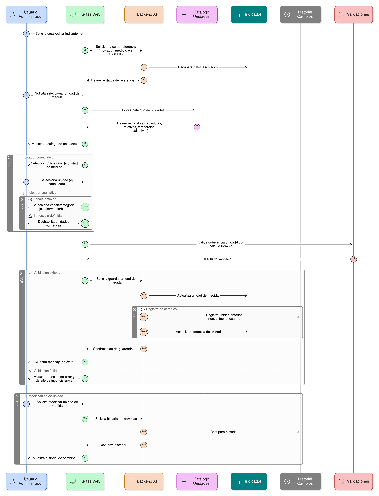
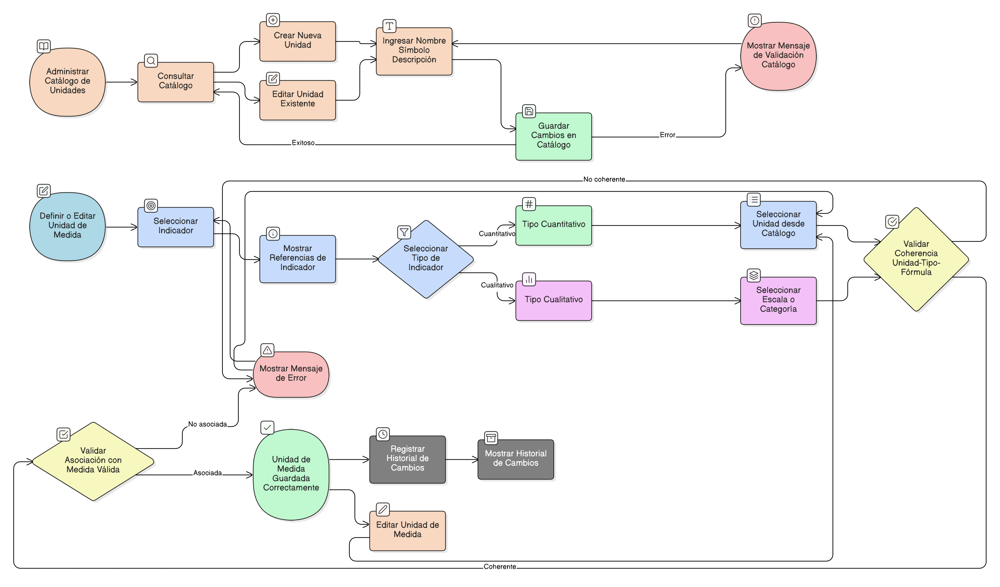

# HU-PIGCCT-SYM-048  
## Épica: Administración de indicadores del PIGCCT  
### Definir unidad de medida

---

## DESCRIPCIÓN HISTORIA DE USUARIO

> **Como:** usuario administrador del sistema.  
> **Quiero:** definir y seleccionar la unidad de medida del indicador.  
> **Para:** interpretar correctamente los resultados, garantizar consistencia en la medición y facilitar el análisis y comparación del avance del PIGCCT.

---

## CRITERIOS DE ACEPTACIÓN

### 1. Selección de la unidad de medida
1.1 El sistema debe permitir seleccionar la **unidad de medida del indicador** desde un catálogo predefinido.  
1.2 La selección de la unidad de medida debe ser obligatoria para los indicadores de tipo **cuantitativo**.  
1.3 Para indicadores **cualitativos**, el sistema debe permitir seleccionar escalas o categorías de medición (cuando aplique).

### 2. Catálogo de unidades de medida
2.1 El sistema debe contar con un catálogo administrable de unidades de medida.  
2.2 El catálogo debe incluir, como mínimo:
- Unidades absolutas (número, hectáreas, toneladas, personas).  
- Unidades relativas (porcentaje, razón, índice).  
- Unidades temporales (años, meses).  
- Escalas cualitativas (alto, medio, bajo; cumple/no cumple).

2.3 Cada unidad de medida debe contar con:
- Nombre.  
- Símbolo o abreviatura (cuando aplique).  
- Descripción.

### 3. Validaciones de coherencia
3.1 El sistema debe validar que la unidad de medida sea coherente con:
- El tipo de cálculo del indicador (cuantitativo o cualitativo).  
- La fórmula de cálculo definida.

3.2 El sistema debe impedir seleccionar unidades numéricas para indicadores cualitativos sin escala definida.  
3.3 El sistema debe mostrar mensajes de validación claros ante inconsistencias.

### 4. Integridad con el indicador y la medida
4.1 El sistema debe mostrar como referencia el indicador, la medida, el eje y el PIGCCT asociados.  
4.2 El sistema debe impedir guardar la unidad de medida si el indicador no está correctamente asociado a una medida válida.

### 5. Edición y trazabilidad
5.1 El sistema debe permitir modificar la unidad de medida del indicador.  
5.2 El sistema debe conservar el historial de cambios, registrando:
- Unidad de medida anterior y nueva.  
- Fecha de modificación.  
- Usuario que realizó el cambio.

---

### Resultado esperado

El sistema permite definir unidades de medida claras y coherentes para los indicadores del PIGCCT, asegurando una correcta interpretación de los resultados, estandarización metodológica y soporte efectivo para el seguimiento y evaluación del plan.

---

## DIAGRAMA DE SECUENCIA

## DIAGRAMA DE FLUJO DEL PROCESO

