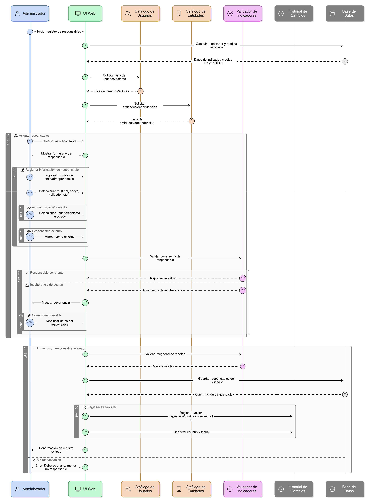
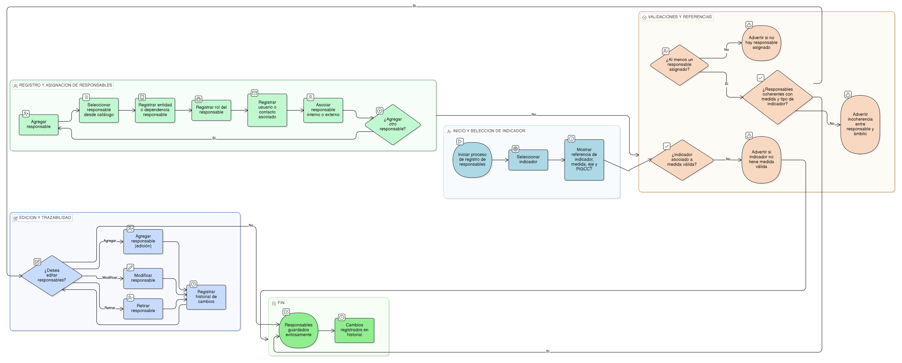

# HU-PIGCCT-SYM-050  
## Épica: Administración de indicadores del PIGCCT  
### Registrar responsables del indicador

---

## DESCRIPCIÓN HISTORIA DE USUARIO

> **Como:** usuario administrador del sistema.  
> **Quiero:** registrar y asignar los responsables del indicador.  
> **Para:** definir claramente la rendición de cuentas, la gestión de la información y el seguimiento efectivo de los indicadores del PIGCCT.

---

## CRITERIOS DE ACEPTACIÓN

### 1. Asignación de responsables
1.1 El sistema debe permitir registrar uno o varios **responsables del indicador**.  
1.2 Cada responsable debe seleccionarse desde un catálogo de actores o usuarios del sistema.  
1.3 Al menos un responsable debe ser obligatorio para guardar el indicador.

### 2. Información del responsable
2.1 Para cada responsable, el sistema debe permitir registrar:
- Nombre de la entidad o dependencia responsable.  
- Rol del responsable (líder, apoyo técnico, validador, reportante, etc.).  
- Usuario o contacto asociado (cuando aplique).

2.2 El sistema debe permitir asociar responsables internos y externos.

### 3. Validaciones de coherencia
3.1 El sistema debe validar que los responsables asignados sean coherentes con:
- La medida asociada.  
- El tipo de indicador (producto, gestión o impacto).

3.2 El sistema debe advertir si no existe correspondencia entre el responsable y el ámbito del indicador.

### 4. Integridad con el indicador y la medida
4.1 El sistema debe mostrar como referencia el indicador, la medida, el eje y el PIGCCT asociados.  
4.2 El sistema debe impedir guardar responsables si el indicador no está correctamente asociado a una medida válida.

### 5. Edición y trazabilidad
5.1 El sistema debe permitir agregar, modificar o retirar responsables del indicador.  
5.2 El sistema debe conservar el historial de cambios, registrando:
- Responsable agregado, modificado o eliminado.  
- Fecha de la acción.  
- Usuario que realizó la modificación.

---

### Resultado esperado

El sistema permite asignar responsables claros a los indicadores del PIGCCT, fortaleciendo la rendición de cuentas, la gestión interinstitucional y el seguimiento efectivo del desempeño del plan.

---

## DIAGRAMA DE SECUENCIA

## DIAGRAMA DE FLUJO DEL PROCESO

## PROTOTIPO PRELIMINAR

