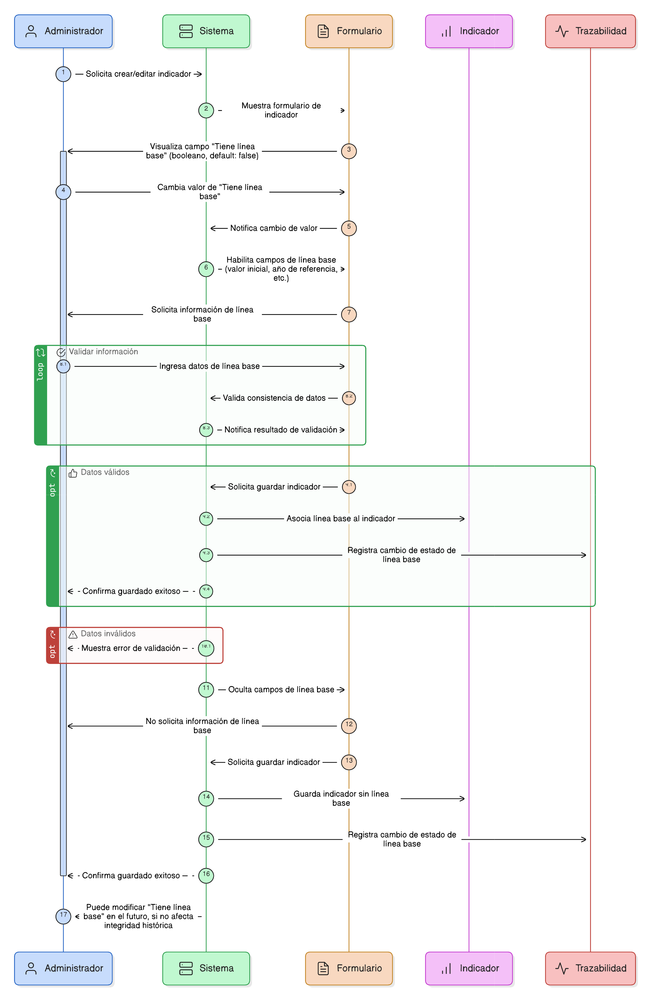
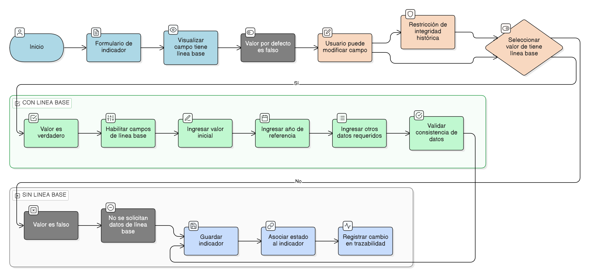

# HU-PIGCCT-SYM-052  
## Épica: Administración de indicadores del PIGCCT  
### Definir si el indicador tiene línea base

---

## DESCRIPCIÓN HISTORIA DE USUARIO

> **Como:** usuario administrador del sistema.  
> **Quiero:** indicar si el indicador cuenta con una línea base.  
> **Para:** establecer un punto de referencia inicial que permita comparar y evaluar el avance del indicador en el tiempo.

---

## CRITERIOS DE ACEPTACIÓN

### 1. Definición del campo línea base
1.1 El sistema debe disponer de un campo **booleano** denominado “Tiene línea base”.  
1.2 El valor por defecto del campo debe ser **false**.  
1.3 El usuario administrador debe poder cambiar el valor a **true** cuando el indicador cuente con línea base definida.

### 2. Comportamiento según el valor del campo
2.1 Si el valor es **false**, el sistema no debe exigir el registro de información asociada a la línea base.  
2.2 Si el valor es **true**, el sistema debe habilitar los campos relacionados con la línea base del indicador (valor inicial, año de referencia u otros definidos en el modelo de datos).  
2.3 El sistema debe validar que la información de línea base sea consistente antes de permitir guardar el indicador.

### 3. Visualización y edición
3.1 El estado del campo “Tiene línea base” debe ser visible en el formulario de creación y edición del indicador.  
3.2 El usuario administrador debe poder modificar este valor en cualquier momento, siempre que no afecte la integridad de la información histórica.  

### 4. Integridad con el indicador
4.1 El sistema debe asociar el estado de línea base directamente al indicador correspondiente.  
4.2 El cambio del valor del campo debe quedar registrado en la trazabilidad del indicador.

---

### Resultado esperado

El sistema permite definir de manera clara y controlada si un indicador cuenta o no con línea base, estableciendo un punto de referencia inicial que fortalece el análisis, el seguimiento y la evaluación del PIGCCT.

---

## DIAGRAMA DE SECUENCIA

## DIAGRAMA DE FLUJO DEL PROCESO

