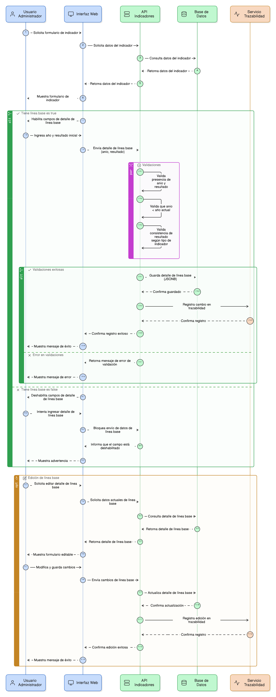
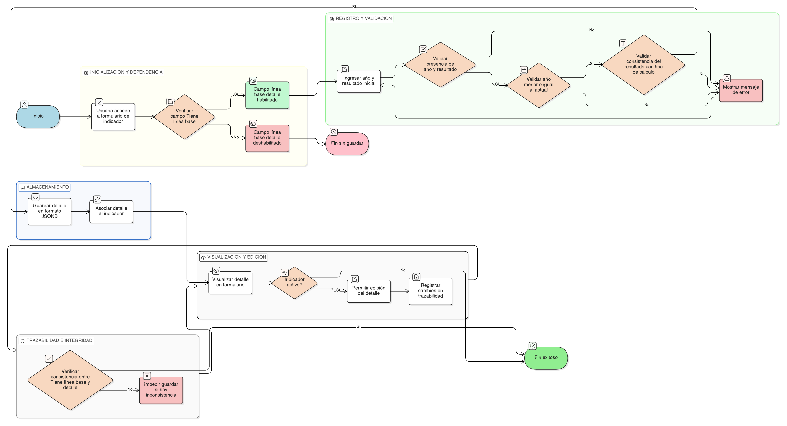

# HU-PIGCCT-SYM-053  
## Épica: Administración de indicadores del PIGCCT  
### Registrar detalle de la línea base

---

## DESCRIPCIÓN HISTORIA DE USUARIO

> **Como:** usuario administrador del sistema.  
> **Quiero:** registrar el detalle de la línea base del indicador.  
> **Para:** almacenar el año de referencia y el resultado inicial que servirán como punto de comparación para el seguimiento y evaluación del PIGCCT.

---

## CRITERIOS DE ACEPTACIÓN

### 1. Dependencia de la línea base
1.1 El sistema debe habilitar el registro del **detalle de la línea base** únicamente cuando el campo **Tiene línea base** [HU-PIGCCT-SYM-052](/content/historias_usuario/HU-PIGCCT-SYM-052/HU-PIGCCT-SYM-052.md) sea **true**.  
1.2 Si el campo **Tiene línea base** es **false**, el campo **línea_base_detalle** debe permanecer deshabilitado o vacío.  
1.3 El sistema no debe permitir guardar información en **línea_base_detalle** si **Tiene línea base** es **false**.


### 2. Estructura del detalle de la línea base
2.1 El detalle de la línea base debe almacenarse en un campo de tipo **JSONB**.  
2.2 La estructura del objeto JSONB debe ser la siguiente:
```json
{
  "anio": 2020,
  "resultado": "valor inicial"
}
```
2.3 El atributo anio debe corresponder a un año válido (numérico).
2.4 El atributo resultado debe permitir almacenar el valor inicial del indicador según su tipo (texto o número, conforme al modelo de datos).


### 3. Validaciones

3.1 El sistema debe validar que ambos atributos (anio y resultado) estén presentes cuando Tiene línea base sea true.
3.2 El sistema debe validar que el año de la línea base no sea mayor al año actual.
3.3 El sistema debe validar la consistencia del valor resultado con el tipo de cálculo del indicador (cuantitativo o cualitativo).


### 4. Visualización y edición

4.1 El detalle de la línea base debe visualizarse en el formulario de creación y edición del indicador.
4.2 El usuario administrador debe poder editar el detalle de la línea base mientras el indicador esté activo.
4.3 Los cambios realizados al detalle de la línea base deben quedar registrados en la trazabilidad del indicador.


### 5. Integridad con el indicador

5.1 El detalle de la línea base debe estar directamente asociado al indicador correspondiente.
5.2 El sistema debe impedir inconsistencias entre el estado del campo Tiene línea base y el contenido del campo línea_base_detalle.

---

### Resultado esperado

El sistema permite registrar y gestionar de forma controlada el detalle de la línea base de los indicadores del PIGCCT, garantizando consistencia metodológica, trazabilidad y un punto de referencia sólido para el seguimiento y la evaluación del plan.

---

## DIAGRAMA DE SECUENCIA



## DIAGRAMA DE FLUJO DEL PROCESO


