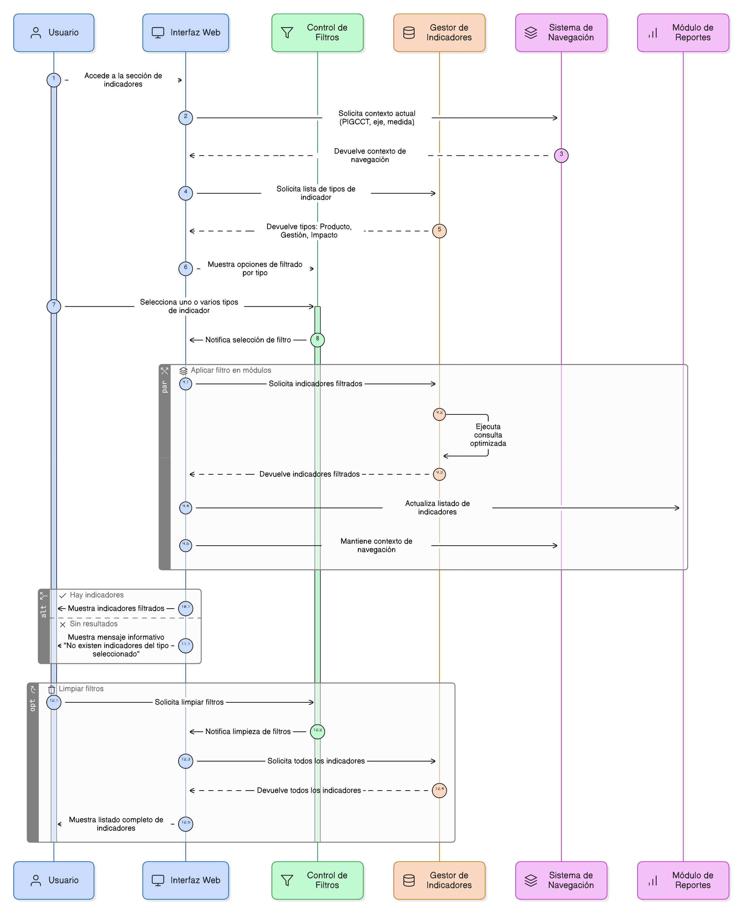
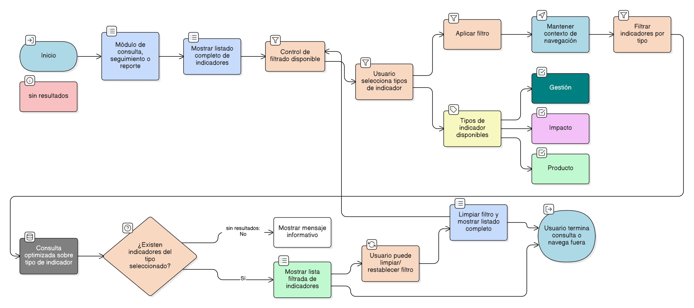

# HU-PIGCCT-SYM-058  
## Épica: Administración de indicadores del PIGCCT  
### Filtrar indicadores por tipo

---

## DESCRIPCIÓN HISTORIA DE USUARIO

> **Como:** usuario del sistema.  
> **Quiero:** filtrar los indicadores por tipo (producto, gestión o impacto).  
> **Para:** analizar los resultados del PIGCCT de acuerdo con el nivel de seguimiento y evaluación correspondiente.

---

## CRITERIOS DE ACEPTACIÓN

### 1. Tipos de indicador disponibles
1.1 El sistema debe reconocer los siguientes tipos de indicador:
- **Producto**  
- **Gestión**  
- **Impacto**

1.2 Estos valores deben corresponder al campo **tipo_indicador** definido en la administración de indicadores.

### 2. Funcionalidad de filtrado
2.1 El sistema debe ofrecer un control de filtrado (lista desplegable, botones o checkboxes) para seleccionar uno o varios tipos de indicador.  
2.2 El filtrado debe aplicarse sobre los listados de indicadores visibles en el sistema.  
2.3 El sistema debe permitir limpiar o restablecer los filtros aplicados.

### 3. Integración con la navegación
3.1 El filtrado por tipo debe funcionar en:
- La consulta de indicadores por medida.  
- Los módulos de seguimiento y reporte.  

3.2 El sistema debe mantener el contexto de navegación (PIGCCT, eje y medida) al aplicar el filtro.

### 4. Visualización de resultados
4.1 El sistema debe actualizar el listado de indicadores de forma inmediata al aplicar el filtro.  
4.2 Los indicadores visibles deben corresponder únicamente a los tipos seleccionados.  
4.3 Si no existen indicadores del tipo seleccionado, el sistema debe mostrar un mensaje informativo.

### 5. Rendimiento
5.1 El sistema debe realizar el filtrado de manera eficiente, incluso con un número elevado de indicadores.  
5.2 El filtrado debe apoyarse en consultas optimizadas sobre el campo **tipo_indicador**.

---

### Resultado esperado

El sistema permite filtrar los indicadores del PIGCCT por tipo (producto, gestión o impacto), facilitando un análisis estructurado y enfocado de los resultados según su nivel dentro del sistema de seguimiento y evaluación.

---

## DIAGRAMA DE SECUENCIA

## DIAGRAMA DE FLUJO DEL PROCESO

