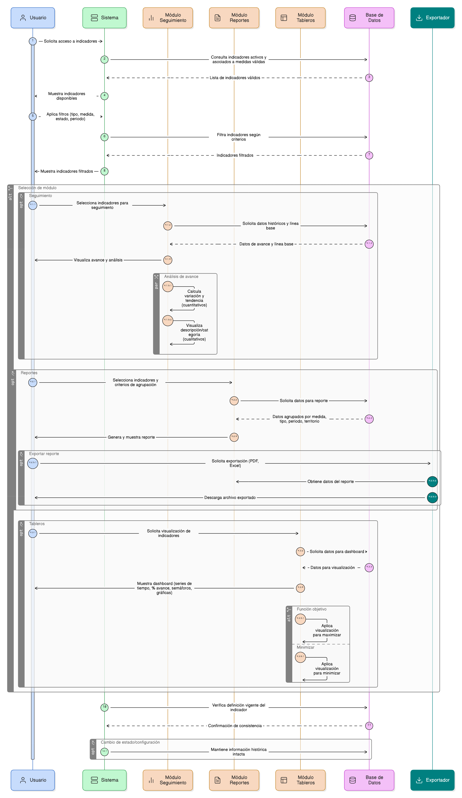
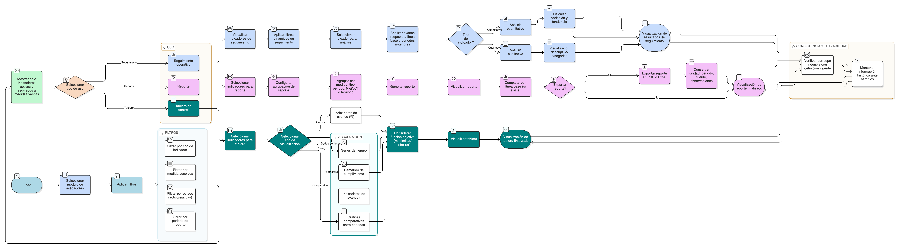

# HU-PIGCCT-SYM-061  
## Épica: Seguimiento, monitoreo y reporte del PIGCCT  
### Uso del indicador en seguimiento y reportes

---

## DESCRIPCIÓN HISTORIA DE USUARIO

> **Como:** usuario del sistema (administrador, técnico o tomador de decisión).  
> **Quiero:** usar los indicadores definidos en el sistema para seguimiento, reportes y tableros.  
> **Para:** evaluar de manera clara y estructurada el avance del PIGCCT.

---

## CRITERIOS DE ACEPTACIÓN

### 1. Disponibilidad del indicador para seguimiento
1.1 El sistema debe permitir utilizar los indicadores **activos** en los módulos de seguimiento.  
1.2 Solo los indicadores asociados a una medida válida [HU-PIGCCT-SYM-060](/content/historias_usuario/HU-PIGCCT-SYM-060/HU-PIGCCT-SYM-060.md) deben estar disponibles.  
1.3 Los indicadores inactivos no deben aparecer por defecto en procesos de seguimiento operativo.

### 2. Uso en reportes
2.1 El sistema debe permitir seleccionar uno o varios indicadores para generar reportes.  
2.2 Los reportes deben permitir agrupar información por:
- Medida.  
- Tipo de indicador (producto, gestión, impacto).  
- Periodo de tiempo.  
- PIGCCT y territorio (cuando aplique).

2.3 El reporte debe mostrar, como mínimo:
- Nombre del indicador.  
- Unidad de medida.  
- Tipo de indicador.  
- Valor reportado por periodo.  
- Comparación con línea base (si existe).  

### 3. Uso en tableros de control
3.1 El sistema debe permitir visualizar los indicadores en tableros (dashboards).  
3.2 Los tableros deben soportar visualizaciones como:
- Series de tiempo.  
- Indicadores de avance (%).  
- Semáforos de cumplimiento.  
- Gráficas comparativas entre periodos.

3.3 El comportamiento visual debe considerar la **función objetivo** del indicador:
- Maximizar.  
- Minimizar.

### 4. Análisis de avance
4.1 El sistema debe permitir analizar el avance del indicador respecto a:
- Línea base (si existe).  
- Periodos anteriores.  

4.2 Para indicadores cuantitativos:
- Se deben permitir cálculos automáticos de variación y tendencia.

4.3 Para indicadores cualitativos:
- Se debe permitir su visualización descriptiva y categórica según su definición.

### 5. Filtros y segmentación
5.1 El sistema debe permitir filtrar indicadores en seguimiento y reportes por:
- Tipo de indicador.  
- Medida asociada.  
- Estado (activo/inactivo).  
- Periodo de reporte.

5.2 Los filtros deben aplicarse de forma dinámica sin afectar la integridad de la información.

### 6. Trazabilidad y consistencia
6.1 El sistema debe garantizar que los valores reportados correspondan a la definición vigente del indicador.  
6.2 Si un indicador cambia de estado o configuración, la información histórica debe mantenerse intacta.  

### 7. Exportación y consulta
7.1 El sistema debe permitir exportar reportes de indicadores en formatos estándar (por ejemplo: PDF, Excel).  
7.2 Los datos exportados deben conservar:
- Unidad de medida.  
- Periodo.  
- Fuente de información.  
- Observaciones relevantes.

---

### Resultado esperado

El sistema permite utilizar los indicadores del PIGCCT de forma integral en procesos de seguimiento, reportes y tableros, garantizando consistencia metodológica, trazabilidad de la información y soporte efectivo para la evaluación del avance del plan.

---

## DIAGRAMA DE SECUENCIA

## DIAGRAMA DE FLUJO DEL PROCESO

