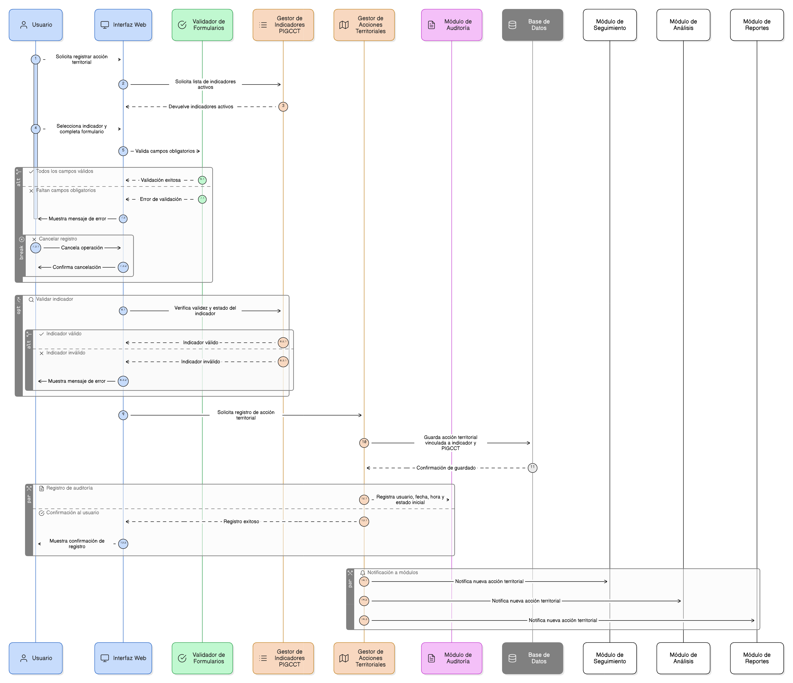
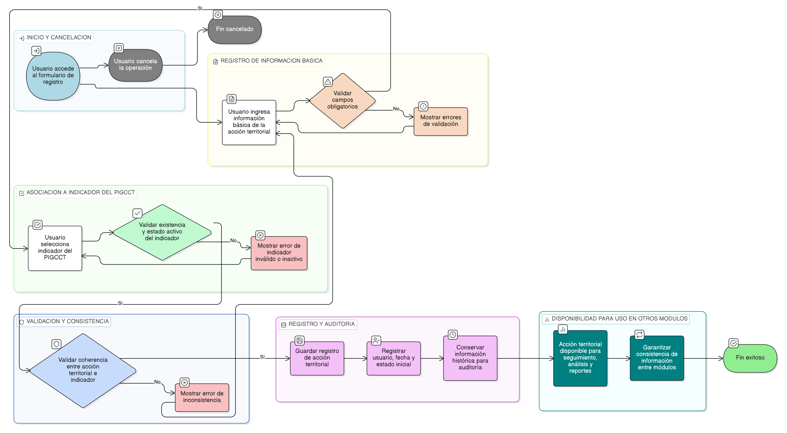

# HU-PIGCCT-SYM-062
## Épica: Gestión de acciones territoriales del PIGCCT
### Registrar de acción territorial

---

## DESCRIPCIÓN HISTORIA DE USUARIO

> **Como:** usuario del sistema.                   
> **Quiero:** registrar una acción territorial.                     
> **Para:** documentar los proyectos que dan cumplimiento a los indicadores del PIGCCT.

---

## CRITERIOS DE ACEPTACIÓN

### 1. Registro de la acción territorial

1.1 El sistema debe permitir crear un registro de acción territorial.                      
1.2 El registro de la acción territorial debe estar asociado a un indicador del PIGCCT.                   
1.3 El sistema no debe permitir guardar una acción territorial sin indicador asociado.

### 2. Asociación con indicadores del PIGCCT

2.1 El sistema debe permitir seleccionar únicamente indicadores existentes en el PIGCCT.            
2.2 El indicador seleccionado debe encontrarse en estado activo, salvo en consultas históricas.                  
2.3 El sistema debe impedir la asociación de una acción territorial a indicadores inexistentes o inválidos.

### 3. Información mínima de la acción territorial

3.1 El sistema debe permitir registrar la información básica de la acción territorial necesaria para su identificación.                   
3.2 Los campos obligatorios deben ser validados antes de guardar el registro.

### 4. Integridad y consistencia de la información

4.1 El sistema debe garantizar la coherencia entre la acción territorial y el indicador asociado.                 
4.2 La acción territorial debe quedar vinculada al mismo PIGCCT del indicador.

### 5. Uso de la información en el sistema

5.1 Las acciones territoriales registradas deben ser utilizadas por los módulos de seguimiento, análisis y reportes.                
5.2 El sistema debe garantizar la consistencia de la información entre módulos.

### 6. Auditoría y trazabilidad

6.1 El sistema debe registrar automáticamente:

- Usuario que registra.
- Fecha y hora de registro.
- Estado inicial del registro.

6.2 El sistema debe conservar la información histórica de las acciones territoriales para fines de auditoría y control.

### 7. Usabilidad y experiencia de usuario

7.1 El formulario debe ser claro y consistente con el diseño general del sistema.                      
7.2 El sistema debe permitir cancelar la operación sin guardar cambios.                     
7.3 El sistema debe prevenir la pérdida de información mediante validaciones previas.

---

### Resultado esperado

El sistema permite registrar acciones territoriales asociadas a indicadores del PIGCCT, garantizando la integridad, coherencia y disponibilidad de la información para el seguimiento y análisis del cumplimiento de los indicadores.

---

## DIAGRAMA DE SECUENCIA

## DIAGRAMA DE FLUJO DEL PROCESO

