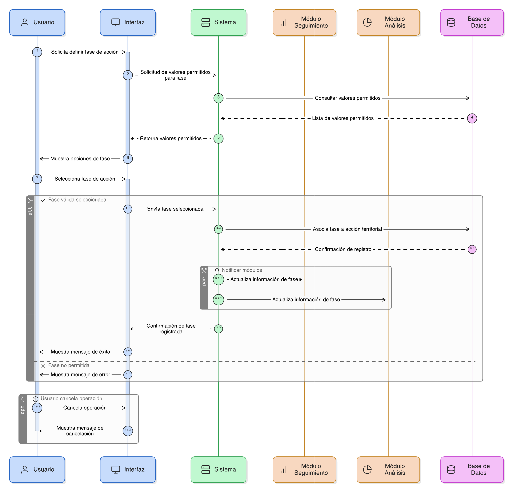
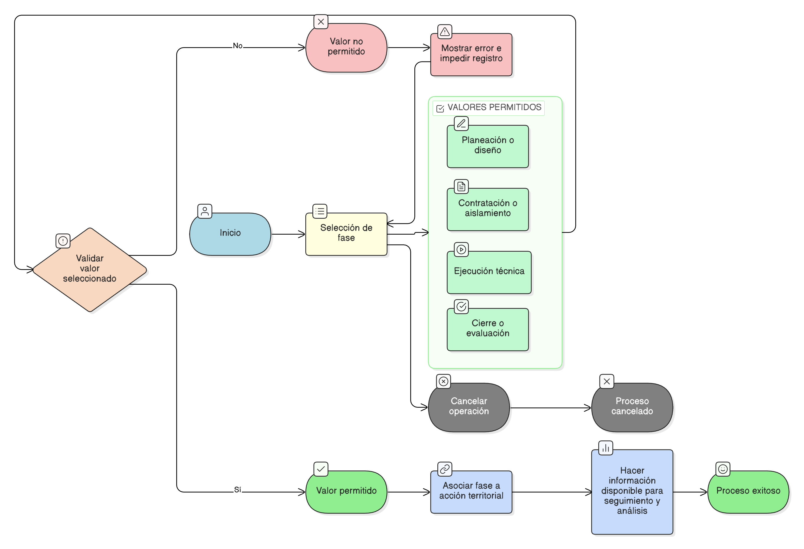

# HU-PIGCCT-SYM-065
## Épica: Gestión de acciones territoriales y seguimiento de indicadores del PIGCCT
### Definir fase de la acción

---

## DESCRIPCIÓN HISTORIA DE USUARIO

> **Como:** usuario del sistema.                   
> **Quiero:** definir la fase de una acción territorial.                  
> **Para:** identificar su estado dentro del ciclo del proyecto.     

---

## CRITERIOS DE ACEPTACIÓN

### 1. Definición de la fase de la acción

1.1 El sistema debe permitir seleccionar una fase de la acción.                   
1.2 La fase de la acción debe definirse a partir de un conjunto de valores permitidos.

### 2. Valores permitidos

2.1 El sistema debe permitir únicamente los siguientes valores:

- Planeación / diseño.
- Contratación / aislamiento.
- Ejecución técnica.
- Cierre / evaluación.

2.2 El sistema no debe permitir registrar valores distintos a los definidos.

### 3. Consistencia de la información

3.1 La fase de la acción debe quedar asociada a la acción territorial.                    
3.2 La información de la fase debe estar disponible para los módulos de seguimiento y análisis.

### 4. Usabilidad y experiencia de usuario

4.1 La interfaz debe ser clara, intuitiva y consistente con el diseño general del sistema.
4.2 El sistema debe permitir cancelar la operación sin guardar cambios.

---

### Resultado esperado

El sistema permite identificar de forma consistente la fase de las acciones territoriales dentro del ciclo del proyecto, facilitando el seguimiento y análisis del cumplimiento de los indicadores del PIGCCT.

---

## DIAGRAMA DE SECUENCIA

## DIAGRAMA DE FLUJO DEL PROCESO

