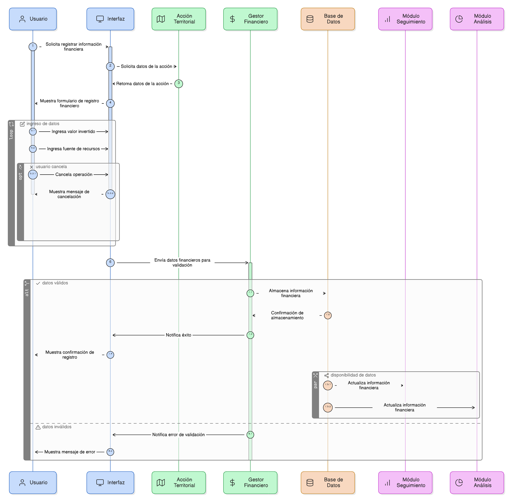
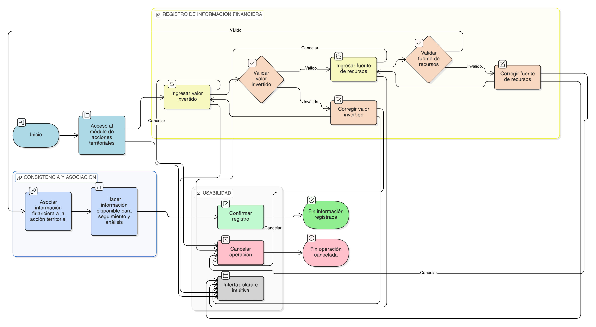

# HU-PIGCCT-SYM-066
## Épica: Gestión de acciones territoriales y seguimiento de indicadores del PIGCCT
### Registrar información financiera

---

## DESCRIPCIÓN HISTORIA DE USUARIO

> **Como:** usuario del sistema.
> **Quiero:** registrar la información financiera de una acción territorial.
> **Para:** garantizar la trazabilidad financiera de la acción.

---

## CRITERIOS DE ACEPTACIÓN

### 1. Registro del valor invertido

1.1 El sistema debe permitir registrar el valor invertido asociado a la acción territorial.                    
1.2 El valor invertido debe ser almacenado como un dato numérico válido.

### 2. Registro de la fuente de los recursos

2.1 El sistema debe permitir registrar la fuente de los recursos asociados a la acción territorial.                     
2.2 La fuente de los recursos debe quedar vinculada a la acción.

### 3. Consistencia de la información financiera

3.1 La información financiera registrada debe estar asociada a la acción territorial.                            
3.2 La información financiera debe estar disponible para los módulos de seguimiento y análisis.

### 4. Usabilidad y experiencia de usuario

4.1 La interfaz debe ser clara, intuitiva y consistente con el diseño general del sistema.
4.2 El sistema debe permitir cancelar la operación sin guardar cambios.

---

### Resultado esperado

El sistema permite registrar información financiera básica de las acciones territoriales, garantizando la trazabilidad y disponibilidad de los datos para el seguimiento del cumplimiento de los indicadores del PIGCCT.

---

## DIAGRAMA DE SECUENCIA

## DIAGRAMA DE FLUJO DEL PROCESO

