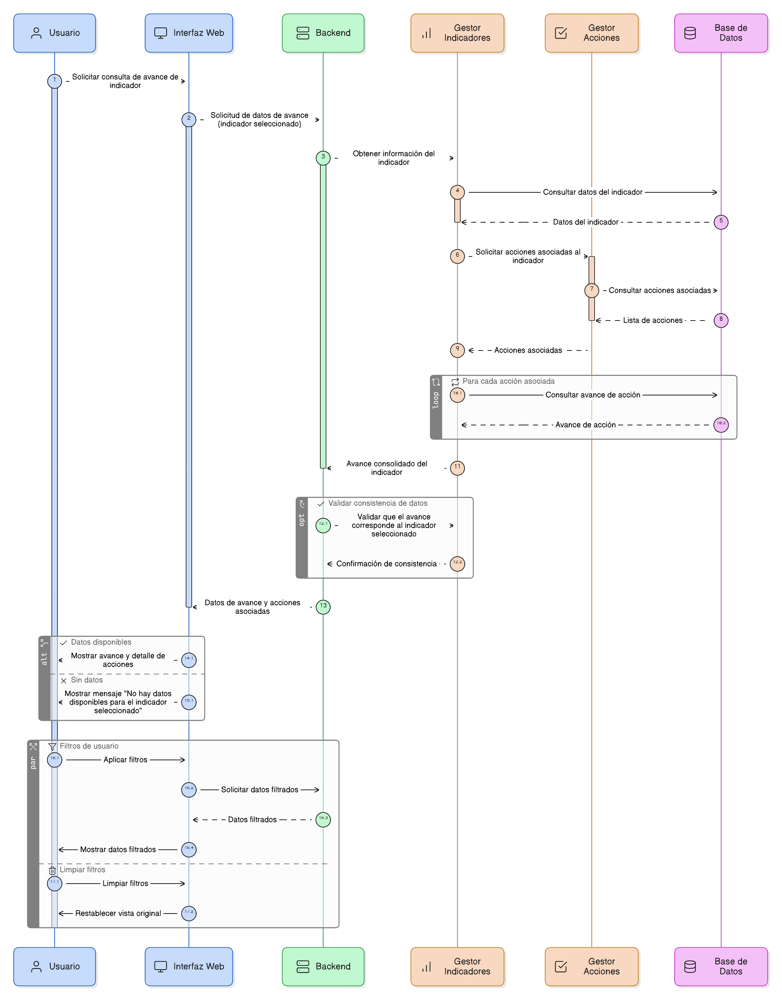
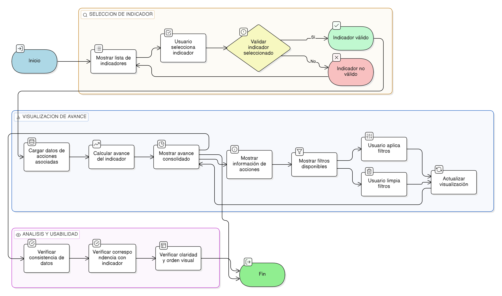

# HU-PIGCCT-SYM-079
## Épica: Gestión de acciones territoriales y seguimiento de indicadores del PIGCCT
### Consultar avance por indicador

---

## DESCRIPCIÓN HISTORIA DE USUARIO

> **Como:** usuario del sistema.                           
> **Quiero:** consultar el avance de un indicador del PIGCCT.                           
> **Para:** analizar el aporte de las acciones asociadas.

---

## CRITERIOS DE ACEPTACIÓN

### 1. Consulta del avance del indicador

1.1 El sistema debe permitir visualizar el avance de un indicador.                       
1.2 El avance debe construirse a partir de la información de las acciones asociadas al indicador.

### 2. Información presentada

2.1 El sistema debe mostrar la información necesaria para analizar el aporte de las acciones al indicador.                       
2.2 La información debe presentarse de forma clara y consistente.

### 3. Consistencia de la información

3.1 La información consultada debe corresponder al indicador seleccionado.                           
3.2 El avance del indicador debe ser consistente con los datos almacenados en el sistema.

### 4. Usabilidad y experiencia de usuario
4.1 La vista del avance por indicador debe ser clara, ordenada y consistente con el diseño general del sistema.  
4.2 Los filtros aplicados deben poder limpiarse fácilmente.

---

### Resultado esperado

El sistema permite consultar de forma consolidada el avance de los indicadores del PIGCCT, facilitando el análisis del aporte de las acciones territoriales para su seguimiento y evaluación.

---

## DIAGRAMA DE SECUENCIA

## DIAGRAMA DE FLUJO DEL PROCESO

