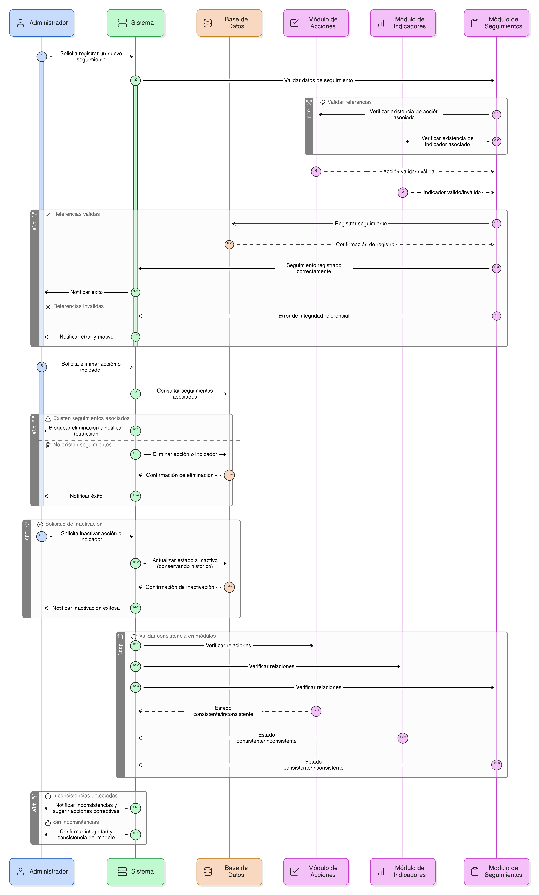
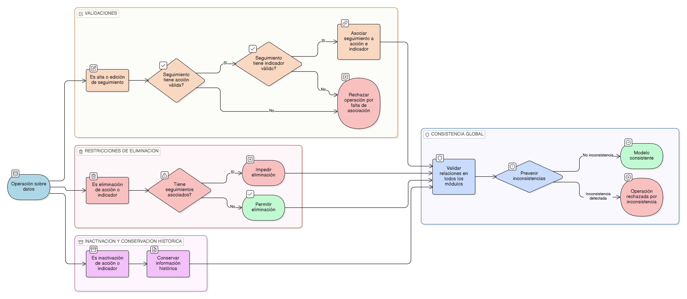

# HU-PIGCCT-SYM-081
## Épica: Gestión de acciones territoriales y seguimiento de indicadores del PIGCCT
### Integridad referencial del modelo

---

## DESCRIPCIÓN HISTORIA DE USUARIO

> **Como:** administrador del sistema.                                       
> **Quiero:** que el sistema garantice la integridad referencial entre acciones, indicadores y seguimientos.                       
> **Para:** mantener la consistencia del modelo de datos del PIGCCT.

---

## CRITERIOS DE ACEPTACIÓN

### 1. Integridad entre acción, indicador y seguimiento

1.1 El sistema debe garantizar que cada seguimiento esté asociado a una acción válida y a un indicador válido.                         
1.2 El sistema debe impedir la existencia de seguimientos sin una acción o indicador asociado.

### 2. Restricciones de eliminación

2.1 El sistema debe impedir la eliminación de acciones o indicadores que tengan seguimientos asociados.                      
2.2 En caso de inactivación, la información histórica debe conservarse.

### 3. Consistencia del modelo de datos

3.1 Las relaciones entre acción, indicador y seguimientos deben mantenerse consistentes en todos los módulos.                          
3.2 El sistema debe prevenir inconsistencias en el modelo de datos.

---

### Resultado esperado

El sistema garantiza la integridad referencial entre acciones, indicadores y seguimientos, preservando la coherencia y confiabilidad del modelo de datos del PIGCCT en todos los módulos del sistema.

---

## DIAGRAMA DE SECUENCIA

## DIAGRAMA DE FLUJO DEL PROCESO

