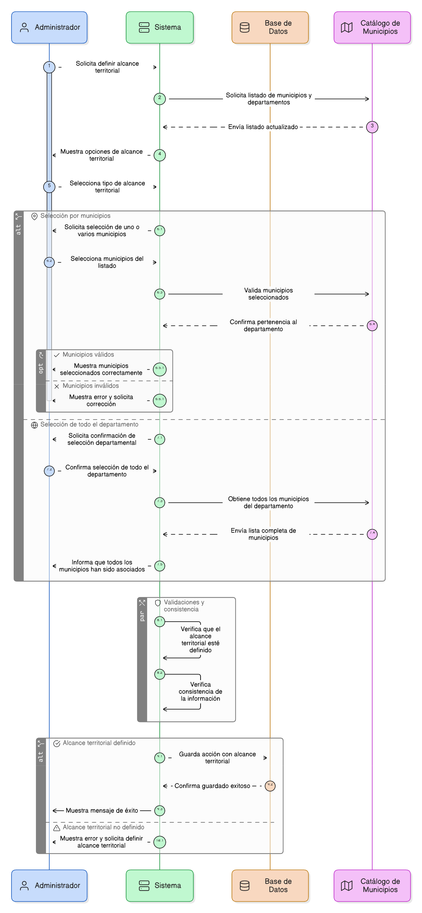
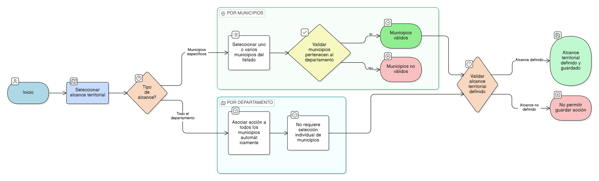

# HU-PIGCCT-SYM-082
## Épica: Gestión territorial de la acción (municipios)
### Definir el alcance territorial de la acción

---

## DESCRIPCIÓN HISTORIA DE USUARIO

> **Como:** administrador del sistema.                      
> **Quiero:** definir el alcance territorial de la acción.                      
> **Para:** indicar de manera precisa en qué territorio se ejecuta la intervención del PIGCCT.

---

## CRITERIOS DE ACEPTACIÓN

### 1. Selección del alcance territorial

1.1 El sistema debe permitir seleccionar el alcance territorial de la acción.                     
1.2 Las opciones de alcance territorial deben incluir:                      
- Municipios específicos.                   
- Todo el departamento.

### 2. Selección por municipios

2.1 Si el usuario selecciona municipios específicos, el sistema debe permitir elegir uno o varios municipios del listado oficial.                  
2.2 El sistema debe validar que los municipios seleccionados pertenezcan al departamento correspondiente.

### 3. Selección a nivel departamental

3.1 Si el usuario selecciona todo el departamento, el sistema debe asociar automáticamente la acción a todos los municipios del departamento.                     
3.2 En este caso, no debe ser obligatoria la selección individual de municipios.

### 4. Validaciones y consistencia

4.1 El sistema debe impedir guardar una acción sin definir su alcance territorial.   

---

### Resultado esperado

El sistema permite definir de manera clara y validada el alcance territorial de cada acción, ya sea a nivel municipal o departamental, asegurando la correcta localización de las intervenciones del PIGCCT y la consistencia de la información en todos los módulos del sistema.

---

## DIAGRAMA DE SECUENCIA

## DIAGRAMA DE FLUJO DEL PROCESO

