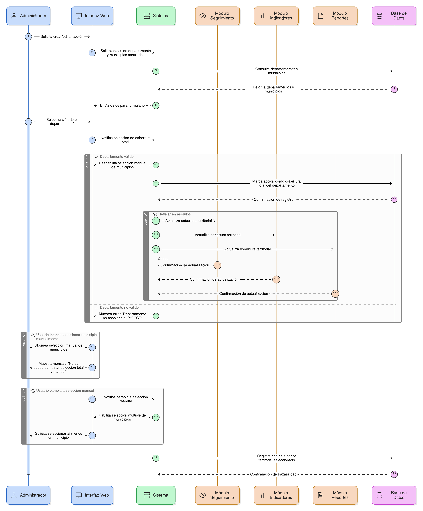
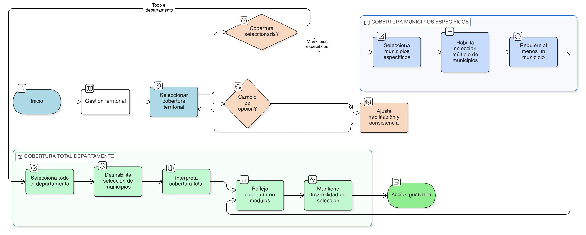

# HU-PIGCCT-SYM-085
## Épica: Gestión territorial de la acción (municipios)
### Seleccionar de todo el departamento

---

## DESCRIPCIÓN HISTORIA DE USUARIO

> **Como:** administrador del sistema.
> **Quiero:** indicar que la acción aplica a todo el departamento.
> **Para:** definir una cobertura territorial total sin necesidad de seleccionar municipios de forma individual.

---

## CRITERIOS DE ACEPTACIÓN

### 1. Selección de cobertura departamental

1.1 El sistema debe permitir al usuario seleccionar la opción “todo el departamento” como alcance territorial de la acción.      
1.2 Esta opción debe estar disponible únicamente para el departamento asociado al PIGCCT.

### 2. Comportamiento del sistema al seleccionar todo el departamento

2.1 Al seleccionar “todo el departamento”, el sistema debe deshabilitar la selección manual de municipios.                      
2.2 El sistema debe interpretar automáticamente que la acción tiene cobertura sobre todos los municipios del departamento.

### 3. Reglas de consistencia territorial

3.1 El sistema no debe permitir combinar la opción “todo el departamento” con la selección manual de municipios.                       
3.2 Si el usuario cambia de “todo el departamento” a municipios específicos, el sistema debe habilitar nuevamente la selección múltiple de municipios y requerir al menos uno.

### 4. Uso y reflejo de la información

4.1 La cobertura total del departamento debe reflejarse de manera consistente en los módulos de seguimiento, indicadores y reportes.                      
4.2 El sistema debe mantener la trazabilidad del tipo de alcance territorial seleccionado para la acción.

---

### Resultado esperado

El sistema permite definir una acción con cobertura en todo el departamento, deshabilitando la selección manual de municipios e interpretando correctamente la intervención como de alcance total, garantizando coherencia territorial y consistencia de la información en todos los módulos del PIGCCT.

---

## DIAGRAMA DE SECUENCIA

## DIAGRAMA DE FLUJO DEL PROCESO

## PROTOTIPO PRELIMINAR

