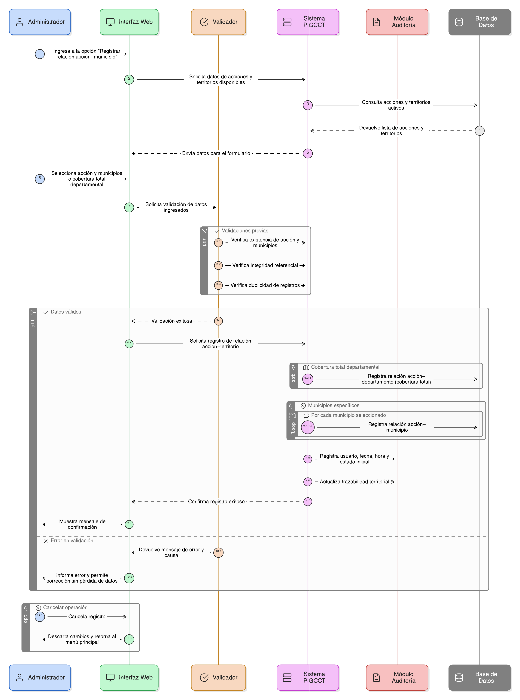
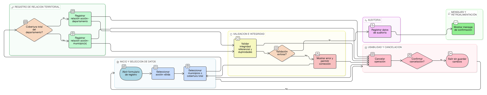

# HU-PIGCCT-SYM-086
## Épica: Gestión territorial de la acción (municipios)
### Registrar la relación acción–municipio

---

## DESCRIPCIÓN HISTORIA DE USUARIO

> **Como:** administrador del sistema.                    
> **Quiero:** registrar la relación entre la acción y los municipios asociados.                        
> **Para:** mantener la trazabilidad territorial de la acción dentro del PIGCCT.

---

## CRITERIOS DE ACEPTACIÓN

### 1. Registro de la relación acción–municipio

1.1 El sistema debe guardar la relación entre la acción y uno o varios municipios seleccionados.                    
1.2 Cada relación registrada debe estar asociada a una acción válida y a un municipio válido.

### 2. Registro en cobertura departamental

2.1 Cuando la acción tenga como alcance todo el departamento, el sistema debe registrar la relación de la acción con el departamento como cobertura total.                            
2.2 En este caso, no debe ser obligatorio registrar relaciones individuales con cada municipio.

### 3. Integridad y trazabilidad territorial

3.1 El sistema debe garantizar la integridad referencial entre acción, departamento y municipios.                    
3.2 La relación acción–municipio o acción–departamento debe permitir identificar claramente el territorio cubierto por la acción.

### 4. Consistencia del modelo de datos

4.1 La información de la relación territorial debe mantenerse consistente en los módulos de seguimiento, indicadores y reportes.                                  
4.2 El sistema debe impedir duplicidades o registros inconsistentes en la relación acción–municipio.

### 5. Mensajes y retroalimentación al usuario

5.1 El sistema debe mostrar un mensaje de confirmación cuando la relación acción–municipio se registren exitosamente.                         
5.2 En caso de error, el sistema debe informar la causa y permitir la corrección sin pérdida de información.

### 6. Auditoría y trazabilidad

6.1 El sistema debe registrar automáticamente:

- Usuario que registra.
- Fecha y hora de registro.
- Estado inicial del registro.

6.2 Esta información debe estar disponible para fines de auditoría y control.

### 7. Usabilidad y experiencia de usuario

7.1 El formulario debe ser claro y consistente con el diseño general del sistema.                      
7.2 El sistema debe permitir cancelar la operación sin guardar cambios.                     
7.3 El sistema debe prevenir la pérdida de información mediante validaciones previas.

---

### Resultado esperado

El sistema registra correctamente la relación entre cada acción y su cobertura territorial, ya sea por municipios específicos o por cobertura total del departamento, garantizando trazabilidad, integridad referencial y coherencia territorial en todo el modelo de datos del PIGCCT.

---

## DIAGRAMA DE SECUENCIA

## DIAGRAMA DE FLUJO DEL PROCESO

