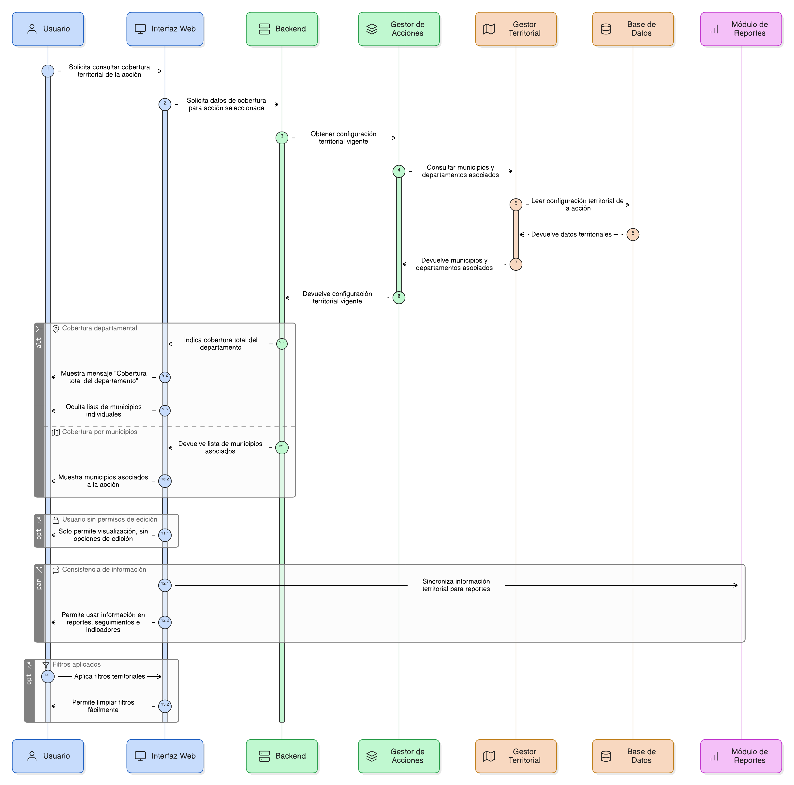
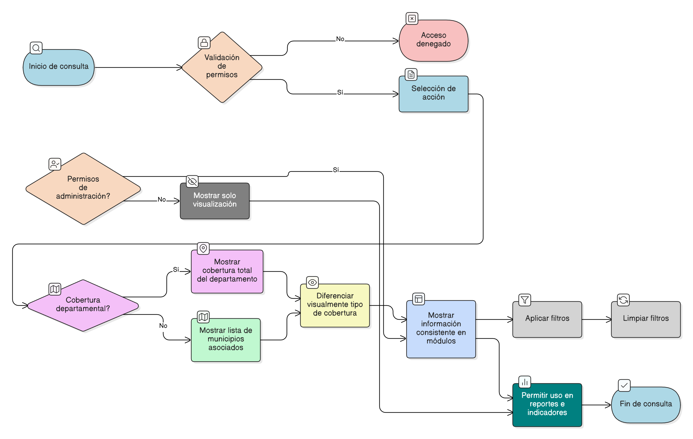

# HU-PIGCCT-SYM-090
## Épica: Gestión territorial de la acción (municipios)
### Consultar la cobertura territorial de la acción

---

## DESCRIPCIÓN HISTORIA DE USUARIO

> **Como:** usuario del sistema.
> **Quiero:** consultar la cobertura territorial de una acción.
> **Para:** conocer los municipios asociados y el alcance territorial de la intervención del PIGCCT.

---

## CRITERIOS DE ACEPTACIÓN

### 1. Visualización de la cobertura territorial

1.1 El sistema debe permitir visualizar los municipios asociados a una acción.
1.2 La información presentada debe corresponder a la configuración territorial vigente de la acción.

### 2. Cobertura departamental

2.1 Cuando la acción tenga cobertura sobre todo el departamento, el sistema debe mostrar claramente que la acción aplica a nivel departamental.                          
2.2 En este caso, el sistema no debe listar municipios individuales, sino indicar cobertura total del departamento.

### 3. Claridad y consistencia de la información

3.1 El sistema debe diferenciar visualmente entre cobertura por municipios específicos y cobertura departamental.                                   
3.2 La información territorial debe mostrarse de manera consistente en todos los módulos donde se consulte la acción.

### 4. Acceso y uso de la información

4.1 La consulta de la cobertura territorial debe estar disponible para los perfiles de usuario con permisos de lectura de acciones.                             
4.2 El sistema debe permitir utilizar esta información como referencia en reportes, seguimientos e indicadores.

### 5. Control de visibilidad por estado y rol
5.1 Los usuarios sin permisos de administración solo deben poder visualizar la información, sin opciones de edición.

### 6. Usabilidad y experiencia de usuario
6.1 La vista de la cobertura territorial de la acción debe ser clara, ordenada y consistente con el diseño general del sistema.  
6.2 Los filtros aplicados deben poder limpiarse fácilmente.

---

### Resultado esperado

El sistema permite consultar de forma clara y precisa la cobertura territorial de cada acción, mostrando los municipios asociados o indicando cobertura total del departamento, garantizando comprensión del alcance territorial y coherencia de la información en todos los módulos del PIGCCT.

---

## DIAGRAMA DE SECUENCIA

## DIAGRAMA DE FLUJO DEL PROCESO

