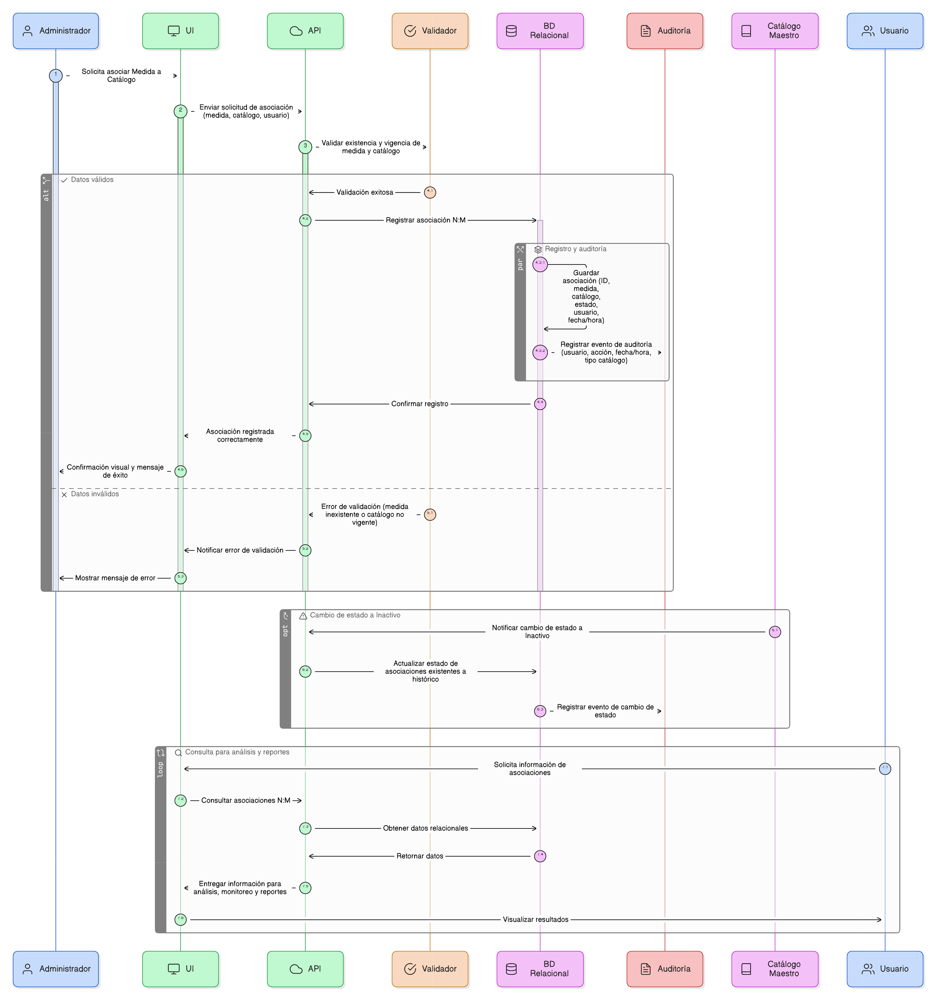

# HU-PIGCCT-SYM-100
## Épica: Alineación estratégica de las medidas del PIGCCT
### Registrar relaciones N:M entre medidas y catálogos estratégicos

---

## DESCRIPCIÓN HISTORIA DE USUARIO

> **Como:** administrador del sistema.                   
> **Quiero:** que el sistema registre y mantenga las relaciones N:M entre las medidas del PIGCCT y los distintos catálogos estratégicos.                     
> **Para:** garantizar la trazabilidad estratégica, consistencia del modelo de datos y disponibilidad de la información para análisis, seguimiento, monitoreo y reporte del PIGCCT.

---

## CRITERIOS DE ACEPTACIÓN

### 1. Alcance de las relaciones N:M

1.1 El sistema debe soportar relaciones de tipo N:M entre la entidad Medida y los siguientes catálogos maestros:

- Medios de implementación.
- Líneas estratégicas del PNCC.
- Líneas instrumentales del PNCC.
- Enfoques.
- Dimensiones.
- Objetivos de Desarrollo Sostenible (ODS).

1.2 Cada tipo de relación debe gestionarse mediante una tabla relacional independiente.

### 2. Registro y persistencia de asociaciones

2.1 El sistema debe almacenar automáticamente cada asociación creada desde las funcionalidades definidas en las HU:

- [HU-PIGCCT-SYM-094](/content/historias_usuario/HU-PIGCCT-SYM-094/HU-PIGCCT-SYM-094.md)
- [HU-PIGCCT-SYM-095](/content/historias_usuario/HU-PIGCCT-SYM-095/HU-PIGCCT-SYM-095.md)
- [HU-PIGCCT-SYM-096](/content/historias_usuario/HU-PIGCCT-SYM-096/HU-PIGCCT-SYM-096.md)
- [HU-PIGCCT-SYM-097](/content/historias_usuario/HU-PIGCCT-SYM-097/HU-PIGCCT-SYM-097.md)
- [HU-PIGCCT-SYM-098](/content/historias_usuario/HU-PIGCCT-SYM-098/HU-PIGCCT-SYM-098.md)
- [HU-PIGCCT-SYM-099](/content/historias_usuario/HU-PIGCCT-SYM-099/HU-PIGCCT-SYM-099.md)

2.2 Cada registro relacional debe contener como mínimo:

- Identificador único de la asociación.
- Identificador de la medida.
- Identificador del elemento del catálogo correspondiente.
- Estado de la asociación (Activo / Inactivo).

### 3. Integridad referencial

3.1 El sistema debe garantizar la integridad referencial entre medidas y los catálogos maestros asociados.                
3.2 No se deben permitir asociaciones con medidas inexistentes o registros de catálogos no vigentes o inexistentes.             
3.3 Si una medida o un elemento del catálogo cambia a estado Inactivo, el sistema debe conservar la asociación para fines históricos, sin permitir nuevas relaciones activas.

### 4. Disponibilidad de la información

4.1 Las relaciones registradas deben estar disponibles para:

- Análisis de alineación estratégica.
- Seguimiento y monitoreo del PIGCCT.
- Evaluación de coherencia con políticas nacionales e internacionales.
- Generación de reportes institucionales.

### 5. Auditoría y trazabilidad

5.1 El sistema debe registrar automáticamente para cada relación:

- Usuario que crea o modifica la asociación.
- Fecha y hora de la operación.
- Tipo de catálogo asociado.
56.2 Esta información debe estar disponible para auditoría, control y seguimiento institucional.

### 6. Usabilidad y consistencia del sistema

6.1 El registro de relaciones debe realizarse de forma transparente para el usuario, como resultado de las acciones de asociación en cada módulo.                               
6.2 El sistema debe manejar los errores de persistencia de manera controlada, informando claramente al usuario.

---

### Resultado esperado

Un modelo de datos relacional consistente, con asociaciones N:M correctamente registradas entre las medidas del PIGCCT y los catálogos estratégicos, garantizando la trazabilidad, integridad y disponibilidad de la información para la gestión integral del cambio climático territorial.

---

## DIAGRAMA DE SECUENCIA

## DIAGRAMA DE FLUJO DEL PROCESO

