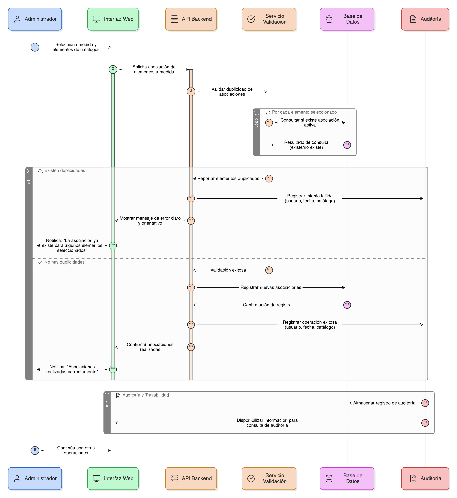
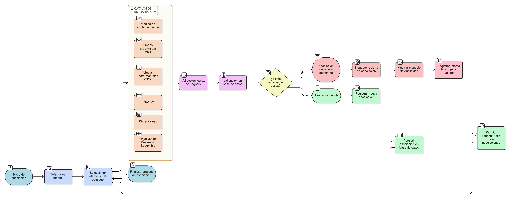

# HU-PIGCCT-SYM-101
## Épica: Alineación estratégica de las medidas del PIGCCT
### Evitar duplicidades de asociaciones entre medidas y catálogos

---

## DESCRIPCIÓN HISTORIA DE USUARIO

> **Como:** administrador del sistema.                  
> **Quiero:** que el sistema evite la creación de asociaciones duplicadas entre una medida del PIGCCT y los elementos de los catálogos estratégicos.                        
> **Para:** mantener la consistencia, integridad y calidad de la información, asegurando una correcta trazabilidad estratégica de las medidas.

---

## CRITERIOS DE ACEPTACIÓN

### 1. Alcance de la validación de duplicidad

1.1 El sistema debe validar la duplicidad en las asociaciones entre medidas y los siguientes catálogos maestros:

- Medios de implementación.
- Líneas estratégicas del PNCC.
- Líneas instrumentales del PNCC.
- Enfoques.
- Dimensiones.
- Objetivos de Desarrollo Sostenible (ODS).

1.2 La validación debe aplicarse a todas las funcionalidades de asociación definidas en las HU:

- [HU-PIGCCT-SYM-094](/content/historias_usuario/HU-PIGCCT-SYM-094/HU-PIGCCT-SYM-094.md)
- [HU-PIGCCT-SYM-095](/content/historias_usuario/HU-PIGCCT-SYM-095/HU-PIGCCT-SYM-095.md)
- [HU-PIGCCT-SYM-096](/content/historias_usuario/HU-PIGCCT-SYM-096/HU-PIGCCT-SYM-096.md)
- [HU-PIGCCT-SYM-097](/content/historias_usuario/HU-PIGCCT-SYM-097/HU-PIGCCT-SYM-097.md)
- [HU-PIGCCT-SYM-098](/content/historias_usuario/HU-PIGCCT-SYM-098/HU-PIGCCT-SYM-098.md)
- [HU-PIGCCT-SYM-099](/content/historias_usuario/HU-PIGCCT-SYM-099/HU-PIGCCT-SYM-099.md)

### 2. Comportamiento del sistema ante duplicidad

2.1 Si el usuario intenta asociar un elemento del catálogo que ya se encuentra vinculado a la medida, el sistema debe:

- Bloquear el registro de la asociación duplicada.
- Mantener intactas las asociaciones existentes.

2.2 El sistema debe mostrar un mensaje claro indicando que la asociación ya existe.

### 3. Reglas de consistencia

3.1 Una asociación se considera duplicada cuando existe una relación activa entre:

- El mismo identificador de medida.
- El mismo identificador del elemento del catálogo.

3.2 El sistema debe validar la duplicidad antes de persistir la información en la base de datos.

### 4. Integridad y desempeño

4.1 La validación de duplicidad debe realizarse tanto a nivel de lógica de negocio como a nivel de base de datos (restricciones únicas o claves compuestas).                     
4.2 El sistema no debe afectar el desempeño general durante la validación de asociaciones múltiples.

### 5. Auditoría y trazabilidad

5.1 El sistema debe registrar intentos fallidos de asociación por duplicidad, incluyendo:

- Usuario que realizó el intento.
- Fecha y hora.
- Tipo de catálogo involucrado.

5.2 Esta información debe estar disponible para auditoría y control, cuando aplique.

### 6. Usabilidad y experiencia de usuario

6.1 El mensaje de validación por duplicidad debe ser claro, comprensible y orientado a la corrección de la acción.                          
6.2 El sistema debe permitir continuar con la operación sin pérdida de las demás asociaciones válidas seleccionadas.

---

### Resultado esperado

Un sistema robusto y consistente, que previene asociaciones duplicadas entre medidas y catálogos estratégicos, asegurando la calidad, integridad y trazabilidad de la información del PIGCCT.

---

## DIAGRAMA DE SECUENCIA

## DIAGRAMA DE FLUJO DEL PROCESO

