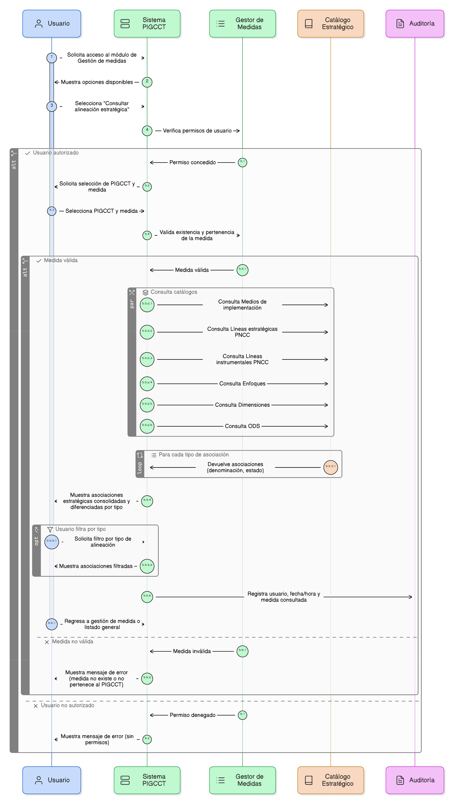
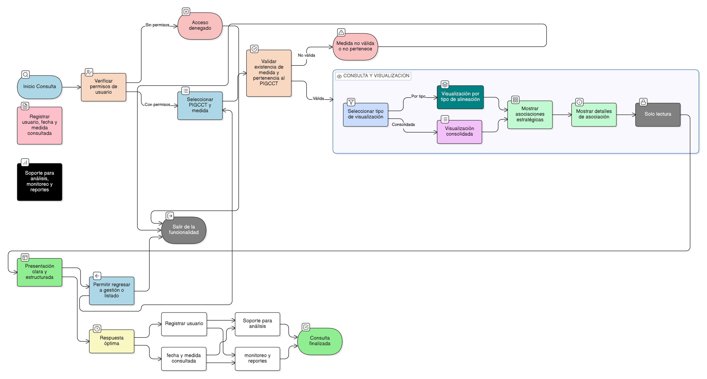

# HU-PIGCCT-SYM-102
# Épica: Alineación estratégica de las medidas del PIGCCT
### Consultar alineación estratégica de la medida

---

## DESCRIPCIÓN HISTORIA DE USUARIO

> **Como:** usuario del sistema.                     
> **Quiero:** visualizar todas las asociaciones estratégicas de una medida del PIGCCT.                      
> **Para:** comprender su alineación institucional, nacional e internacional, facilitando el análisis, seguimiento y evaluación integral de la medida dentro del marco estratégico del PIGCCT.

---

## CRITERIOS DE ACEPTACIÓN

### 1. Acceso a la funcionalidad de consulta

1.1 El sistema debe permitir el acceso a la opción “Consultar alineación estratégica” a usuarios con permisos de consulta o administración, según el perfil definido.                   
1.2 La funcionalidad debe estar disponible desde el módulo de Gestión de medidas del PIGCCT.                      
1.3 El usuario debe seleccionar previamente un PIGCCT y una medida registrada.

### 2. Información estratégica a visualizar

2.1 El sistema debe mostrar, de manera consolidada, todas las asociaciones estratégicas de la medida, organizadas por tipo de catálogo:

- Medios de implementación.
- Líneas estratégicas del PNCC.
- Líneas instrumentales del PNCC.
- Enfoques.
- Dimensiones.
- Objetivos de Desarrollo Sostenible (ODS).

2.2 Para cada asociación, el sistema debe mostrar como mínimo:

- Denominación del elemento del catálogo.
- Estado de la asociación (Activo / Inactivo).

### 3. Visualización y presentación

3.1 La información debe presentarse de forma clara, estructurada y legible, diferenciando cada tipo de alineación.                 
3.2 El sistema debe permitir la visualización por tipo de alineación o listado completo de asociaciones.
3.3 La consulta debe ser solo de lectura, sin permitir modificaciones desde esta funcionalidad.

### 4. Validaciones

4.1 El sistema debe validar que:

- La medida seleccionada exista y pertenezca al PIGCCT seleccionado.                 
- El usuario tenga permisos para consultar la información.

4.2 En caso de error, el sistema debe mostrar un mensaje claro indicando la causa.

### 5. Disponibilidad y uso de la información

5.1 La información de alineación estratégica debe estar disponible para:

- Análisis institucional y técnico.
- Seguimiento y monitoreo del PIGCCT.
- Evaluaciones de coherencia con políticas nacionales e internacionales.
- Generación de reportes.

### 6. Auditoría y trazabilidad

6.1 El sistema debe registrar:

- Usuario que realiza la consulta.
- Fecha y hora de acceso.
- Medida consultada.

6.2 Esta información debe estar disponible para fines de auditoría y control, cuando aplique.

### 7. Usabilidad y experiencia de usuario

7.1 La interfaz debe ser clara, intuitiva y consistente con el diseño general del sistema.                   
7.2 El sistema debe permitir regresar fácilmente a la gestión de la medida o al listado general.                         
7.3 El tiempo de respuesta de la consulta debe ser óptimo, incluso con múltiples asociaciones.

---

### Resultado esperado

Una visualización completa y clara de la alineación estratégica de una medida del PIGCCT, permitiendo comprender su coherencia institucional, nacional e internacional, y apoyando los procesos de análisis, seguimiento y toma de decisiones.

---

## DIAGRAMA DE SECUENCIA

## DIAGRAMA DE FLUJO DEL PROCESO

