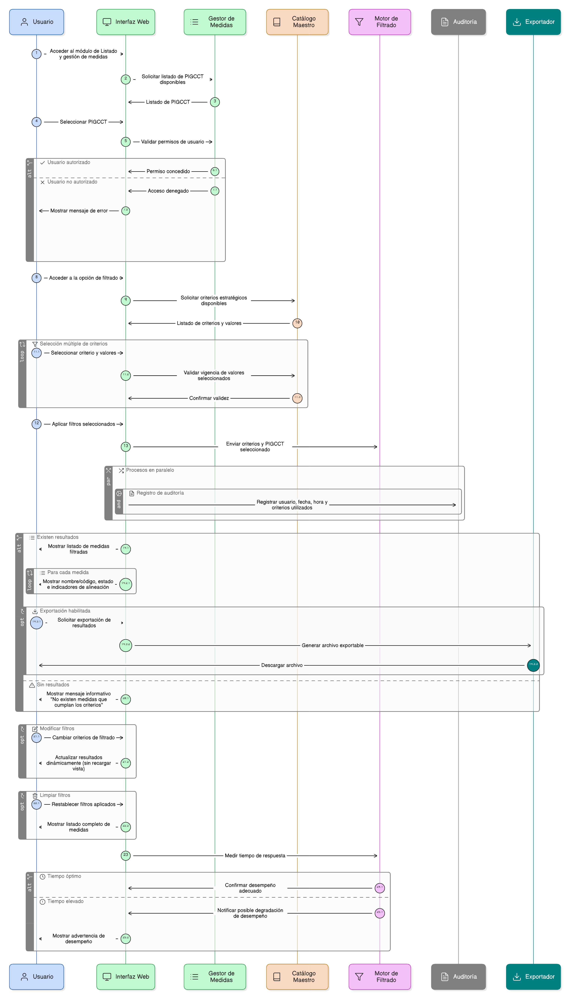

# HU-PIGCCT-SYM-103
## Épica: Alineación estratégica de las medidas del PIGCCT
### Filtrar medidas por criterios estratégicos

---

## DESCRIPCIÓN HISTORIA DE USUARIO

> **Como:** usuario del sistema.                   
> **Quiero:** filtrar las medidas del PIGCCT utilizando criterios estratégicos.                      
> **Para:** realizar análisis transversales del PIGCCT, identificar patrones de alineación y apoyar la toma de decisiones en los procesos de planificación, seguimiento y evaluación.

---

## CRITERIOS DE ACEPTACIÓN

### 1. Acceso a la funcionalidad de filtrado

1.1 El sistema debe permitir el acceso a la opción de filtrado de medidas a usuarios con permisos de consulta o administración, según el perfil definido.                
1.2 La funcionalidad debe estar disponible desde el módulo de Listado y gestión de medidas del PIGCCT.                                         
1.3 El usuario debe seleccionar previamente un PIGCCT.

# 2. Criterios estratégicos de filtrado

2.1 El sistema debe permitir filtrar medidas por uno o varios de los siguientes criterios estratégicos:

- Medio de implementación.
- Objetivo de Desarrollo Sostenible (ODS).
- Enfoque.
- Dimensión.

2.2 Cada criterio debe permitir selección múltiple.                       
2.3 Los valores disponibles para cada criterio deben provenir de los catálogos maestros del sistema.

### 3. Combinación de filtros

3.1 El sistema debe permitir aplicar uno o varios criterios de forma simultánea.                        
3.2 Cuando se utilicen múltiples criterios, el sistema debe aplicar una lógica de filtrado consistente (AND), mostrando únicamente las medidas que cumplan con todos los criterios seleccionados.                 
3.3 El sistema debe permitir limpiar o restablecer los filtros aplicados.

###  4. Resultados del filtrado

4.1 El sistema debe mostrar un listado de medidas que cumplan con los criterios seleccionados.                  
4.2 Para cada medida listada, el sistema debe mostrar como mínimo:

- Nombre o código de la medida.
- Estado de la medida.
- Indicadores básicos de alineación estratégica (cuando aplique).                      

4.3 Si no existen resultados, el sistema debe mostrar un mensaje informativo.

### 5. Validaciones y desempeño

5.1 El sistema debe validar que los criterios seleccionados sean válidos y vigentes.                   
5.2 El tiempo de respuesta del filtrado debe ser óptimo, incluso con grandes volúmenes de datos.

### 6. Uso de la información

6.1 Los resultados del filtrado deben poder utilizarse Para:

- Análisis transversales del PIGCCT.
- Identificación de brechas o concentraciones estratégicas.
- Apoyo a la toma de decisiones.

6.2 El sistema puede permitir la exportación de los resultados, si la funcionalidad está habilitada.

### 7. Auditoría y trazabilidad

7.1 El sistema debe registrar:

- Usuario que realiza el filtrado.
- Fecha y hora de la consulta.
- Criterios utilizados (cuando aplique).

### 8. Usabilidad y experiencia de usuario

8.1 La interfaz de filtrado debe ser clara, intuitiva y consistente con el diseño general del sistema.                       
8.2 El sistema debe permitir modificar los filtros sin recargar la vista completa.                  
8.3 El sistema debe prevenir la pérdida de información al cambiar de criterios.

---

### Resultado esperado

Un listado dinámico de medidas del PIGCCT filtradas por criterios estratégicos, que permita realizar análisis transversales, comprender patrones de alineación y fortalecer los procesos de planificación, seguimiento y evaluación del PIGCCT.

---

## DIAGRAMA DE SECUENCIA

## DIAGRAMA DE FLUJO DEL PROCESO

