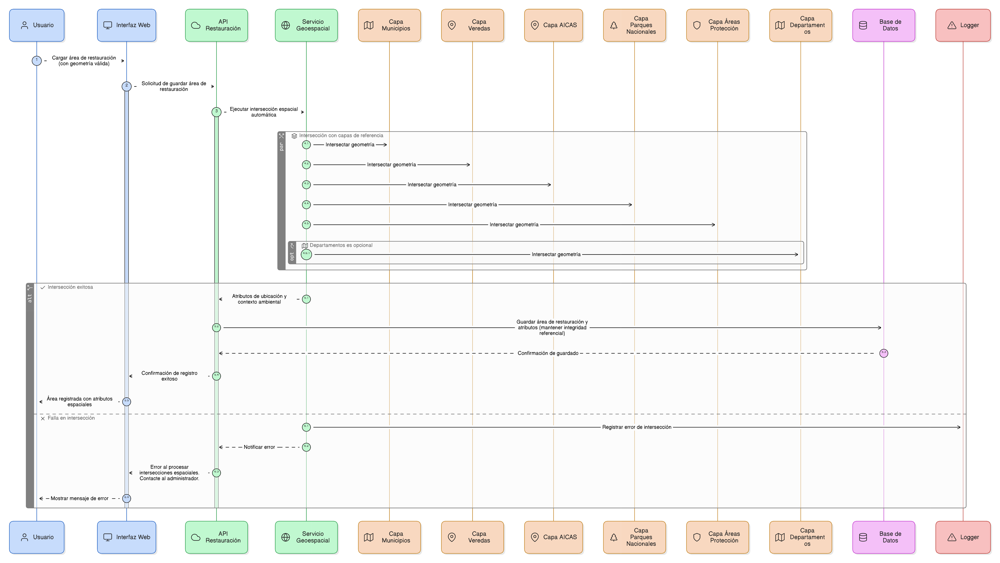
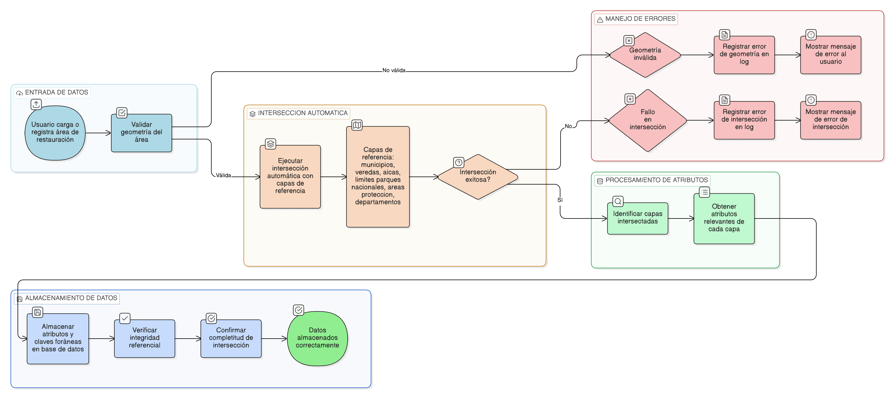

## HU-pigcct-sym-106

> **Identificador Historia de Usuario:** hu-pigcct-sym-106 \
> **Nombre Historia de Usuario:** Módulo de restauración - Intersecciones Espaciales Automáticas.

> **Área Proyecto:** Subdirección de Ecosistemas e Información Ambiental \
> **Nombre proyecto:** Realizar la construcción temática, mejoras informáticas y optimización del Módulo de restauración del SNIF del IDEAM. \
> **Líder funcional:** Wilmer Espitia Muñoz\
> **Analista de requerimiento de TI:** Sergio Alonso Anaya Estévez

## DESCRIPCIÓN HISTORIA DE USUARIO

> **Como:** usuario del sistema. \
> **Quiero:** que el sistema realice intersecciones espaciales automáticas entre las áreas cargadas y las capas de referencia.   \
> **Para:** almacenar los atributos de ubicación y contexto ambiental sin intervención del usuario.

## CRITERIOS DE ACEPTACIÓN

1. **Intersección Automática con Capas de Referencia**  
   1.1 El proceso se debe ejecutar automáticamente al guardar la geometría, sin intervención del usuario. \
   1.2 El sistema debe realizar intersecciones espaciales con las capas de municipios, veredas, aicas, limites_parques_nacionales, areas_proteccion y departamentos esta ultima es opcional. \
   1.3 Dado que el usuario carga o registra un área de restauración con una geometría válida, cuando el sistema ejecuta el proceso de análisis espacial, entonces debe identificar todas las capas geográficas que intersectan dicha geometría. \
   1.4 Dado que se detectan intersecciones con una o más capas, cuando el sistema procesa la información, entonces debe obtener los atributos relevantes de cada capa intersectada — por ejemplo: nombre, código, categoría u otros definidos en el modelo de datos. \
   1.5 Dado que los atributos relevantes han sido obtenidos, cuando se almacena la información del área de restauración, entonces el sistema debe guardar los valores correspondientes en los campos de clave foránea (FK) asociados, manteniendo la integridad referencial de la base de datos. \
   1.6 Si falla la intersección (por ejemplo, error de geometría), se debe registrar en log y mostrar el siguiente mensaje: “Error al procesar intersecciones espaciales. Contacte al administrador.” \
   1.7 Se debe verificar que la intersección se complete correctamente.

## DIAGRAMA DE SECUENCIA

## DIAGRAMA DE FLUJO DEL PROCESO

## ANEXOS

-	[HU-pigcct-sym-101](/content/historias_usuario/HU-pigcct-sym-101/HU-pigcct-sym-101.md)
-  Mapeo de errores de validación a mensajes específicos.