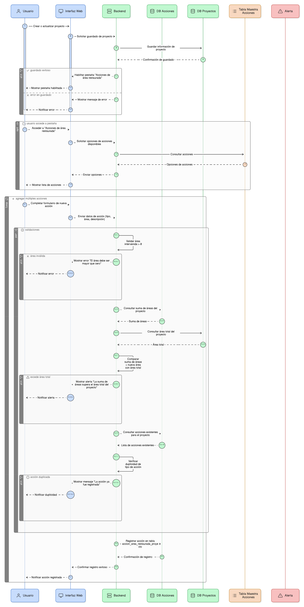
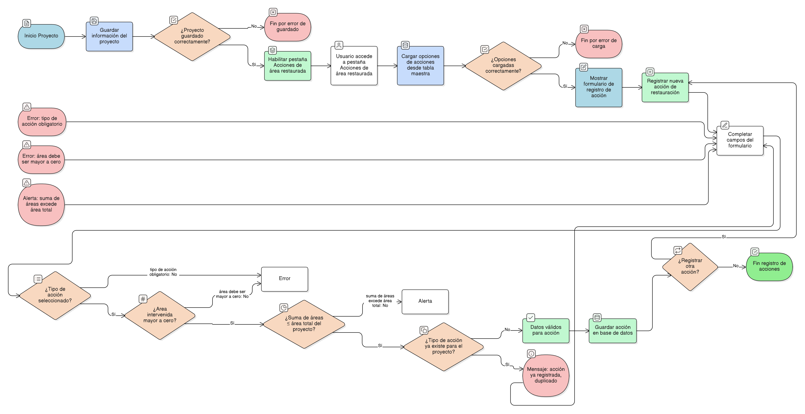

## HU-pigcct-sym-107

> **Identificador Historia de Usuario:** hu-pigcct-sym-107 \
> **Nombre Historia de Usuario:** Módulo de restauración - Gestión de Acciones de Área Restaurada.

> **Área Proyecto:** Subdirección de Ecosistemas e Información Ambiental \
> **Nombre proyecto:** Realizar la construcción temática, mejoras informáticas y optimización del Módulo de restauración del SNIF del IDEAM. \
> **Líder funcional:** Wilmer Espitia Muñoz\
> **Analista de requerimiento de TI:** Sergio Alonso Anaya Estévez

## DESCRIPCIÓN HISTORIA DE USUARIO

> **Como:** usuario del sistema. \
> **Quiero:** seleccionar y agregar múltiples acciones de área restaurada.   \
> **Para:** documentar las medidas aplicadas en el área del proyecto.

## CRITERIOS DE ACEPTACIÓN

1. **Gestión de acciones**  
   1.1 Dado que el usuario ha creado o actualizado un proyecto, cuando el sistema guarda correctamente la información del proyecto, entonces debe habilitar la pestaña “Acciones de área restaurada” dentro del formulario de gestión. \
   1.2 Dado que la pestaña “Acciones de área restaurada” está habilitada, cuando el usuario accede a ella, entonces el sistema debe cargar las opciones de acciones disponibles desde la tabla maestra correspondiente. \
   1.3 Dado que el usuario registra una nueva acción de restauración, cuando completa los campos del formulario, entonces cada acción debe incluir los siguientes campos: Tipo de acción, campo obligatorio de selección (lista desplegable); Área intervenida: campo numérico decimal (hectáreas); Descripción: campo de texto opcional. \
   1.4 Dado que el usuario registra el valor del área intervenida, cuando intenta guardar la acción, entonces el sistema debe validar que el valor sea mayor que cero ( > 0 ), de lo contrario, debe mostrar un mensaje de error indicando el valor inválido. \
   1.5 Dado que el proyecto tiene un área total registrada, cuando el usuario agrega o actualiza acciones de restauración, entonces el sistema debe verificar que la suma total de las áreas intervenidas no supere el área total del proyecto. Si se excede el límite, el sistema debe impedir el guardado y mostrar una alerta. \
   1.6 Dado que el usuario intenta registrar una nueva acción, cuando selecciona un tipo de acción ya existente para el mismo proyecto, entonces el sistema debe rechazar el registro duplicado y mostrar un mensaje informativo indicando que la acción ya fue registrada. \
   1.7 Dado que los datos de la acción son válidos, cuando el usuario guarda la información, entonces el sistema debe registrar la acción en la tabla accion_area_restaurada_proyecto, manteniendo la referencia con el campo id_proyecto correspondiente.

## DIAGRAMA DE SECUENCIA

## DIAGRAMA DE FLUJO DEL PROCESO

## ANEXOS

-	[HU-pigcct-sym-101](/content/historias_usuario/HU-pigcct-sym-101/HU-pigcct-sym-101.md)
-  Mapeo de errores de validación a mensajes específicos.