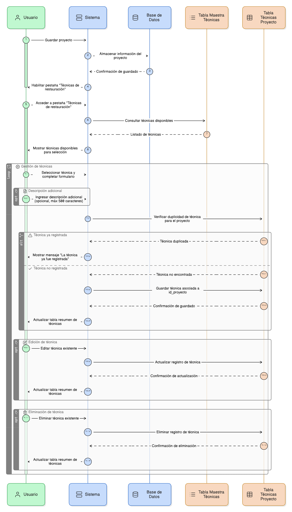
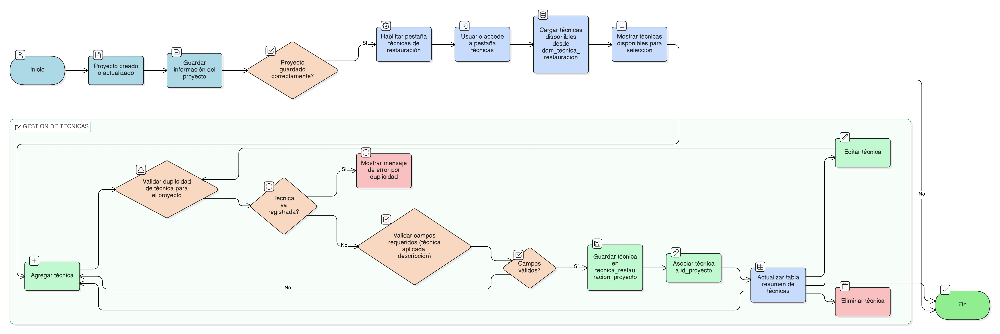

## HU-pigcct-sym-108

> **Identificador Historia de Usuario:** hu-pigcct-sym-108 \
> **Nombre Historia de Usuario:** Módulo de restauración - Gestión de Técnicas de Restauración.

> **Área Proyecto:** Subdirección de Ecosistemas e Información Ambiental \
> **Nombre proyecto:** Realizar la construcción temática, mejoras informáticas y optimización del Módulo de restauración del SNIF del IDEAM. \
> **Líder funcional:** Wilmer Espitia Muñoz\
> **Analista de requerimiento de TI:** Sergio Alonso Anaya Estévez

## DESCRIPCIÓN HISTORIA DE USUARIO

> **Como:** usuario del sistema. \
> **Quiero:** seleccionar y asociar múltiples técnicas de restauración.   \
> **Para:** registrar los métodos técnicos aplicados en el proyecto.

## CRITERIOS DE ACEPTACIÓN

1. **Gestión de técnicas**  
   1.1 Dado que el usuario ha creado o actualizado un proyecto, cuando el sistema guarda correctamente la información del proyecto, entonces la pestaña **“Técnicas de restauración”** debe habilitarse automáticamente dentro del formulario. \
   1.2 Dado que la pestaña “Técnicas de restauración” está habilitada, cuando el usuario accede a ella, entonces el sistema debe mostrar las técnicas disponibles para selección, cargadas desde la tabla maestra **`dom_tecnica_restauracion`**. \
   1.3 Dado que el usuario desea registrar una técnica, cuando completa el formulario, entonces cada registro debe incluir los siguientes campos: Técnica aplicada (select obligatorio) y Descripción adicional (texto opcional, máximo 500 caracteres). \
   1.4 Dado que el usuario intenta registrar una técnica, cuando selecciona una que ya existe para el mismo proyecto, entonces el sistema debe impedir la duplicidad y mostrar un mensaje indicando que la técnica ya fue registrada. \
   1.5 Dado que el usuario trabaja en la pestaña de técnicas, cuando gestiona los registros, entonces el sistema debe permitir **agregar, editar y eliminar técnicas**, mostrando los resultados en una **tabla resumen** dentro del formulario. \
   1.6 Dado que los datos de la técnica son válidos, cuando el usuario guarda el registro, entonces el sistema debe almacenar la información en la tabla **`tecnica_restauracion_proyecto`**, asociando correctamente el registro con el **`id_proyecto`** correspondiente. \

## DIAGRAMA DE SECUENCIA

## DIAGRAMA DE FLUJO DEL PROCESO

## ANEXOS

-	[HU-pigcct-sym-101](/content/historias_usuario/HU-pigcct-sym-101/HU-pigcct-sym-101.md)
-  Mapeo de errores de validación a mensajes específicos.