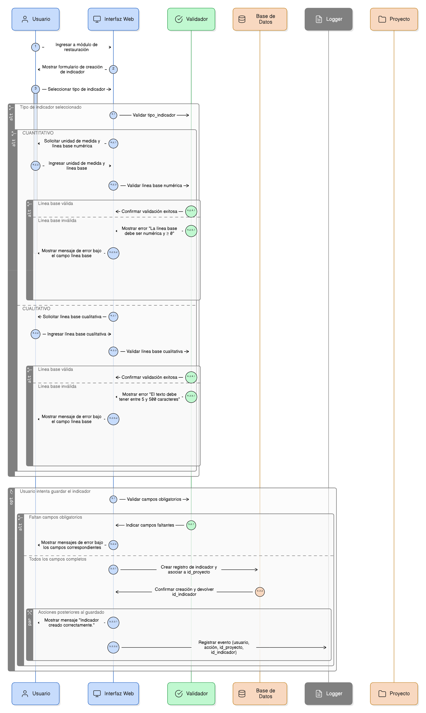
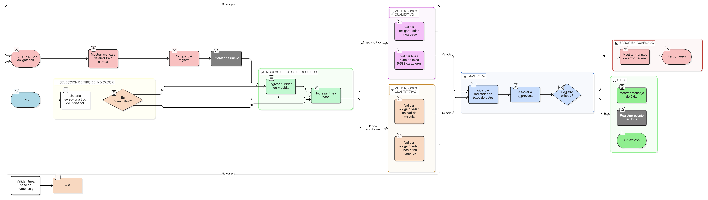

# HU-PIGCCT-SYM-110  
## Épica: Gestión de adjuntos y evidencias del PIGCCT  
### Actualizar fecha de modificación

---

## DESCRIPCIÓN HISTORIA DE USUARIO

> **Como:** desarrollador del sistema.  
> **Quiero:** que el sistema actualice automáticamente la fecha de modificación en los registros de adjuntos.  
> **Para:** mantener trazabilidad precisa de cambios, facilitar auditorías, permitir ordenamiento cronológico y garantizar la integridad temporal de la información documental del PIGCCT.

---

## CRITERIOS DE ACEPTACIÓN

### 1. Campo de fecha de modificación
1.1 La tabla `adjuntos` debe incluir el campo **`updatedat`** (o equivalente).  
1.2 Este campo debe almacenar fecha y hora con precisión de segundos.  
1.3 El formato debe ser timestamp o datetime según el motor de base de datos utilizado.

### 2. Inicialización del campo
2.1 Al crear un nuevo registro de adjunto, el campo `updatedat` debe inicializarse con el mismo valor que `createdat`.  
2.2 Esto indica que el registro no ha sido modificado desde su creación.  
2.3 La inicialización debe ser automática, sin intervención manual.

### 3. Actualización automática en operaciones de edición
3.1 El sistema debe actualizar automáticamente `updatedat` cada vez que se modifique cualquier campo del registro de adjunto.  
3.2 Las operaciones que deben disparar la actualización incluyen:
- Edición de la descripción.
- Cambio de estado (activar/inactivar).
- Actualización de metadatos.
- Cualquier otra modificación al registro.

3.3 La actualización debe ocurrir al momento de confirmar la transacción en la base de datos.

### 4. Implementación mediante triggers o lógica de aplicación
4.1 La actualización puede implementarse mediante:
- **Trigger de base de datos**: se ejecuta automáticamente en cada UPDATE.
- **Lógica en el ORM o capa de aplicación**: el framework actualiza el campo automáticamente.
- **Lógica explícita en servicios**: cada servicio que modifica el registro actualiza el campo.

4.2 Se recomienda usar triggers o funcionalidad del ORM para garantizar consistencia.  
4.3 La implementación debe ser transparente para el usuario final.

### 5. Precisión temporal
5.1 El campo `updatedat` debe capturar la fecha y hora exacta del servidor al momento de la modificación.  
5.2 Debe usar la zona horaria configurada del sistema (ej: UTC o zona horaria del servidor).  
5.3 La precisión debe ser suficiente para distinguir modificaciones realizadas en momentos muy cercanos.

### 6. Preservación de la fecha de creación
6.1 El campo `createdat` **nunca debe modificarse** después de la creación inicial del registro.  
6.2 El sistema debe garantizar que `createdat` permanezca inmutable.  
6.3 Esto permite mantener la trazabilidad completa: cuándo se cargó y cuándo se modificó por última vez.

### 7. Consultas y filtros por fecha de modificación
7.1 El sistema debe permitir consultar adjuntos ordenados por fecha de modificación (más recientes primero).  
7.2 Debe ser posible filtrar adjuntos modificados en un rango de fechas específico.  
7.3 Ejemplo: "Mostrar todos los adjuntos modificados en los últimos 30 días".

### 8. Auditoría y trazabilidad
8.1 La fecha de modificación debe registrarse en logs o tabla de auditoría junto con:
- Usuario que realizó la modificación.
- Tipo de operación realizada.
- Valores modificados (opcional).

8.2 Esta información debe estar disponible para auditorías institucionales.

### 9. Manejo de modificaciones masivas
9.1 Si se realizan actualizaciones masivas (múltiples adjuntos), cada registro debe actualizar su `updatedat` individualmente.  
9.2 La fecha debe reflejar el momento exacto de la modificación de cada registro.  
9.3 Las operaciones masivas deben respetar la lógica de actualización automática.

### 10. No actualización en operaciones de solo lectura
10.1 Las consultas, descargas o visualizaciones de adjuntos **no deben modificar** el campo `updatedat`.  
10.2 Solo operaciones de escritura (UPDATE) deben disparar la actualización.  
10.3 Esto garantiza que el campo refleje realmente cuándo se modificó el contenido o metadatos.

### 11. Compatibilidad con diferentes motores de base de datos
11.1 La implementación debe ser compatible con el motor de base de datos utilizado (PostgreSQL, MySQL, SQL Server, etc.).  
11.2 Debe aprovechar características nativas como `CURRENT_TIMESTAMP` o `NOW()`.  
11.3 Si se usan triggers, deben adaptarse a la sintaxis del motor específico.

### 12. Validación y pruebas
12.1 El sistema debe incluir pruebas automatizadas que validen la actualización correcta de `updatedat`.  
12.2 Las pruebas deben cubrir:
- Creación de adjunto (updatedat = createdat).
- Edición de adjunto (updatedat > createdat).
- Múltiples ediciones (updatedat siempre actualizado).

12.3 Las pruebas deben verificar que `createdat` nunca cambie después de la creación.

---

### Resultado esperado

Un **sistema automatizado robusto** que actualiza el campo `updatedat` cada vez que se modifica un registro de adjunto, manteniendo trazabilidad precisa de cambios sin intervención manual, facilitando auditorías y permitiendo análisis temporal de la información documental del PIGCCT.

---

## DIAGRAMA DE SECUENCIA

## DIAGRAMA DE FLUJO DEL PROCESO

