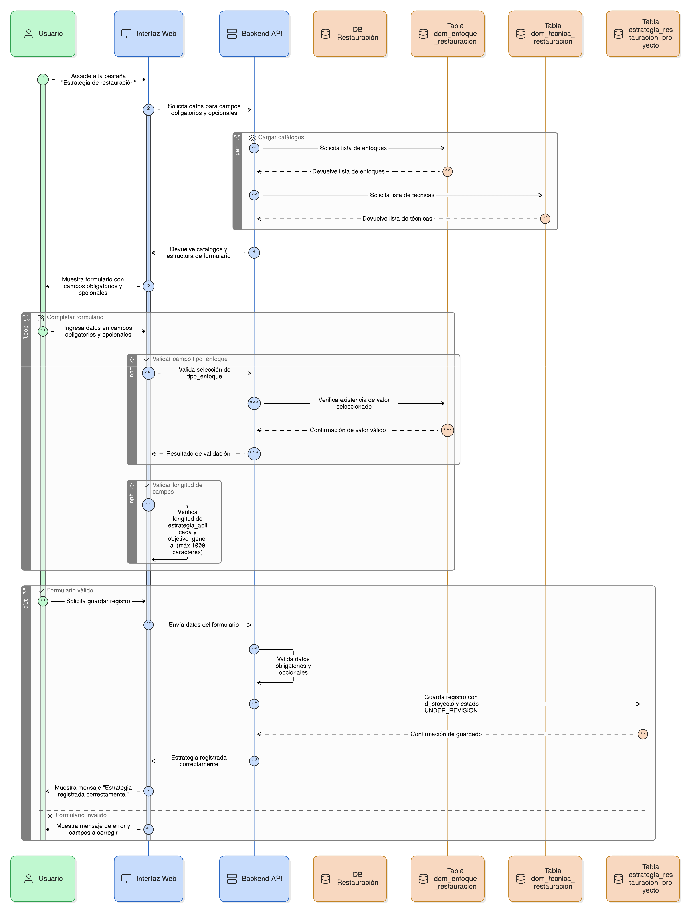
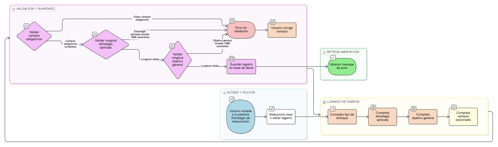

# HU-PIGCCT-SYM-112  
## Épica: Gestión de adjuntos y evidencias del PIGCCT  
### Listar adjuntos de un registro

---

## DESCRIPCIÓN HISTORIA DE USUARIO

> **Como:** usuario del sistema.  
> **Quiero:** visualizar la lista de archivos adjuntos asociados a un registro específico del PIGCCT.  
> **Para:** consultar la evidencia documental disponible, verificar qué archivos respaldan la información, acceder rápidamente a la documentación soporte y evaluar la completitud de la evidencia asociada a cada elemento del plan.

---

## CRITERIOS DE ACEPTACIÓN

### 1. Ubicación de la funcionalidad
1.1 La lista de adjuntos debe estar visible en la interfaz de detalle de cada registro que permita adjuntos.  
1.2 Debe ubicarse en una sección claramente identificada (ej: **"Documentos adjuntos"**, **"Evidencias"**, **"Archivos asociados"**).  
1.3 La sección puede presentarse como:
- Tabla expandible.
- Panel lateral.
- Pestaña adicional en el detalle del registro.

### 2. Identificación del registro relacionado
2.1 El sistema debe identificar automáticamente el registro actual y consultar sus adjuntos.  
2.2 La consulta debe filtrar por:
- `relatedschema`: Esquema correspondiente.
- `relatedtable`: Tabla del registro.
- `relatedid`: ID específico del registro.

2.3 Solo deben mostrarse adjuntos directamente asociados al registro actual.

### 3. Filtrado por estado (activos/inactivos)
3.1 Por defecto, la lista debe mostrar **solo adjuntos activos** (`activo = true`).  
3.2 Usuarios administradores deben poder ver opcionalmente adjuntos inactivos mediante un filtro o toggle.  
3.3 Los adjuntos inactivos deben diferenciarse visualmente (color gris, etiqueta "Inactivo").

### 4. Información mostrada por cada adjunto
4.1 La lista debe mostrar, como mínimo, la siguiente información por cada adjunto:
- **Nombre del archivo** (originalname): Nombre original con el que fue cargado.
- **Descripción**: Texto descriptivo del propósito del archivo.
- **Tipo de archivo**: Extensión o ícono visual (PDF, DOCX, JPG, etc.).
- **Tamaño**: Tamaño del archivo en formato legible (KB, MB).
- **Fecha de carga**: Fecha y hora de creación (createdat).
- **Usuario que cargó**: Nombre o identificación del usuario.

4.2 Información adicional opcional:
- Fecha de última modificación (updatedat).
- Categoría o etiqueta del archivo.
- Número de descargas.

### 5. Acciones disponibles por adjunto
5.1 Cada adjunto en la lista debe tener botones o íconos para acciones comunes:
- **Visualizar/Ver**: Previsualizar el archivo (si es posible) o ver detalles.
- **Descargar**: Descargar el archivo al dispositivo del usuario.
- **Editar descripción**: Modificar la descripción del adjunto (según permisos).
- **Inactivar/Activar**: Cambiar el estado del adjunto (solo administradores).

5.2 Las acciones deben estar visibles o accesibles mediante menú contextual.

### 6. Ordenamiento de la lista
6.1 El sistema debe permitir ordenar la lista de adjuntos por:
- Fecha de carga (más reciente primero, por defecto).
- Fecha de modificación.
- Nombre del archivo (alfabético).
- Tamaño del archivo.
- Tipo de archivo.

6.2 El usuario debe poder cambiar el criterio de ordenamiento fácilmente.

### 7. Búsqueda y filtrado dentro de la lista
7.1 Si el registro tiene muchos adjuntos, el sistema debe ofrecer:
- **Búsqueda por nombre**: Filtrar adjuntos por nombre de archivo o descripción.
- **Filtro por tipo**: Mostrar solo documentos, imágenes, archivos geoespaciales, etc.
- **Filtro por fecha**: Mostrar adjuntos cargados en un rango de fechas específico.

7.2 Los filtros deben aplicarse en tiempo real sin recargar la página.

### 8. Indicador de cantidad de adjuntos
8.1 El sistema debe mostrar la cantidad total de adjuntos activos asociados al registro.  
8.2 Ejemplo: _"Documentos adjuntos (5)"_.  
8.3 Si hay adjuntos pero están todos inactivos, puede indicarse: _"Documentos adjuntos (0) - 2 inactivos"_.

### 9. Mensaje cuando no hay adjuntos
9.1 Si el registro no tiene adjuntos asociados, el sistema debe mostrar un mensaje claro.  
9.2 Ejemplo: _"No hay documentos adjuntos asociados a este registro."_  
9.3 Si el usuario tiene permisos, puede mostrarse botón para cargar el primer adjunto.

### 10. Visualización de íconos según tipo de archivo
10.1 El sistema debe mostrar íconos visuales que representen el tipo de archivo.  
10.2 Ejemplos:
- PDF: ícono de documento PDF.
- Imágenes: miniatura o ícono de imagen.
- Excel: ícono de hoja de cálculo.
- Shapefile: ícono de archivo geoespacial.

10.3 Esto facilita la identificación rápida del tipo de documento.

### 11. Permisos de visualización
11.1 Los usuarios deben poder ver la lista de adjuntos si tienen permisos de lectura sobre el registro.  
11.2 Las acciones de edición, descarga o eliminación dependerán de permisos adicionales.  
11.3 Si el usuario no tiene permisos para ver adjuntos, la sección puede ocultarse o mostrar mensaje de restricción.

### 12. Actualización dinámica de la lista
12.1 Después de cargar un nuevo adjunto, la lista debe actualizarse automáticamente.  
12.2 No debe requerirse recargar la página completa para ver el nuevo archivo.  
12.3 El nuevo adjunto puede resaltarse brevemente para indicar que fue agregado recientemente.

### 13. Información de estado del registro
13.1 Si el registro está en estado cerrado, bloqueado o archivado, puede indicarse que no se pueden cargar más adjuntos.  
13.2 La visualización de adjuntos existentes debe seguir disponible.

### 14. Usabilidad y experiencia de usuario
14.1 La lista debe ser clara, organizada y fácil de navegar.  
14.2 Los nombres de archivo largos deben truncarse adecuadamente con tooltip para ver el nombre completo.  
14.3 El diseño debe ser responsive y funcionar correctamente en dispositivos móviles.  
14.4 Las acciones más comunes (ver, descargar) deben ser rápidamente accesibles.

---

### Resultado esperado

Una **lista completa y funcional** de todos los adjuntos activos asociados al registro, mostrando información relevante, permitiendo ordenamiento y filtrado, con acciones rápidas de visualización y descarga, facilitando la consulta y gestión de evidencia documental en el contexto del PIGCCT.

---

## DIAGRAMA DE SECUENCIA

## DIAGRAMA DE FLUJO DEL PROCESO

