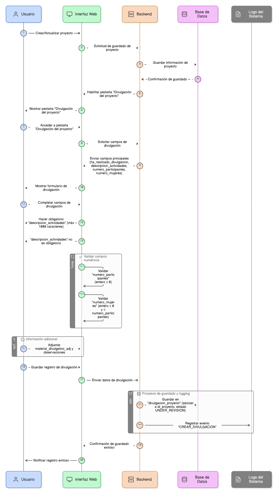
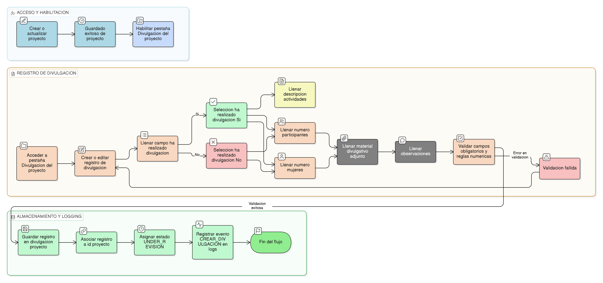

# HU-PIGCCT-SYM-113  
## Épica: Gestión de adjuntos y evidencias del PIGCCT  
### Descargar adjunto

---

## DESCRIPCIÓN HISTORIA DE USUARIO

> **Como:** usuario del sistema.  
> **Quiero:** descargar archivos adjuntos asociados a registros del PIGCCT.  
> **Para:** revisar, analizar, compartir o utilizar la evidencia documental almacenada en el sistema fuera del entorno web y la distribución de información según sea necesario.

---

## CRITERIOS DE ACEPTACIÓN

### 1. Acceso a la funcionalidad de descarga
1.1 La opción de **"Descargar"** debe estar disponible en cada adjunto listado.  
1.2 Debe representarse mediante un botón, ícono o enlace claramente identificable (ej: ícono de descarga ⬇).  
1.3 Los usuarios con permisos de lectura sobre el registro deben poder descargar sus adjuntos.

### 2. Identificación del adjunto a descargar
2.1 El sistema debe identificar correctamente el adjunto seleccionado mediante su identificador único.  
2.2 Debe validar que el adjunto exista y esté activo antes de iniciar la descarga.  
2.3 Si el adjunto está inactivo, debe bloquearse la descarga (salvo para administradores con permisos especiales).

### 3. Recuperación del archivo desde el almacenamiento
3.1 El sistema debe localizar el archivo físico usando el campo `path` almacenado en la tabla `adjuntos`.  
3.2 Debe verificar que el archivo exista físicamente en el servidor o almacenamiento configurado.  
3.3 Si el archivo no se encuentra, debe informar al usuario con mensaje de error claro.

### 4. Envío del archivo al usuario
4.1 El sistema debe transmitir el archivo al navegador del usuario de manera segura.  
4.2 Debe configurarse correctamente el tipo MIME (`mimetype`) para que el navegador maneje apropiadamente el archivo.  
4.3 El nombre del archivo descargado debe ser el `originalname` para mantener coherencia con el nombre original.

### 5. Configuración de headers HTTP
5.1 El sistema debe enviar headers HTTP apropiados:
- `Content-Type`: Tipo MIME del archivo.
- `Content-Disposition: attachment; filename="nombre_original.ext"`: Fuerza la descarga en lugar de visualización.
- `Content-Length`: Tamaño del archivo en bytes.

5.2 Estos headers garantizan una descarga correcta y completa.

### 6. Validación de permisos
6.1 El sistema debe validar que el usuario tenga permisos para descargar el adjunto.  
6.2 Los permisos pueden depender de:
- Permisos sobre el registro relacionado.
- Rol del usuario.
- Estado del registro (abierto, cerrado, archivado).

6.3 Si el usuario no tiene permisos, el sistema debe:
- Bloquear la descarga.
- Mostrar mensaje: _"No tiene permisos para descargar este archivo."_

### 7. Registro de descargas para auditoría
7.1 El sistema debe registrar cada descarga para trazabilidad y auditoría:
- Usuario que descargó el archivo.
- Fecha y hora de la descarga.
- Adjunto descargado (ID, nombre).
- Dirección IP del usuario (opcional).

7.2 Esta información debe almacenarse en tabla de logs o auditoría.  
7.3 Los registros deben ser inmutables y consultables por administradores.

### 8. Contador de descargas (opcional)
8.1 El sistema puede mantener un contador de descargas por cada adjunto.  
8.2 Este contador incrementa automáticamente con cada descarga exitosa.  
8.3 La información puede mostrarse en la lista de adjuntos: _"Descargado 12 veces"_.

### 9. Previsualización antes de descargar (opcional)
9.1 Para ciertos tipos de archivo (PDF, imágenes, texto), el sistema puede ofrecer previsualización antes de descargar.  
9.2 La previsualización puede mostrarse en ventana modal o pestaña nueva.  
9.3 Desde la previsualización, el usuario debe poder descargar si lo desea.

### 10. Descarga de múltiples archivos
10.1 El sistema puede permitir seleccionar múltiples adjuntos y descargarlos juntos.  
10.2 Los archivos pueden empaquetarse en un archivo ZIP temporal.  
10.3 El ZIP debe generarse dinámicamente y nombrarse de forma descriptiva (ej: `adjuntos_accion_123.zip`).

### 11. Manejo de errores durante la descarga
11.1 Si ocurre un error durante la descarga, el sistema debe:
- Informar claramente al usuario.
- Registrar el error en logs para diagnóstico.
- Permitir reintentar la descarga.

11.2 Errores posibles:
- Archivo no encontrado en almacenamiento.
- Archivo corrupto.
- Conexión interrumpida.
- Permisos de lectura en servidor.

### 12. Seguridad y prevención de acceso no autorizado
12.1 Las rutas de descarga deben ser protegidas y no predecibles.  
12.2 Debe evitarse acceso directo a archivos sin pasar por validación de permisos.  
12.3 No deben exponerse las rutas físicas de almacenamiento al usuario.  
12.4 El sistema debe prevenir ataques de "path traversal" o descarga de archivos arbitrarios.

### 13. Experiencia de usuario en diferentes navegadores
13.1 La funcionalidad de descarga debe funcionar correctamente en navegadores modernos (Chrome, Firefox, Safari, Edge).  
13.2 Debe probarse el comportamiento en dispositivos móviles.  
13.3 Los nombres de archivo con caracteres especiales deben manejarse apropiadamente.

### 14. Mensajes de retroalimentación
14.1 Antes de iniciar la descarga, puede mostrarse mensaje: _"Preparando descarga..."_.  
14.2 El navegador mostrará su propio diálogo/barra de descarga según configuración del usuario.  
14.3 Si la descarga falla, mostrar: _"Error al descargar el archivo. Por favor, intente nuevamente."_.

### 15. Consideraciones de rendimiento
15.1 Las descargas no deben bloquear otras operaciones del sistema.  
15.2 Debe implementarse limitación de ancho de banda si es necesario para proteger el servidor.  
15.3 Las descargas simultáneas por usuario pueden limitarse según políticas institucionales.

---

### Resultado esperado

Un **sistema de descarga seguro y eficiente** que permite a usuarios autorizados obtener archivos adjuntos desde el sistema, con validación de permisos, registro completo de auditoría, manejo robusto de errores y experiencia de usuario fluida en diferentes navegadores y dispositivos.

---

## DIAGRAMA DE SECUENCIA

## DIAGRAMA DE FLUJO DEL PROCESO

## PROTOTIPO PRELIMINAR

