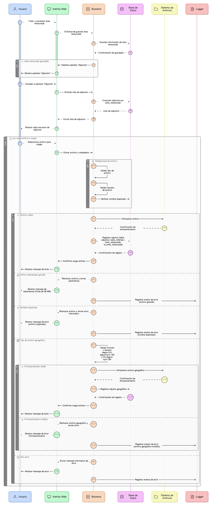
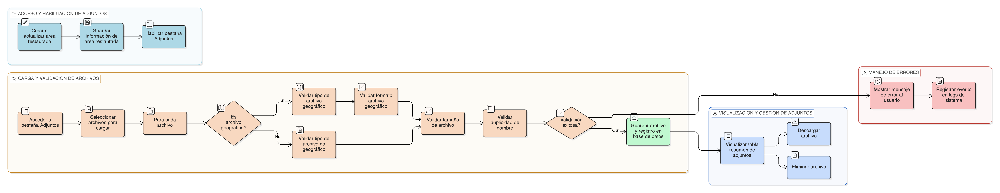

# HU-PIGCCT-SYM-114  
## Épica: Gestión de adjuntos y evidencias del PIGCCT  
### Validar existencia del registro relacionado

---

## DESCRIPCIÓN HISTORIA DE USUARIO

> **Como:** desarrollador del sistema.  
> **Quiero:** que el sistema valide automáticamente la existencia del registro relacionado antes de permitir asociar un adjunto.  
> **Para:** evitar la creación de adjuntos "huérfanos" sin registro padre válido, garantizar la integridad referencial de los datos y mantener la consistencia de la base de datos del PIGCCT.

---

## CRITERIOS DE ACEPTACIÓN

### 1. Validación obligatoria antes de asociar adjunto
1.1 Antes de permitir la carga de un adjunto asociado a un registro, el sistema debe validar que el registro relacionado exista.  
1.2 La validación debe realizarse utilizando los campos de referencia:
- `relatedschema`: Esquema de base de datos.
- `relatedtable`: Tabla del registro padre.
- `relatedid`: Identificador del registro específico.

1.3 La validación debe ejecutarse antes de almacenar el archivo y crear el registro en la tabla `adjuntos`.

### 2. Consulta de existencia del registro
2.1 El sistema debe ejecutar una consulta a la tabla especificada en `relatedtable` dentro del esquema `relatedschema`.  
2.2 Debe verificar que exista un registro con el identificador indicado en `relatedid`.  
2.3 La consulta debe considerar solo registros activos (si aplica campo `activo` en la tabla relacionada).

### 3. Bloqueo de operación si el registro no existe
3.1 Si el registro relacionado no existe, el sistema debe:
- Bloquear inmediatamente la carga del adjunto.
- No almacenar el archivo en el servidor.
- No crear registro en la tabla `adjuntos`.
- Liberar recursos utilizados (archivo temporal si se cargó).

3.2 El bloqueo debe ocurrir antes de consumir recursos significativos del servidor.

### 4. Mensaje de error claro
4.1 Al detectar que el registro relacionado no existe, el sistema debe mostrar un mensaje de error claro al usuario.  
4.2 Ejemplo de mensaje:  
_"Error: El registro al que intenta asociar el adjunto no existe o ha sido eliminado. Por favor, verifique e intente nuevamente."_

4.3 El mensaje debe ser amigable pero informativo para usuarios técnicos si es necesario.

### 5. Validación de estado del registro relacionado
5.1 Además de validar la existencia, el sistema puede verificar el estado del registro relacionado.  
5.2 Puede bloquearse la asociación de adjuntos a registros:
- Inactivos.
- Eliminados lógicamente.
- En estado "Cerrado" o "Archivado" (según reglas de negocio).

5.3 Si el estado no permite asociar adjuntos, debe informarse claramente al usuario.

### 6. Validación de permisos sobre el registro relacionado
6.1 La validación debe incluir verificar que el usuario tenga permisos para asociar adjuntos al registro.  
6.2 No basta con que el registro exista; el usuario debe tener derechos de edición o asociación.  
6.3 Si no tiene permisos, mostrar mensaje: _"No tiene permisos para asociar adjuntos a este registro."_

### 7. Manejo de referencias a múltiples esquemas
7.1 Si el sistema maneja múltiples esquemas de base de datos (desarrollo, producción, módulos separados), la validación debe ejecutarse en el esquema correcto especificado en `relatedschema`.  
7.2 El sistema debe tener mecanismos de conexión y consulta a esquemas diferenciados.  
7.3 Los errores de conexión a esquemas deben manejarse apropiadamente.

### 8. Integridad referencial a nivel de base de datos
8.1 Idealmente, la tabla `adjuntos` debe tener restricciones de integridad referencial (foreign keys) cuando sea posible.  
8.2 Sin embargo, dado que `relatedtable` es dinámico (puede apuntar a diferentes tablas), las foreign keys tradicionales pueden no ser viables.  
8.3 Por ello, la validación a nivel de aplicación es crítica y obligatoria.

### 9. Prevención de race conditions
9.1 El sistema debe manejar casos donde el registro relacionado existe al iniciar la carga pero se elimina durante el proceso.  
9.2 La validación debe realizarse dentro de una transacción o con mecanismos de bloqueo apropiados.  
9.3 Si se detecta eliminación concurrente, debe abortarse la operación y informar al usuario.

### 10. Validación en operaciones masivas
10.1 Si el sistema permite asociar múltiples adjuntos simultáneamente, debe validarse la existencia del registro antes de procesar cada archivo.  
10.2 Si el registro se invalida durante el proceso masivo, todos los adjuntos pendientes deben rechazarse.

### 11. Registro en logs de errores de validación
11.1 Los intentos de asociar adjuntos a registros inexistentes deben registrarse en logs del sistema.  
11.2 El registro debe incluir:
- Usuario que intentó la operación.
- Referencia especificada (schema, table, id).
- Fecha y hora del intento.
- Resultado de la validación.

11.3 Esta información es útil para detectar:
- Errores en la aplicación.
- Registros eliminados incorrectamente.
- Posibles intentos maliciosos.

### 12. Validación de tablas permitidas
12.1 El sistema debe validar que `relatedtable` corresponda a una tabla autorizada del sistema.  
12.2 Debe existir una lista blanca de tablas válidas que pueden tener adjuntos.  
12.3 Si la tabla especificada no está autorizada, debe bloquearse la operación con mensaje claro.

### 13. Manejo de eliminación en cascada
13.1 El sistema debe definir qué ocurre con los adjuntos cuando se elimina el registro relacionado:
- **Eliminación en cascada**: Eliminar también los adjuntos.
- **Inactivación**: Marcar los adjuntos como inactivos.
- **Restricción**: No permitir eliminar el registro si tiene adjuntos activos.

13.2 La política elegida debe documentarse y aplicarse consistentemente.  
13.3 La validación debe considerar estas políticas.

### 14. Pruebas de integridad
14.1 El sistema debe incluir pruebas automatizadas que verifiquen:
- Rechazo de adjuntos a registros inexistentes.
- Aceptación de adjuntos a registros válidos.
- Manejo correcto de eliminación concurrente.
- Validación en diferentes esquemas.

14.2 Las pruebas deben ejecutarse regularmente.

### 15. Experiencia de usuario
15.1 La validación debe ser transparente y rápida.  
15.2 El usuario no debe percibir demora significativa por las validaciones.  
15.3 Los mensajes de error deben orientar hacia la solución del problema.  
15.4 Si el error se debe a que el usuario no seleccionó correctamente el registro, debe poder corregir fácilmente.

---

### Resultado esperado

Un **sistema de validación robusto** que garantiza que todos los adjuntos cargados tengan un registro padre válido y existente, previniendo adjuntos huérfanos, manteniendo la integridad referencial de los datos y facilitando la gestión coherente de evidencia documental en el PIGCCT.

---

## DIAGRAMA DE SECUENCIA

## DIAGRAMA DE FLUJO DEL PROCESO

