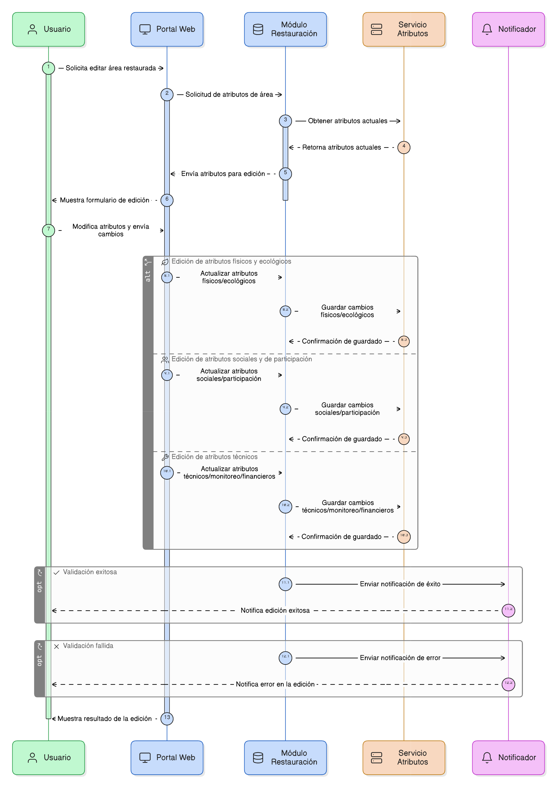
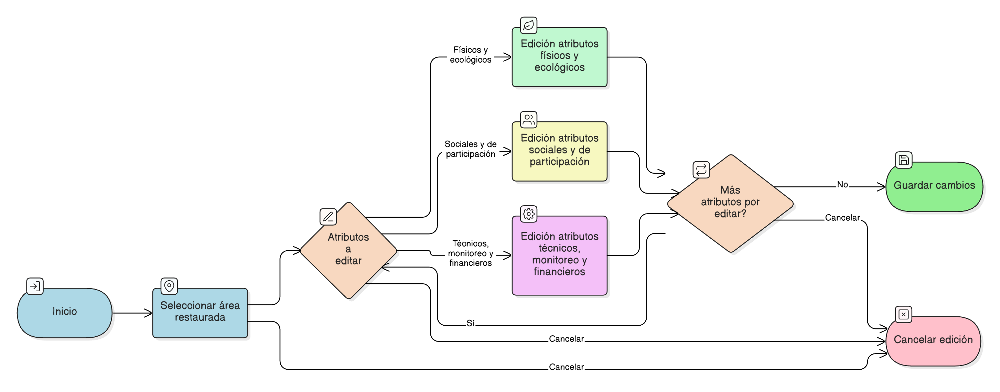

## HU-pigcct-sym-115

> **Identificador Historia de Usuario:** hu-pigcct-sym-115 \
> **Nombre Historia de Usuario:** Módulo de restauración - Edición de Atributos Temáticos de Área Restaurada.

> **Área Proyecto:** Subdirección de Ecosistemas e Información Ambiental \
> **Nombre proyecto:** Realizar la construcción temática, mejoras informáticas y optimización del Módulo de restauración del SNIF del IDEAM. \
> **Líder funcional:** Wilmer Espitia Muñoz\
> **Analista de requerimiento de TI:** Sergio Alonso Anaya Estévez

## DESCRIPCIÓN HISTORIA DE USUARIO

> **Como:** usuario del sistema. \
> **Quiero:** que el sistema me permita editar los atributos ecológicos, sociales, técnicos, de monitoreo y financieros de cada área restaurada ya registrada.   \
> **Para:** completar y actualizar la información necesaria para el análisis y seguimiento exhaustivo del área.

## CRITERIOS DE ACEPTACIÓN
1. **Funcionales generales**  
   1.1 Debe permitir la edición de atributos físicos y ecológicos, (Ver  [HU-pigcct-sym-116](/content/historias_usuario/HU-pigcct-sym-116/HU-pigcct-sym-116.md)). \
   1.2 Debe permitir la edición de atributos sociales y de participación, (Ver  [HU-pigcct-sym-117](/content/historias_usuario/HU-pigcct-sym-117/HU-pigcct-sym-117.md)). \
   1.3 Debe permitir la edición de Atributos Técnicos, Monitoreo y Financieros, (Ver  [HU-pigcct-sym-118](/content/historias_usuario/HU-pigcct-sym-118/HU-pigcct-sym-118.md)). \

## DIAGRAMA DE SECUENCIA

## DIAGRAMA DE FLUJO DEL PROCESO

## ANEXOS

-	Historias de usuario del HU-116 a HU-118