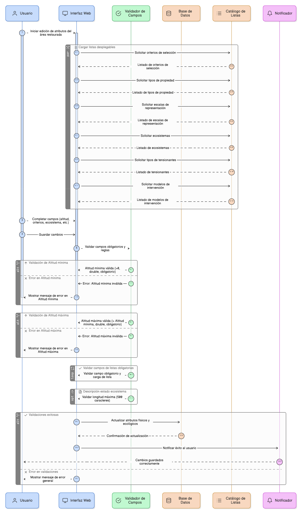
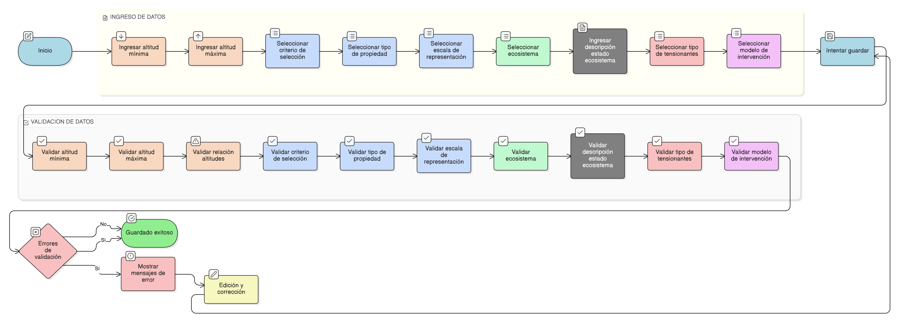

# HU-PIGCCT-SYM-116  
## Épica: Gestión de adjuntos y evidencias del PIGCCT  
### Trazabilidad por esquema

---

## DESCRIPCIÓN HISTORIA DE USUARIO

> **Como:** administrador del sistema.  
> **Quiero:** utilizar el campo `relatedschema` en la gestión de adjuntos.  
> **Para:** soportar ambientes diferenciados (desarrollo, pruebas, producción), módulos independientes o esquemas de base de datos separados, facilitando la arquitectura multitenancy, permitiendo segregación lógica de datos y manteniendo trazabilidad precisa del origen de cada adjunto en el PIGCCT.

---

## CRITERIOS DE ACEPTACIÓN

### 1. Propósito del campo `relatedschema`
1.1 El campo `relatedschema` en la tabla `adjuntos` debe almacenar el nombre del esquema de base de datos al que pertenece el registro relacionado.  
1.2 Este campo permite identificar claramente en qué esquema reside el registro padre del adjunto.  
1.3 Facilita arquitecturas donde:
- Diferentes departamentos tienen esquemas separados.
- Ambientes (dev, staging, prod) comparten tabla de adjuntos.
- Módulos del sistema están segregados por esquema.

### 2. Estructura del campo
2.1 El campo `relatedschema` debe ser de tipo texto (VARCHAR o equivalente).  
2.2 Debe almacenar el nombre exacto del esquema según el motor de base de datos (PostgreSQL schemas, MySQL databases, etc.).  
2.3 Ejemplos de valores:
- `public` (esquema predeterminado en PostgreSQL).
- `pigcct_antioquia` (esquema para departamento específico).
- `pigcct_produccion` (ambiente de producción).
- `modulo_acciones` (módulo independiente).

### 3. Valor predeterminado del campo
3.1 Si el sistema utiliza un solo esquema, `relatedschema` puede tener un valor predeterminado (ej: `public` o el nombre del esquema principal).  
3.2 El valor predeterminado debe configurarse según la arquitectura del sistema.  
3.3 En sistemas multi-esquema, el valor debe capturarse dinámicamente del contexto de la operación.

### 4. Captura automática del esquema
4.1 El sistema debe capturar automáticamente el valor de `relatedschema` al asociar un adjunto.  
4.2 El esquema debe determinarse según:
- Contexto de autenticación del usuario (si está asociado a un esquema específico).
- Configuración del módulo o entidad utilizada.
- Parámetro de sesión o contexto de aplicación.

4.3 Los usuarios finales NO deben ingresar manualmente el nombre del esquema.

### 5. Validación de esquemas autorizados
5.1 El sistema debe mantener una lista de esquemas autorizados en el sistema.  
5.2 Antes de asociar un adjunto, debe validarse que `relatedschema` corresponda a un esquema autorizado.  
5.3 Si el esquema no está autorizado, debe bloquearse la operación con mensaje claro.

### 6. Validación de existencia del esquema
6.1 El sistema debe validar que el esquema especificado exista realmente en la base de datos.  
6.2 Debe verificarse antes de ejecutar consultas de validación de registros relacionados.  
6.3 Si el esquema no existe, informar error: _"Error: El esquema especificado no existe en el sistema."_

### 7. Consultas multi-esquema
7.1 Al validar la existencia del registro relacionado (HU-114), la consulta debe ejecutarse en el esquema correcto especificado en `relatedschema`.  
7.2 Ejemplo en PostgreSQL:  
```sql
SELECT id FROM {relatedschema}.{relatedtable} WHERE id = {relatedid}
```

7.3 El sistema debe manejar correctamente la sintaxis según el motor de base de datos utilizado.

### 8. Filtrado por esquema en consultas de adjuntos
8.1 Al listar adjuntos de un registro, el sistema debe filtrar por:
- `relatedschema`: Esquema del registro.
- `relatedtable`: Tabla del registro.
- `relatedid`: ID del registro.

8.2 Esto garantiza que solo se muestren adjuntos del esquema correcto.  
8.3 Previene confusiones en sistemas multi-esquema donde puede haber IDs duplicados en esquemas diferentes.

### 9. Gestión de configuración de esquemas
9.1 Los administradores del sistema deben poder:
- Consultar la lista de esquemas autorizados.
- Agregar nuevos esquemas al sistema.
- Inactivar esquemas (para ambientes que ya no se usan).
- Configurar propiedades de cada esquema (descripción, ambiente, estado).

9.2 Esta gestión debe estar en el módulo de **Configuración del sistema**.

### 10. Mapeo de usuarios a esquemas
10.1 El sistema puede implementar mapeo de usuarios o roles a esquemas específicos.  
10.2 Ejemplo:
- Usuario del departamento de Antioquia → `pigcct_antioquia`
- Usuario del departamento del Huila → `pigcct_huila`
- Administrador general → acceso a todos los esquemas

10.3 Esta configuración determina automáticamente el `relatedschema` en las operaciones.

### 11. Separación de adjuntos por esquema en almacenamiento físico
11.1 Opcionalmente, los archivos físicos pueden organizarse en carpetas separadas por esquema.  
11.2 Ejemplo de estructura de carpetas:
```
/adjuntos/
  /pigcct_antioquia/
    /accion/
      archivo1.pdf
  /pigcct_huila/
    /accion/
      archivo2.pdf
```

11.3 El campo `path` debe reflejar esta estructura si se implementa.

### 12. Reportes y estadísticas por esquema
12.1 El sistema debe permitir generar reportes de adjuntos segmentados por esquema.  
12.2 Ejemplos de reportes:
- "Adjuntos por departamento (esquema)"
- "Uso de almacenamiento por esquema"
- "Adjuntos cargados por esquema en el último mes"

12.3 Esto facilita administración y planificación de recursos.

### 13. Migración y sincronización entre esquemas
13.1 El sistema puede incluir funcionalidades para:
- Copiar adjuntos de un esquema a otro.
- Migrar adjuntos al reestructurar esquemas.
- Sincronizar adjuntos entre ambientes (dev → prod).

13.2 Estas operaciones deben validar que las referencias (`relatedtable`, `relatedid`) existan en el esquema destino.  
13.3 Debe mantenerse auditoría completa de operaciones de migración.

### 14. Auditoría y trazabilidad
14.1 Todos los logs y registros de auditoría de adjuntos deben incluir el `relatedschema`.  
14.2 Esto permite rastrear en qué esquema ocurrió cada operación.  
14.3 Facilita diagnóstico de problemas en sistemas multi-esquema.

### 15. Compatibilidad con arquitectura single-schema
15.1 Si el sistema utiliza un solo esquema, el campo `relatedschema` debe poblarse consistentemente con ese único valor.  
15.2 Esto mantiene la estructura preparada para evolución futura hacia multi-esquema.  
15.3 No debe agregarse complejidad innecesaria en sistemas simples.

### 16. Documentación técnica
16.1 Debe documentarse claramente:
- Qué esquemas existen en el sistema.
- Propósito de cada esquema.
- Cómo se determina automáticamente el esquema.
- Consideraciones de seguridad y acceso.

16.2 La documentación debe estar accesible para desarrolladores y administradores.

### 17. Pruebas en ambientes multi-esquema
17.1 El sistema debe incluir pruebas que verifiquen:
- Correcta captura del esquema en diferentes contextos.
- Validación en el esquema correcto.
- Filtrado apropiado en consultas multi-esquema.
- Prevención de acceso cruzado entre esquemas.

17.2 Las pruebas deben cubrir casos de uso multitenancy si aplica.

---

### Resultado esperado

Un **sistema de trazabilidad por esquema** completamente funcional que permite gestionar adjuntos en arquitecturas multi-esquema o multitenancy, con captura automática del esquema de origen, validación en el esquema correcto, filtrado apropiado de datos, soporte para segregación lógica de información y preparación para escalabilidad futura del PIGCCT.

---

## DIAGRAMA DE SECUENCIA




## DIAGRAMA DE FLUJO DEL PROCESO




## PROTOTIPO PRELIMINAR


