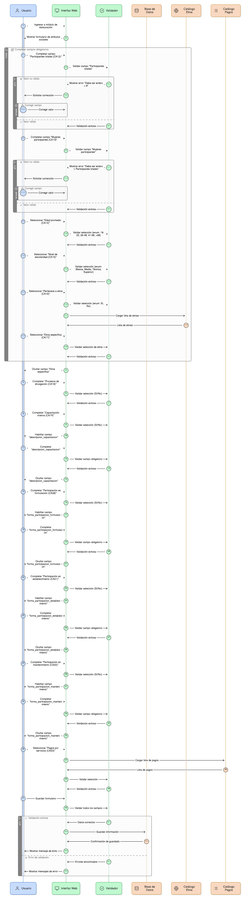
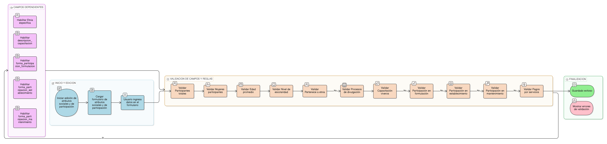

# HU-PIGCCT-SYM-117  
## Épica: Gestión de eventos y validación de información del PIGCCT  
### Generar evento al crear un registro

---

## DESCRIPCIÓN HISTORIA DE USUARIO

> **Como:** usuario no administrador del sistema.  
> **Quiero:** que el sistema genere automáticamente un evento cuando creo un registro.  
> **Para:** iniciar el proceso de validación institucional de la información registrada en las tablas acción, indicador_accion, indicador_accion_valor y adjuntos.

---

## CRITERIOS DE ACEPTACIÓN

### 1. Generación automática de evento en creación
1.1 El sistema debe generar automáticamente un evento cuando un usuario **no administrador** crea un registro en alguna de las siguientes tablas:
- acción
- indicador_accion
- indicador_accion_valor
- adjuntos

1.2 La generación del evento debe ser transparente para el usuario, sin requerir acciones adicionales más allá de crear el registro.

### 2. Registro del evento en la tabla evento
2.1 El sistema debe crear un nuevo registro en la tabla **evento** con los siguientes campos diligenciados:
- **id_usuario_fk**: ID del usuario que crea el registro.
- **fch_creacion**: Fecha y hora de creación del registro.
- **esquema_principal**: Esquema de la base de datos donde se encuentra la tabla.
- **tabla_principal**: Nombre de la tabla donde se creó el registro.
- **id_objeto_principal**: ID del registro creado.
- **tipo_afectacion_enm**: Debe establecerse con el valor **"create"**.
- **creado_por**: ID del usuario que crea el evento (mismo que id_usuario_fk).
- **valor_nuevo**: Contenido JSON o representación del registro creado.

2.2 Los campos deben almacenarse de forma correcta y completa para garantizar la trazabilidad del evento.

### 3. Validación de tipo de usuario
3.1 El sistema debe validar que el usuario que crea el registro **no tenga rol de administrador**.  
3.2 Si el usuario es administrador, el sistema **no debe generar el evento de validación**, ya que los administradores tienen permisos directos.

### 4. Captura del valor nuevo
4.1 El sistema debe capturar el contenido completo del registro creado en el campo **valor_nuevo**.  
4.2 El formato del valor nuevo debe permitir su posterior consulta y comparación durante el proceso de validación.  
4.3 Se recomienda almacenar en formato **JSON** para facilitar la interpretación.

### 5. Estado inicial del evento
5.1 El evento creado debe tener un estado inicial que permita identificarlo como **pendiente de envío a validación**.  
5.2 El campo **estado_registro** debe indicar claramente este estado inicial.

### 6. Auditoría y trazabilidad
6.1 El sistema debe registrar automáticamente:
- Usuario creador del evento.
- Fecha y hora de creación del evento.
- Tabla y objeto afectado.

6.2 Esta información debe quedar disponible para consultas de auditoría y seguimiento del proceso de validación.

### 7. Rendimiento del sistema
7.1 La generación del evento debe ejecutarse de forma eficiente, sin afectar perceptiblemente el tiempo de respuesta de la operación de creación del registro.  
7.2 El proceso debe ser asincrónico o suficientemente optimizado para no bloquear al usuario.

### 8. Integridad transaccional
8.1 Si la creación del evento falla, el sistema debe:
- Registrar el error en logs del sistema.
- Notificar al administrador del sistema.
- Opcionalmente, revertir la creación del registro o marcar como pendiente de validación manual.

8.2 El sistema debe garantizar la coherencia entre el registro creado y el evento generado.

---

### Resultado esperado

Un **evento registrado automáticamente** en la tabla evento cuando un usuario no administrador crea un registro, con todos los campos necesarios diligenciados correctamente, iniciando el proceso de validación institucional y garantizando la trazabilidad de la información.

---

## DIAGRAMA DE SECUENCIA

## DIAGRAMA DE FLUJO DEL PROCESO

## PROTOTIPO PRELIMINAR

