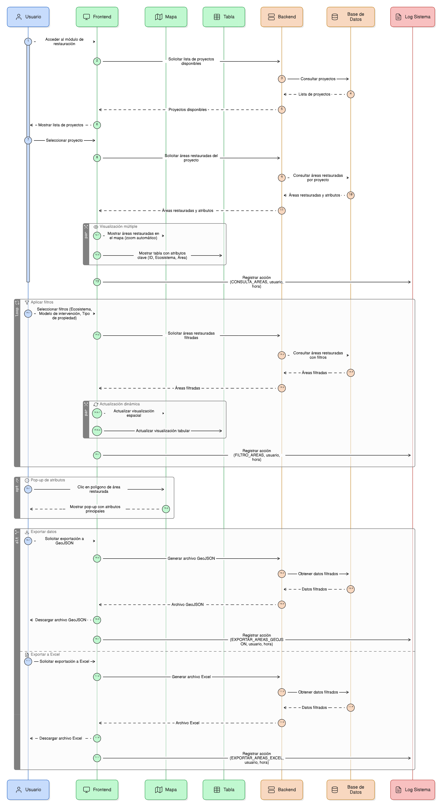
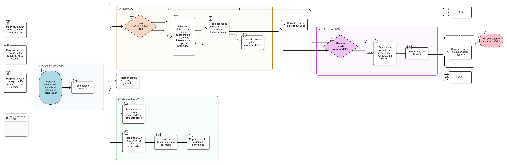

# HU-PIGCCT-SYM-119  
## Épica: Gestión de eventos y validación de información del PIGCCT  
### Registrar evento con referencia a objeto principal

---

## DESCRIPCIÓN HISTORIA DE USUARIO

> **Como:** sistema de gestión de eventos.  
> **Quiero:** registrar el evento sobre la tabla principal acción cuando se realiza una inserción directa en ella.  
> **Para:** mantener la trazabilidad del proceso de validación asociando correctamente el evento con la acción correspondiente.

---

## CRITERIOS DE ACEPTACIÓN

### 1. Identificación de inserción directa en tabla acción
1.1 El sistema debe identificar cuando se crea o actualiza un registro directamente en la tabla **acción**.  
1.2 Este tipo de operación debe reconocerse como una afectación directa a un objeto principal.

### 2. Registro del evento con referencia a acción
2.1 Cuando la inserción o actualización ocurre directamente en la tabla **acción**, el sistema debe registrar el evento con los siguientes campos:
- **tabla_principal**: Debe establecerse con el valor **"accion"**.
- **id_objeto_principal**: Debe contener el **id_accion** del registro creado o actualizado.

2.2 Los campos esquema_principal, id_usuario_fk, tipo_afectacion_enm y demás campos de auditoría deben diligenciarse según corresponda al tipo de operación (create o update).

### 3. Trazabilidad desde la tabla principal
3.1 El sistema debe garantizar que todos los eventos relacionados con una acción específica puedan consultarse mediante el **id_objeto_principal**.  
3.2 Esta referencia debe permitir reconstruir el historial completo de cambios de una acción.

### 4. Coherencia en el modelo de datos
4.1 El modelo de eventos debe permitir distinguir claramente cuando un evento afecta directamente a la tabla **acción** versus cuando afecta a tablas relacionadas.  
4.2 Los campos tabla_principal e id_objeto_principal deben proporcionar esta información de forma inequívoca.

### 5. Relación con tablas dependientes
5.1 Cuando el evento se registra sobre la tabla acción, el sistema debe poder relacionar posteriormente eventos de tablas dependientes (adjuntos, indicador_accion, indicador_accion_valor) con la misma acción.  
5.2 Esta relación debe facilitar la visualización del contexto completo de validación.

### 6. Validación de existencia del objeto principal
6.1 El sistema debe validar que el **id_accion** registrado en **id_objeto_principal** exista efectivamente en la tabla acción.  
6.2 Si el ID no existe, el sistema debe registrar un error y notificar al administrador.

### 7. Consulta de eventos por acción
7.1 El sistema debe permitir consultar todos los eventos asociados a una acción específica utilizando:
```sql
WHERE tabla_principal = 'accion' AND id_objeto_principal = [id_accion]
```

7.2 Esta consulta debe ser eficiente y estar soportada por índices apropiados.

### 8. Integridad referencial
8.1 El sistema debe mantener la integridad referencial entre la tabla **evento** y la tabla **acción**.  
8.2 Si se elimina una acción (caso excepcional), el sistema debe:
- Opción A: Conservar los eventos con fines históricos (recomendado).
- Opción B: Eliminar en cascada los eventos asociados (solo si la política institucional lo permite).

### 9. Diferenciación clara en el modelo
9.1 La documentación del sistema debe explicar claramente que:
- **tabla_principal = "accion"** indica que el evento afecta directamente a la tabla acción.
- **id_objeto_principal = id_accion** proporciona la referencia específica al registro afectado.

### 10. Auditoría y reportes
10.1 El sistema debe permitir generar reportes de eventos por acción.  
10.2 Los reportes deben mostrar claramente:
- Acciones creadas, actualizadas o eliminadas.
- Usuario responsable de cada operación.
- Fechas de cada evento.
- Estado de validación de cada evento.

---

### Resultado esperado

Un **evento correctamente registrado** sobre la tabla principal acción, con tabla_principal = 'accion' e id_objeto_principal = id_accion, garantizando la trazabilidad completa del proceso de validación y facilitando la consulta del historial de cambios asociados a cada acción del PIGCCT.

---

## DIAGRAMA DE SECUENCIA




## DIAGRAMA DE FLUJO DEL PROCESO



